::: {.cell}

```{.r .cell-code}
library(forecast)
library(cobalt)
library(plotrix)
library(randomForest)
library(dplyr)
library(tidyr)
library(epiR)
library(viridisLite)
library(ggplot2)
library(binom)
library(survminer)
library(MatchThem)
library(pROC)
library(treemap)
library(psy)
library(MASS)
library(rpart)
library(rpart.plot)
library(plotly)
library(dplyr)
library(ggplot2)
library(psych)
library(knitr)
library(kableExtra)
library(nord)
library(lmerTest)
library(psych)
library(lme4)
library(prettyR)
library(zoo)
library(kableExtra)
library(gtsummary)
library(lattice)
library(survey)
library(corrplot)
library(mice)
library(paletteer)
library(skimr)
library(nord)
library(wesanderson)
library(lubridate)
library(qgraph)
library(readxl)
library(nlme)
library(pwr)
library(nord)
library(ape)
library(survival)
library(gmodels)
library(httpgd)
library(e1071)
library(psy)
library(reshape2)
knitr::opts_chunk$set(echo = TRUE, warning = FALSE, message = FALSE)
if (knitr::is_latex_output()) {
    knitr::opts_chunk$set(dev = "pdf", fig.path = "these_brieuc_files/figure-pdf/")
}
```
:::


\newpage
::: {.callout-note title="Origine de ce document"}
-   Ce document est au format Quarto Markdown (.qmd) : il contient du code R et est généré directement pour obtenir un rapport en PDF ou HTML. 

-   Il est donc à la fois un document de travail pour moi, et à la fois un document de présentation des analyses. Je laisse donc volontairement les sections de code pour transparence et reproductibilité des analyses.

-   La préparation des données a été faite sur R plutôt que sur Excel pour éviter les erreurs et tracer les étapes. La première partie du document est donc consacrée à la préparation des données, avec des sections de code pour chaque variable (vous pouvez donc sauter les sections de code si vous ne souhaitez pas les détails de la préparation des données).

-   Je suis interne en chirurgie digestive à Paris et actuellement un master 2 en biostatistiques ("Méthodologie et Statistiques en Recherche biomédicale", Université Paris Saclay). Et accessoirement, ami de Brieuc !

-   Le rapport est disponible en format HTML hébergé sur Github Pages, et aussi téléchargeable en PDF, DOCX et Quarto (.qmd), contenant le code R utilisé pour les analyses.
:::

\newpage
# Import de la base et préparation des données


::: {.cell}

```{.r .cell-code}
# import principal depuis le nouveau recueil CSV, puis complément ciblé
# depuis l'ancien recueil pour les variables historiques non présentes.
normalize_names <- function(x) {
    x <- trimws(x)
    map <- c(
        "Prénom" = "prenom",
        "Coté" = "Cote",
        "Date de recueil" = "Date_de_recueil",
        "Examen Clinique" = "Examen_Clinique",
        "Resultat Inf" = "Resultat_Inf",
        "Gold Standard" = "Gold_Standard",
        "U1 E1" = "U1_E1",
        "U2a E1" = "U2a_E1",
        "U2b E1" = "U2b_E1",
        "U3 E1" = "U3_E1",
        "U1 E2" = "U1_E2",
        "U2a E2" = "U2a_E2",
        "U2b E2" = "U2b_E2",
        "U3 E2" = "U3_E2"
    )
    x[x %in% names(map)] <- unname(map[x[x %in% names(map)]])
    x
}

parse_excel_date <- function(x) {
    x_chr <- trimws(as.character(x))
    x_chr[x_chr %in% c("", "NA", "N/A")] <- NA
    x_num <- suppressWarnings(as.numeric(x_chr))
    out <- as.Date(rep(NA_character_, length(x_chr)))
    is_excel_num <- !is.na(x_num)
    out[is_excel_num] <- as.Date(x_num[is_excel_num], origin = "1899-12-30")
    out[!is_excel_num & !is.na(x_chr)] <- as.Date(x_chr[!is_excel_num & !is.na(x_chr)])
    out
}

df <- read.csv("recueil_bon_avec_sexe.csv", check.names = FALSE, stringsAsFactors = FALSE)
names(df) <- normalize_names(names(df))

# Supprime les lignes visuellement vides conservées lors de l'export CSV.
df <- df |>
    mutate(
        Nom = trimws(as.character(Nom)),
        prenom = trimws(as.character(prenom)),
        DDN = trimws(as.character(DDN)),
        Cote = trimws(as.character(Cote)),
        Date_de_recueil = trimws(as.character(Date_de_recueil))
    ) |>
    filter(!(Nom == "" & prenom == "" & DDN == ""))

# harmonisation minimale des libellés textuels pour éviter les divergences de casse / espaces
norm_result <- function(x) {
    x <- trimws(as.character(x))
    x[x %in% c("", "NA", "N/A", "NT")] <- NA
    x[x %in% c("Pos", "Positive", "positif", "Positif ")] <- "Positif"
    x[x %in% c("Neg", "Negative", "negatif", "négatif", "Negatif ")] <- "Negatif"
    x
}

for (v in c("Gold_Standard", "U1_E1", "U2a_E1", "U2b_E1", "U3_E1", "U1_E2", "U2a_E2", "U2b_E2", "U3_E2")) {
    df[[v]] <- norm_result(df[[v]])
}
```
:::


::: {.cell}

```{.r .cell-code}
# Convertir les colonnes de dates au format Date
df$DDN <- parse_excel_date(df$DDN)
df$Date_de_recueil <- parse_excel_date(df$Date_de_recueil)
```
:::


::: {.cell}

```{.r .cell-code}
# Convertir les variables numériques
df$Age <- as.numeric(df$Age)
df$BMI <- as.numeric(df$BMI)
class(df$Age)
```
:::


::: {.cell}

```{.r .cell-code}
# Convertir la variable "Sexe" en facteur
df$Sexe <- factor(c(M = "Masculin", F = "Féminin")[df$Sexe], levels = c("Masculin", "Féminin"))
table(df$Sexe, useNA = "ifany")
```
:::


::: {.cell}

```{.r .cell-code}
# Convertir la variable "Côté" en facteur
df$Cote <- factor(
    c(G = "Gauche", D = "Droite")[df$Cote],
    levels = c("Gauche", "Droite")
)
table(df$Cote, useNA = "ifany")
```
:::


::: {.cell}

```{.r .cell-code}
# Convertir la variable "Niveau" en facteur ordonné
df$Niveau
df$Niveau <- factor(
    df$Niveau,
    levels = c("C4", "C5", "C6", "C7", "C8"),
    ordered = TRUE
)
table(df$Niveau, useNA = "ifany")
```
:::


::: {.cell}

```{.r .cell-code}
summary(df$BMI)
class(df$BMI)
table(is.na(df$BMI), useNA = "ifany")
```
:::


::: {.cell}

```{.r .cell-code}
df$Tabac <- trimws(as.character(df$Tabac))
df$Tabac[df$Tabac %in% c("", "NA", "N/A")] <- NA
df$Tabac[df$Tabac == "oui"] <- "Oui"
df$Tabac[df$Tabac == "non"] <- "Non"
df$Tabac <- factor(df$Tabac, levels = c("Non", "Oui"))
table(df$Tabac, useNA = "ifany")
```
:::


::: {.cell}

```{.r .cell-code}
str(df$Examen_Clinique)
class(df$Examen_Clinique)
unique(df$Examen_Clinique)
#création d'une variable binaire "Examen_Clinique_Binaire" (1 = Positif, 0 = Negatif ou Douteux)
df$Examen_Clinique_Positif_YN <- ifelse(df$Examen_Clinique == "Positif", 1, 0)
table(df$Examen_Clinique_Positif_YN, useNA = "ifany")
#création d'une variable binaire "Examen_Clinique_Douteux_YN" (1 = Douteux, 0 = Positif ou Negatif)
df$Examen_Clinique_Douteux_YN <- ifelse(df$Examen_Clinique == "Douteux", 1, 0)
table(df$Examen_Clinique_Douteux_YN, useNA = "ifany")
```
:::


::: {.cell}

```{.r .cell-code}
str(df$IRM)
class(df$IRM)
unique(df$IRM)
#création d'une variable binaire "IRM_Positif_YN" (1 = Positif, 0 = Negatif ou Douteux)
df$IRM_Positif_YN <- ifelse(df$IRM == "Positif", 1, 0)
table(df$IRM_Positif_YN, useNA = "ifany")
#création d'une variable binaire "IRM_Douteux_YN" (1 = Douteux, 0 = Positif ou Negatif)
df$IRM_Douteux_YN <- ifelse(df$IRM == "Douteux", 1, 0)
table(df$IRM_Douteux_YN, useNA = "ifany")
```
:::


::: {.cell}

```{.r .cell-code}
str(df$Infiltrations)
class(df$Infiltrations)
unique(df$Infiltrations)
# harmonisation simple du statut d'infiltration
df$Infiltrations <- trimws(as.character(df$Infiltrations))
df$Infiltrations[df$Infiltrations %in% c("", "NA", "N/A")] <- NA
df$Infiltrations[df$Infiltrations %in% c("oui", "Positif")] <- "Oui"
df$Infiltrations[df$Infiltrations %in% c("non", "Negatif")] <- "Non"
df$Infiltrations <- factor(df$Infiltrations, levels = c("Non", "Oui"))
table(df$Infiltrations, useNA = "ifany")
```
:::


::: {.cell}

```{.r .cell-code}
str(df$Resultat_Inf)
class(df$Resultat_Inf)
unique(df$Resultat_Inf)
# harmonisation simple du résultat des infiltrations
df$Resultat_Inf <- trimws(as.character(df$Resultat_Inf))
df$Resultat_Inf[df$Resultat_Inf %in% c("", "NA", "N/A")] <- NA
df$Resultat_Inf[df$Resultat_Inf == "Positif"] <- "Positif"
df$Resultat_Inf[df$Resultat_Inf == "Negatif"] <- "Negatif"
df$Resultat_Inf <- factor(df$Resultat_Inf, levels = c("Negatif", "Positif"))
table(df$Resultat_Inf, useNA = "ifany")
```
:::


::: {.cell}

```{.r .cell-code}
#création d'une variable binaire "Gold_Standard_Positif_YN" (1 = Positif, 0 = Negatif ou Douteux ou NA)
df$Gold_Standard_Positif_YN <- ifelse(df$Gold_Standard == "Positif", 1,
    ifelse(df$Gold_Standard %in% c("Negatif", "Douteux"), 0, NA)
)
table(df$Gold_Standard_Positif_YN, useNA = "ifany")

#création d'une variable binaire "Gold_Standard_Douteux_YN" (1 = Douteux, 0 = Positif ou Negatif ou NA)
df$Gold_Standard_Douteux_YN <- ifelse(df$Gold_Standard == "Douteux", 1,
    ifelse(df$Gold_Standard %in% c("Positif", "Negatif"), 0, NA)
)
table(df$Gold_Standard_Douteux_YN, useNA = "ifany")
```
:::


::: {.cell}

```{.r .cell-code}
str(df$U1_E1)
class(df$U1_E1)
table(df$U1_E1, useNA = "ifany")
#création d'une variable binaire "U1_E1_Positif_YN" (1 = Positif, 0 = Negatif ou NA) 
df$U1_E1_positif <- as.numeric(df$U1_E1 == "Positif")
table(df$U1_E1_positif, useNA = "ifany")
```
:::


::: {.cell}

```{.r .cell-code}
str(df$U2a_E1)
class(df$U2a_E1)
table(df$U2a_E1, useNA = "ifany")
#création d'une variable binaire "U2a_E1_Positif_YN" (1 = Positif, 0 = Negatif ou NA) 
df$U2a_E1_positif <- as.numeric(df$U2a_E1 == "Positif")
table(df$U2a_E1_positif, useNA = "ifany")
```
:::


::: {.cell}

```{.r .cell-code}
str(df$U2b_E1)
class(df$U2b_E1)
table(df$U2b_E1, useNA = "ifany")
#création d'une variable binaire "U2b_E1_Positif_YN" (1 = Positif, 0 = Negatif ou NA) 
df$U2b_E1_positif <- as.numeric(df$U2b_E1 == "Positif")
table(df$U2b_E1_positif, useNA = "ifany")
```
:::


::: {.cell}

```{.r .cell-code}
str(df$U3_E1)
class(df$U3_E1)
table(df$U3_E1, useNA = "ifany")
#création d'une variable binaire "U3_E1_Positif_YN" (1 = Positif, 0 = Negatif ou NA) 
df$U3_E1_positif <- as.numeric(df$U3_E1 == "Positif")
table(df$U3_E1_positif, useNA = "ifany")
```
:::


::: {.cell}

```{.r .cell-code}
str(df$U1_E2)
class(df$U1_E2)
table(df$U1_E2, useNA = "ifany")
#transformation NT en NA 
df$U1_E2 <- ifelse(df$U1_E2 == "NT", NA, df$U1_E2)
table(df$U1_E2, useNA = "ifany")
#création d'une variable binaire "U1_E2_Positif_YN" (1 = Positif, 0 = Negatif ou NA) 
df$U1_E2_positif <- as.numeric(df$U1_E2 == "Positif")
table(df$U1_E2_positif, useNA = "ifany")
```
:::


::: {.cell}

```{.r .cell-code}
str(df$U2a_E2)
class(df$U2a_E2)
table(df$U2a_E2, useNA = "ifany")
#transformation NT en NA 
df$U2a_E2 <- ifelse(df$U2a_E2 == "NT", NA, df$U2a_E2)
table(df$U2a_E2, useNA = "ifany")
#création d'une variable binaire "U2a_E2_Positif_YN" (1 = Positif, 0 = Negatif ou NA) 
df$U2a_E2_positif <- as.numeric(df$U2a_E2 == "Positif")
table(df$U2a_E2_positif, useNA = "ifany")
```
:::


::: {.cell}

```{.r .cell-code}
str(df$U2b_E2)
class(df$U2b_E2)
table(df$U2b_E2, useNA = "ifany")
#transformation NT en NA
df$U2b_E2 <- ifelse(df$U2b_E2 == "NT", NA, df$U2b_E2)
table(df$U2b_E2, useNA = "ifany")
#création d'une variable binaire "U2b_E2_Positif_YN" (1 = Positif, 0 = Negatif ou NA) 
df$U2b_E2_positif <- as.numeric(df$U2b_E2 == "Positif")
table(df$U2b_E2_positif, useNA = "ifany")
```
:::


::: {.cell}

```{.r .cell-code}
str(df$U3_E2)
class(df$U3_E2)
table(df$U3_E2, useNA = "ifany")
#transformation NT en NA
df$U3_E2 <- ifelse(df$U3_E2 == "NT", NA, df$U3_E2)
table(df$U3_E2, useNA = "ifany")
#création d'une variable binaire "U3_E2_Positif_YN" (1 = Positif, 0 = Negatif ou NA) 
df$U3_E2_positif <- as.numeric(df$U3_E2 == "Positif")
table(df$U3_E2_positif, useNA = "ifany")
```
:::


::: {.cell}

```{.r .cell-code}
# Objets section effectif
sample_size_scenarios_input <- data.frame(
S = paste0("S", 1:11),
Scenario_num = 1:11,
Sp_cible = c(
    0.90, 0.90, 0.90, 0.90, 0.90, 0.90,
    0.85, 0.85, 0.85, 0.85, 0.85
),
p = c(
    0.75, 0.50, 0.75, 0.50, 0.60, 0.60,
    0.75, 0.50, 0.75, 0.60, 0.50
),
Largeur_IC = c(
    0.099, 0.099, 0.149, 0.149, 0.099, 0.149,
    0.099, 0.099, 0.149, 0.099, 0.149
)
)

sample_size_scenarios <- sample_size_scenarios_input %>%
crossing(N_negatifs_testes = 2:5000) %>%
mutate(
    Borne_inferieure = qbeta(
        0.05,
        N_negatifs_testes * Sp_cible,
        N_negatifs_testes * (1 - Sp_cible) + 1
    ),
    Largeur_calculee = Sp_cible - Borne_inferieure,
    Largeur_calculee_arrondie = round(Largeur_calculee, 3)
) %>%
filter(Largeur_calculee_arrondie <= Largeur_IC) %>%
group_by(Scenario_num) %>%
slice(1) %>%
ungroup() %>%
arrange(Scenario_num) %>%
transmute(
    S,
    Sp_cible,
    p,
    Largeur_IC,
    N_neg_requis = N_negatifs_testes,
    N_tot_requis = ceiling(N_negatifs_testes / (1 - p)),
    Borne_inferieure,
    Largeur_calculee
)

sample_size_table <- sample_size_scenarios %>%
mutate(
    Sp_cible = sprintf("%.2f", Sp_cible),
    p = sprintf("%.2f", p),
    Largeur_IC = sprintf("%.3f", Largeur_IC),
    Borne_inferieure = sprintf("%.3f", Borne_inferieure),
    Largeur_calculee = sprintf("%.3f", Largeur_calculee)
) %>%
kable(
    format = if (knitr::is_latex_output()) {
        "latex"
    } else if (knitr::is_html_output()) {
        "html"
    } else {
        "pipe"
    },
    booktabs = TRUE,
    align = "c",
    col.names = c(
        "Scenario",
        "Target Sp",
        "Prevalence",
        "CI width",
        "Required negatives",
        "Required total N",
        "Lower bound",
        "Computed width"
    )
)

if (knitr::is_latex_output()) {
    sample_size_table <- sample_size_table %>%
        kable_styling(
            latex_options = c("hold_position", "scale_down"),
            full_width = FALSE,
            font_size = 8
        )
} else if (knitr::is_html_output()) {
    sample_size_table <- sample_size_table %>%
        kable_styling(
            full_width = FALSE,
            position = "center"
        )
}

gold_standard_main_effectif <- ifelse(df$Gold_Standard == "Douteux", "Negatif", df$Gold_Standard)
effectif_n_total_main <- sum(gold_standard_main_effectif %in% c("Positif", "Negatif"), na.rm = TRUE)
effectif_n_pos_main <- sum(gold_standard_main_effectif == "Positif", na.rm = TRUE)
effectif_n_neg_main <- sum(gold_standard_main_effectif == "Negatif", na.rm = TRUE)
effectif_prev_main <- effectif_n_pos_main / effectif_n_total_main

sample_size_closest_scenario <- sample_size_scenarios %>%
    filter(Sp_cible == 0.90, p == 0.60, Largeur_IC == 0.149)

effectif_lb_sp90_observed <- qbeta(
    0.05,
    effectif_n_neg_main * 0.90,
    effectif_n_neg_main * (1 - 0.90) + 1
)
effectif_width_sp90_observed <- 0.90 - effectif_lb_sp90_observed

sample_size_posthoc_round <- data.frame(
    Cadre = c(
        "Cohorte finale analysee",
        "Scenario le plus proche du protocole",
        paste0("Precision observee avec ", effectif_n_neg_main, " negatifs")
    ),
    `Sp cible` = c(
        "",
        sprintf("%.2f", sample_size_closest_scenario$Sp_cible),
        "0.90"
    ),
    `Prevalence` = c(
        paste0(sprintf("%.1f", effectif_prev_main * 100), " %"),
        paste0(sprintf("%.0f", sample_size_closest_scenario$p * 100), " %"),
        ""
    ),
    `N negatifs` = c(
        as.character(effectif_n_neg_main),
        as.character(sample_size_closest_scenario$N_neg_requis),
        as.character(effectif_n_neg_main)
    ),
    `N total` = c(
        as.character(effectif_n_total_main),
        as.character(sample_size_closest_scenario$N_tot_requis),
        as.character(effectif_n_total_main)
    ),
    `Borne inferieure IC95%` = c(
        "",
        sprintf("%.3f", sample_size_closest_scenario$Borne_inferieure),
        sprintf("%.3f", effectif_lb_sp90_observed)
    ),
    `Largeur` = c(
        "",
        sprintf("%.3f", sample_size_closest_scenario$Largeur_IC),
        sprintf("%.3f", effectif_width_sp90_observed)
    ),
    check.names = FALSE
)

sample_size_posthoc_table <- sample_size_posthoc_round %>%
    kable(
        format = if (knitr::is_latex_output()) {
            "latex"
        } else if (knitr::is_html_output()) {
            "html"
        } else {
            "pipe"
        },
        booktabs = TRUE,
        align = "c"
    )

if (knitr::is_latex_output()) {
    sample_size_posthoc_table <- sample_size_posthoc_table %>%
        kable_styling(
            latex_options = c("hold_position", "scale_down"),
            full_width = FALSE,
            font_size = 8
        )
} else if (knitr::is_html_output()) {
    sample_size_posthoc_table <- sample_size_posthoc_table %>%
        kable_styling(
            full_width = FALSE,
            position = "center"
        )
}
```
:::


::: {.cell}

```{.r .cell-code}
# Objets section caractéristiques initiales
age_median <- median(df$Age, na.rm = TRUE)
df$Age <- ifelse(df$Age == 125, age_median, df$Age)

resume_age <- data.frame(as.list(summary(df$Age)), check.names = FALSE)
resume_age_kable <- kable(
    resume_age,
    format = if (knitr::is_latex_output()) {
        "latex"
    } else if (knitr::is_html_output()) {
        "html"
    } else {
        "pipe"
    },
    caption = "variable âge"
)

if (knitr::is_latex_output() || knitr::is_html_output()) {
    resume_age_table <- resume_age_kable %>%
        kable_styling(full_width = FALSE, position = "center")
} else {
    resume_age_table <- resume_age_kable
}

resume_bmi <- data.frame(as.list(summary(df$BMI)), check.names = FALSE)
resume_bmi_kable <- kable(
    resume_bmi,
    format = if (knitr::is_latex_output()) {
        "latex"
    } else if (knitr::is_html_output()) {
        "html"
    } else {
        "pipe"
    },
    caption = "Variable BMI"
)

if (knitr::is_latex_output() || knitr::is_html_output()) {
    resume_bmi_table <- resume_bmi_kable %>%
        kable_styling(full_width = FALSE, position = "center")
} else {
    resume_bmi_table <- resume_bmi_kable
}

n_total_patients <- nrow(df)
gold_standard_n_pos <- sum(df$Gold_Standard == "Positif", na.rm = TRUE)
gold_standard_pct_pos <- round(100 * mean(df$Gold_Standard == "Positif", na.rm = TRUE), 1)
gold_standard_n_doubtful <- sum(df$Gold_Standard == "Douteux", na.rm = TRUE)
gold_standard_pct_doubtful <- round(100 * mean(df$Gold_Standard == "Douteux", na.rm = TRUE), 1)
gold_standard_n_neg <- sum(df$Gold_Standard == "Negatif", na.rm = TRUE)
gold_standard_pct_neg <- round(100 * mean(df$Gold_Standard == "Negatif", na.rm = TRUE), 1)
gold_standard_n_missing <- sum(is.na(df$Gold_Standard) | df$Gold_Standard %in% c("NT", ""))
gold_standard_pct_missing <- round(100 * mean(is.na(df$Gold_Standard) | df$Gold_Standard %in% c("NT", "")), 1)
# transformation des variables catégorielles en binaires 1 / 0 numériques
df_baseline <- df 
df_baseline <- df_baseline %>%
    mutate(
        Tabac = ifelse(Tabac == "Oui", 1, ifelse(Tabac == "Non", 0, NA)),
        Infiltrations = ifelse(Infiltrations == "Oui", 1, ifelse(Infiltrations == "Non", 0, NA)),
        Resultat_Inf = ifelse(Resultat_Inf == "Positif", 1, ifelse(Resultat_Inf == "Negatif", 0, NA)),
        Gold_Standard = ifelse(Gold_Standard == "Positif", 1,
            ifelse(Gold_Standard %in% c("Negatif", "Douteux"), 0, NA)
        ),
        U1_E1 = ifelse(U1_E1 == "Positif", 1, ifelse(U1_E1 == "Negatif", 0, NA)),
        U2a_E1 = ifelse(U2a_E1 == "Positif", 1, ifelse(U2a_E1 == "Negatif", 0, NA)),
        U2b_E1 = ifelse(U2b_E1 == "Positif", 1, ifelse(U2b_E1 == "Negatif", 0, NA)),
        U3_E1 = ifelse(U3_E1 == "Positif", 1, ifelse(U3_E1 == "Negatif", 0, NA))
    )

baseline_tbl <- df_baseline %>%
    select(
        Age, BMI, Sexe, Cote, Niveau,
        Tabac, Infiltrations, Resultat_Inf, Gold_Standard,
        U1_E1, U2a_E1, U2b_E1, U3_E1
    ) %>%
    tbl_summary(
        missing = "no",
        label = list(
            Age ~ "Âge (années)",
            BMI ~ "BMI (kg/m²)",
            Sexe ~ "Sexe",
            Cote ~ "Côté",
            Niveau ~ "Niveau",
            Tabac ~ "Tabac actif",
            Infiltrations ~ "Infiltrations",
            Resultat_Inf ~ "Résultat des infiltrations",
            Gold_Standard ~ "Gold Standard positif",
            U1_E1 ~ "ULNT1 E1 positif",
            U2a_E1 ~ "ULNT2a E1 positif",
            U2b_E1 ~ "ULNT2b E1 positif",
            U3_E1 ~ "ULNT3 E1 positif"
        )
    ) %>%
    modify_header(label = "**Caractéristiques**")

sexe_table <- table(df$Sexe)
sexe_pct <- round(100 * prop.table(sexe_table), 1)
sexe_labels <- dimnames(sexe_table)[[1]]
sexe_colors <- c(
    Masculin = nord("frost")[2],
    Féminin = nord("lumina")[1]
)

cote_table <- table(df$Cote)
cote_pct <- round(100 * prop.table(cote_table), 1)
cote_labels <- dimnames(cote_table)[[1]]
cote_colors <- c(
    Gauche = nord("aurora")[1],
    Droite = nord("aurora")[4]
)

niveau_table <- table(factor(df$Niveau, levels = c("C4", "C5", "C6", "C7", "C8")))
niveau_pct <- round(100 * prop.table(niveau_table), 1)
niveau_labels <- dimnames(niveau_table)[[1]]
niveau_colors <- c(
    C4 = nord("lumina")[1],
    C5 = nord("lumina")[2],
    C6 = nord("lumina")[3],
    C7 = nord("lumina")[4],
    C8 = nord("lumina")[5]
)
niveau_table <- rev(niveau_table)
niveau_pct <- rev(niveau_pct)
niveau_labels <- rev(niveau_labels)

tabac_non_n <- sum(df$Tabac == "Non", na.rm = TRUE)
tabac_oui_n <- sum(df$Tabac == "Oui", na.rm = TRUE)
tabac_na_n <- sum(is.na(df$Tabac))
tabac_renseigne_n <- tabac_non_n + tabac_oui_n
tabac_non_pct <- round(100 * tabac_non_n / tabac_renseigne_n, 1)
tabac_oui_pct <- round(100 * tabac_oui_n / tabac_renseigne_n, 1)
tabac_summary <- data.frame(
    Modalite = c("Non", "Oui"),
    Effectif = c(tabac_non_n, tabac_oui_n),
    Pourcentage = c(tabac_non_pct, tabac_oui_pct)
)

infiltration_non_n <- sum(df$Infiltrations == "Non", na.rm = TRUE)
infiltration_oui_n <- sum(df$Infiltrations == "Oui", na.rm = TRUE)
infiltration_na_n <- sum(is.na(df$Infiltrations))
infiltration_renseigne_n <- infiltration_non_n + infiltration_oui_n
infiltration_non_pct <- round(100 * infiltration_non_n / infiltration_renseigne_n, 1)
infiltration_oui_pct <- round(100 * infiltration_oui_n / infiltration_renseigne_n, 1)
infiltration_summary <- data.frame(
    Modalite = c("Non", "Oui"),
    Effectif = c(infiltration_non_n, infiltration_oui_n),
    Pourcentage = c(infiltration_non_pct, infiltration_oui_pct)
)

resultat_inf_neg_n <- sum(df$Infiltrations == "Oui" & df$Resultat_Inf == "Negatif", na.rm = TRUE)
resultat_inf_pos_n <- sum(df$Infiltrations == "Oui" & df$Resultat_Inf == "Positif", na.rm = TRUE)
resultat_inf_renseigne_n <- resultat_inf_neg_n + resultat_inf_pos_n
resultat_inf_non_renseigne_n <- infiltration_oui_n - resultat_inf_renseigne_n
resultat_inf_neg_pct <- round(100 * resultat_inf_neg_n / resultat_inf_renseigne_n, 1)
resultat_inf_pos_pct <- round(100 * resultat_inf_pos_n / resultat_inf_renseigne_n, 1)
resultat_inf_summary <- data.frame(
    Modalite = c("Negatif", "Positif"),
    Effectif = c(resultat_inf_neg_n, resultat_inf_pos_n),
    Pourcentage = c(resultat_inf_neg_pct, resultat_inf_pos_pct)
)

plot_age_distribution <- function() {
    op <- par(no.readonly = TRUE)
    on.exit(par(op))
    par(mfrow = c(1, 2))
    hist(
        df$Age,
        breaks = 10,
        prob = TRUE,
        main = "Distribution de l'âge",
        xlab = "Âge",
        ylab = "Densité",
        col = "lightblue"
    )
    lines(density(df$Age, na.rm = TRUE), col = "red", lwd = 2)
    qqnorm(df$Age, main = "Q-Q plot de l'âge")
    qqline(df$Age, col = "red", lwd = 2)
}

plot_sexe_distribution <- function() {
    op <- par(no.readonly = TRUE)
    on.exit(par(op))
    par(mfrow = c(1, 2))
    bar_pos <- barplot(
        sexe_table,
        main = "Répartition du sexe",
        col = sexe_colors[sexe_labels],
        ylab = "Nombre de patients",
        ylim = c(0, max(sexe_table) * 1.18)
    )
    text(
        x = bar_pos,
        y = sexe_table + max(sexe_table) * 0.05,
        labels = paste0(sexe_pct, " %"),
        cex = 0.9
    )
    pie(
        sexe_table,
        labels = paste0(names(sexe_table), "\n", sexe_pct, " %"),
        main = "Répartition du sexe",
        col = sexe_colors[names(sexe_table)]
    )
}

plot_cote_distribution <- function() {
    op <- par(no.readonly = TRUE)
    on.exit(par(op))
    par(mfrow = c(1, 2))
    bar_pos <- barplot(
        cote_table,
        main = "Répartition du côté",
        col = cote_colors[cote_labels],
        ylab = "Nombre de patients",
        ylim = c(0, max(cote_table) * 1.18)
    )
    text(
        x = bar_pos,
        y = cote_table + max(cote_table) * 0.05,
        labels = paste0(cote_pct, " %"),
        cex = 0.9
    )
    pie(
        cote_table,
        labels = paste0(names(cote_table), "\n", cote_pct, " %"),
        main = "Répartition du côté",
        col = cote_colors[names(cote_table)]
    )
}

plot_niveau_distribution <- function() {
    op <- par(no.readonly = TRUE)
    on.exit(par(op))
    par(mfrow = c(1, 1))
    bar_pos <- barplot(
        niveau_table,
        main = "Répartition du niveau",
        col = niveau_colors[niveau_labels],
        xlab = "Nombre de patients",
        horiz = TRUE,
        xlim = c(0, max(niveau_table) * 1.18)
    )
    text(
        y = bar_pos,
        x = niveau_table + max(niveau_table) * 0.05,
        labels = paste0(niveau_pct, " %"),
        cex = 0.9
    )
}
```
:::


::: {.cell}

```{.r .cell-code}
# Objets ULNT1
df$Gold_Standard_main <- ifelse(df$Gold_Standard == "Douteux", "Negatif", df$Gold_Standard)

u1_data <- df %>%
    filter(
        Gold_Standard_main %in% c("Positif", "Negatif"),
        !is.na(U1_E1)
    )

u1_VP <- sum(u1_data$U1_E1 == "Positif" & u1_data$Gold_Standard_main == "Positif")
u1_FN <- sum(u1_data$U1_E1 == "Negatif" & u1_data$Gold_Standard_main == "Positif")
u1_FP <- sum(u1_data$U1_E1 == "Positif" & u1_data$Gold_Standard_main == "Negatif")
u1_VN <- sum(u1_data$U1_E1 == "Negatif" & u1_data$Gold_Standard_main == "Negatif")
u1_N <- u1_VP + u1_FN + u1_FP + u1_VN
u1_Se <- u1_VP / (u1_VP + u1_FN)
u1_Se_IC <- binom.test(u1_VP, u1_VP + u1_FN)$conf.int
u1_Sp <- u1_VN / (u1_VN + u1_FP)
u1_Sp_IC <- binom.test(u1_VN, u1_VN + u1_FP)$conf.int
u1_VPP <- u1_VP / (u1_VP + u1_FP)
u1_VPP_IC <- binom.test(u1_VP, u1_VP + u1_FP)$conf.int
u1_VPN <- u1_VN / (u1_VN + u1_FN)
u1_VPN_IC <- binom.test(u1_VN, u1_VN + u1_FN)$conf.int
u1_LR_pos <- u1_Se / (1 - u1_Sp)
u1_LR_neg <- (1 - u1_Se) / u1_Sp
u1_Youden <- u1_Se + u1_Sp - 1
roc_u1 <- roc(
    response = as.numeric(u1_data$Gold_Standard_main == "Positif"),
    predictor = as.numeric(u1_data$U1_E1 == "Positif"),
    quiet = TRUE
)
u1_AUC <- as.numeric(auc(roc_u1))
u1_AUC_IC <- ci.auc(roc_u1)
u1_Fisher_p <- fisher.test(table(u1_data$U1_E1, u1_data$Gold_Standard_main))$p.value

u1_effectifs <- data.frame(
    Test = "U1",
    N = u1_N,
    VP = u1_VP,
    FN = u1_FN,
    FP = u1_FP,
    VN = u1_VN,
    check.names = FALSE
)

u1_performance <- data.frame(
    Test = "U1",
    N = u1_N,
    VP = u1_VP,
    FN = u1_FN,
    FP = u1_FP,
    VN = u1_VN,
    Se = round(u1_Se, 3),
    Se_IC95 = paste0("[", round(u1_Se_IC[1], 3), " ; ", round(u1_Se_IC[2], 3), "]"),
    Sp = round(u1_Sp, 3),
    Sp_IC95 = paste0("[", round(u1_Sp_IC[1], 3), " ; ", round(u1_Sp_IC[2], 3), "]"),
    VPP = round(u1_VPP, 3),
    VPP_IC95 = paste0("[", round(u1_VPP_IC[1], 3), " ; ", round(u1_VPP_IC[2], 3), "]"),
    VPN = round(u1_VPN, 3),
    VPN_IC95 = paste0("[", round(u1_VPN_IC[1], 3), " ; ", round(u1_VPN_IC[2], 3), "]"),
    LR_pos = round(u1_LR_pos, 2),
    LR_neg = round(u1_LR_neg, 2),
    Youden = round(u1_Youden, 3),
    AUC = round(u1_AUC, 3),
    AUC_IC95 = paste0("[", round(u1_AUC_IC[1], 3), " ; ", round(u1_AUC_IC[3], 3), "]"),
    Fisher_p = signif(u1_Fisher_p, 3)
)

u1_performance_table <- kable(
    u1_performance,
    format = if (knitr::is_latex_output()) {
        "latex"
    } else if (knitr::is_html_output()) {
        "html"
    } else {
        "pipe"
    },
    booktabs = TRUE,
    align = "c",
    caption = "Diagnostic performance of U1 compared with the reference standard",
    col.names = c(
        "Test", "N", "VP", "FN", "FP", "VN", "Se", "Se 95% CI", "Sp", "Sp 95% CI",
        "PPV", "PPV 95% CI", "NPV", "NPV 95% CI", "LR+", "LR-", "Youden", "AUC", "AUC 95% CI", "Fisher p"
    )
)
if (knitr::is_latex_output()) {
    u1_performance_table <- u1_performance_table %>%
        kable_styling(latex_options = c("hold_position", "scale_down"), full_width = FALSE, font_size = 7)
} else if (knitr::is_html_output()) {
    u1_performance_table <- u1_performance_table %>%
        kable_styling(full_width = FALSE, position = "center")
}

u1_descriptive <- data.frame(
    Test = "U1",
    Positif = paste0(sum(df$U1_E1 == "Positif", na.rm = TRUE), " (", round(100 * mean(df$U1_E1 == "Positif", na.rm = TRUE), 1), "%)"),
    Negatif = paste0(sum(df$U1_E1 == "Negatif", na.rm = TRUE), " (", round(100 * mean(df$U1_E1 == "Negatif", na.rm = TRUE), 1), "%)"),
    stringsAsFactors = FALSE
)
u1_descriptive_table <- kable(
    u1_descriptive,
    format = if (knitr::is_latex_output()) {
        "latex"
    } else if (knitr::is_html_output()) {
        "html"
    } else {
        "pipe"
    },
    caption = "Tableau descriptif des résultats de U1 (évaluateur 1)",
    align = "c",
    col.names = c("Test", "Positif n (%)", "Négatif n (%)")
)
if (knitr::is_latex_output()) {
    u1_descriptive_table <- u1_descriptive_table %>%
        kable_styling(
            latex_options = c("hold_position", "scale_down"),
            full_width = FALSE,
            font_size = 8
        )
} else if (knitr::is_html_output()) {
    u1_descriptive_table <- u1_descriptive_table %>%
        kable_styling(
            full_width = FALSE,
            position = "center"
        )
}

u1_tab <- table(
    factor(df$U1_E1[!is.na(df$U1_E1) & df$Gold_Standard_main %in% c("Positif", "Negatif")], levels = c("Positif", "Negatif")),
    factor(df$Gold_Standard_main[!is.na(df$U1_E1) & df$Gold_Standard_main %in% c("Positif", "Negatif")], levels = c("Positif", "Negatif"))
)
u1_contingency <- data.frame(
    U1 = c("T+", "T-", "Total"),
    `G+` = c(
        paste0(u1_tab["Positif", "Positif"], " (", round(100 * u1_tab["Positif", "Positif"] / u1_N, 1), "%)"),
        paste0(u1_tab["Negatif", "Positif"], " (", round(100 * u1_tab["Negatif", "Positif"] / u1_N, 1), "%)"),
        paste0(sum(u1_tab[, "Positif"]), " (", round(100 * sum(u1_tab[, "Positif"]) / u1_N, 1), "%)")
    ),
    `G-` = c(
        paste0(u1_tab["Positif", "Negatif"], " (", round(100 * u1_tab["Positif", "Negatif"] / u1_N, 1), "%)"),
        paste0(u1_tab["Negatif", "Negatif"], " (", round(100 * u1_tab["Negatif", "Negatif"] / u1_N, 1), "%)"),
        paste0(sum(u1_tab[, "Negatif"]), " (", round(100 * sum(u1_tab[, "Negatif"]) / u1_N, 1), "%)")
    ),
    Total = c(
        paste0(sum(u1_tab["Positif", ]), " (", round(100 * sum(u1_tab["Positif", ]) / u1_N, 1), "%)"),
        paste0(sum(u1_tab["Negatif", ]), " (", round(100 * sum(u1_tab["Negatif", ]) / u1_N, 1), "%)"),
        paste0(sum(u1_tab), " (", round(100 * sum(u1_tab) / u1_N, 1), "%)")
    ),
    check.names = FALSE,
    stringsAsFactors = FALSE
)
u1_contingency_table <- kable(
    u1_contingency,
    format = if (knitr::is_latex_output()) {
        "latex"
    } else if (knitr::is_html_output()) {
        "html"
    } else {
        "pipe"
    },
    caption = "Tableau de contingence de U1 par rapport au gold standard",
    align = "c"
)
if (knitr::is_latex_output()) {
    u1_contingency_table <- u1_contingency_table %>%
        kable_styling(
            latex_options = c("hold_position", "scale_down"),
            full_width = FALSE,
            font_size = 8
        )
} else if (knitr::is_html_output()) {
    u1_contingency_table <- u1_contingency_table %>%
        kable_styling(
            full_width = FALSE,
            position = "center"
        )
}

u1_performance_summary <- data.frame(
    Test = "U1",
    Se = paste0(round(u1_Se, 3), " [", round(u1_Se_IC[1], 3), " ; ", round(u1_Se_IC[2], 3), "]"),
    Sp = paste0(round(u1_Sp, 3), " [", round(u1_Sp_IC[1], 3), " ; ", round(u1_Sp_IC[2], 3), "]"),
    VPP = paste0(round(u1_VPP, 3), " [", round(u1_VPP_IC[1], 3), " ; ", round(u1_VPP_IC[2], 3), "]"),
    VPN = paste0(round(u1_VPN, 3), " [", round(u1_VPN_IC[1], 3), " ; ", round(u1_VPN_IC[2], 3), "]"),
    `LR+` = round(u1_LR_pos, 2),
    `LR-` = round(u1_LR_neg, 2),
    Youden = round(u1_Youden, 3),
    AUC = paste0(round(u1_AUC, 3), " [", round(u1_AUC_IC[1], 3), " ; ", round(u1_AUC_IC[3], 3), "]"),
    check.names = FALSE
)
u1_performance_summary_table <- kable(
    u1_performance_summary,
    format = if (knitr::is_latex_output()) {
        "latex"
    } else if (knitr::is_html_output()) {
        "html"
    } else {
        "pipe"
    },
    caption = "Performances diagnostiques de U1 par rapport au gold standard",
    align = "c"
)
if (knitr::is_latex_output()) {
    u1_performance_summary_table <- u1_performance_summary_table %>%
        kable_styling(
            latex_options = c("hold_position", "scale_down"),
            full_width = FALSE,
            font_size = 8
        )
} else if (knitr::is_html_output()) {
    u1_performance_summary_table <- u1_performance_summary_table %>%
        kable_styling(
            full_width = FALSE,
            position = "center"
        )
}

if (u1_LR_pos < 1) {
    u1_lr_pos_text <- "un test positif ne renforce pas l'hypothèse diagnostique et peut même orienter légèrement dans le sens inverse."
} else if (u1_LR_pos < 2) {
    u1_lr_pos_text <- "un test positif renforce très peu l'hypothèse diagnostique."
} else if (u1_LR_pos < 5) {
    u1_lr_pos_text <- "un test positif apporte un argument diagnostique modéré en faveur de la maladie."
} else {
    u1_lr_pos_text <- "un test positif apporte un argument fort pour confirmer la maladie."
}

if (u1_LR_neg > 1) {
    u1_lr_neg_text <- "un test négatif n'aide pas à exclure la maladie et peut même aller légèrement dans le sens inverse."
} else if (u1_LR_neg > 0.5) {
    u1_lr_neg_text <- "un test négatif apporte très peu d'information pour écarter la maladie."
} else if (u1_LR_neg > 0.2) {
    u1_lr_neg_text <- "un test négatif réduit modérément la probabilité de maladie, sans suffire à l'exclure à lui seul."
} else {
    u1_lr_neg_text <- "un test négatif constitue un bon argument pour exclure la maladie."
}

if (u1_Youden < 0) {
    u1_youden_text <- "cela traduit un test globalement non informatif dans cet échantillon."
} else if (u1_Youden < 0.2) {
    u1_youden_text <- "cela correspond à une performance diagnostique globale faible."
} else if (u1_Youden < 0.4) {
    u1_youden_text <- "cela correspond à une performance diagnostique globale modeste."
} else {
    u1_youden_text <- "cela correspond à une performance diagnostique globale au moins modérée."
}

if (u1_AUC < 0.5) {
    u1_auc_text <- "cela signifie que le test discrimine moins bien que le hasard dans cette cohorte."
} else if (u1_AUC < 0.6) {
    u1_auc_text <- "cela correspond à une discrimination faible et proche du hasard."
} else if (u1_AUC < 0.7) {
    u1_auc_text <- "cela correspond à une discrimination faible à modérée."
} else if (u1_AUC < 0.8) {
    u1_auc_text <- "cela correspond à une discrimination modérée."
} else {
    u1_auc_text <- "cela correspond à une bonne discrimination."
}

if (u1_Fisher_p < 0.05) {
    u1_fisher_text <- "la p-value est inférieure à 0,05, ce qui suggère une association statistiquement significative entre U1 et le gold standard."
} else {
    u1_fisher_text <- "la p-value n'est pas inférieure à 0,05, ce qui ne permet pas de conclure à une association statistiquement significative entre U1 et le gold standard."
}

plot_roc_u1 <- function() {
    plot(roc_u1, main = "Courbe ROC de U1 par rapport au gold standard", col = "blue", lwd = 2)
}
```
:::


::: {.cell}

```{.r .cell-code}
# Objets ULNT2a
u2a_data <- df %>%
    filter(
        Gold_Standard_main %in% c("Positif", "Negatif"),
        !is.na(U2a_E1)
    )

u2a_VP <- sum(u2a_data$U2a_E1 == "Positif" & u2a_data$Gold_Standard_main == "Positif")
u2a_FN <- sum(u2a_data$U2a_E1 == "Negatif" & u2a_data$Gold_Standard_main == "Positif")
u2a_FP <- sum(u2a_data$U2a_E1 == "Positif" & u2a_data$Gold_Standard_main == "Negatif")
u2a_VN <- sum(u2a_data$U2a_E1 == "Negatif" & u2a_data$Gold_Standard_main == "Negatif")
u2a_N <- u2a_VP + u2a_FN + u2a_FP + u2a_VN
u2a_Se <- u2a_VP / (u2a_VP + u2a_FN)
u2a_Se_IC <- binom.test(u2a_VP, u2a_VP + u2a_FN)$conf.int
u2a_Sp <- u2a_VN / (u2a_VN + u2a_FP)
u2a_Sp_IC <- binom.test(u2a_VN, u2a_VN + u2a_FP)$conf.int
u2a_VPP <- u2a_VP / (u2a_VP + u2a_FP)
u2a_VPP_IC <- binom.test(u2a_VP, u2a_VP + u2a_FP)$conf.int
u2a_VPN <- u2a_VN / (u2a_VN + u2a_FN)
u2a_VPN_IC <- binom.test(u2a_VN, u2a_VN + u2a_FN)$conf.int
u2a_LR_pos <- u2a_Se / (1 - u2a_Sp)
u2a_LR_neg <- (1 - u2a_Se) / u2a_Sp
u2a_Youden <- u2a_Se + u2a_Sp - 1
roc_u2a <- roc(
    response = as.numeric(u2a_data$Gold_Standard_main == "Positif"),
    predictor = as.numeric(u2a_data$U2a_E1 == "Positif"),
    quiet = TRUE
)
u2a_AUC <- as.numeric(auc(roc_u2a))
u2a_AUC_IC <- ci.auc(roc_u2a)
u2a_Fisher_p <- fisher.test(table(u2a_data$U2a_E1, u2a_data$Gold_Standard_main))$p.value

u2a_effectifs <- data.frame(
    Test = "U2a",
    N = u2a_N,
    VP = u2a_VP,
    FN = u2a_FN,
    FP = u2a_FP,
    VN = u2a_VN,
    check.names = FALSE
)

u2a_performance <- data.frame(
    Test = "U2a",
    N = u2a_N,
    VP = u2a_VP,
    FN = u2a_FN,
    FP = u2a_FP,
    VN = u2a_VN,
    Se = round(u2a_Se, 3),
    Se_IC95 = paste0("[", round(u2a_Se_IC[1], 3), " ; ", round(u2a_Se_IC[2], 3), "]"),
    Sp = round(u2a_Sp, 3),
    Sp_IC95 = paste0("[", round(u2a_Sp_IC[1], 3), " ; ", round(u2a_Sp_IC[2], 3), "]"),
    VPP = round(u2a_VPP, 3),
    VPP_IC95 = paste0("[", round(u2a_VPP_IC[1], 3), " ; ", round(u2a_VPP_IC[2], 3), "]"),
    VPN = round(u2a_VPN, 3),
    VPN_IC95 = paste0("[", round(u2a_VPN_IC[1], 3), " ; ", round(u2a_VPN_IC[2], 3), "]"),
    LR_pos = round(u2a_LR_pos, 2),
    LR_neg = round(u2a_LR_neg, 2),
    Youden = round(u2a_Youden, 3),
    AUC = round(u2a_AUC, 3),
    AUC_IC95 = paste0("[", round(u2a_AUC_IC[1], 3), " ; ", round(u2a_AUC_IC[3], 3), "]"),
    Fisher_p = signif(u2a_Fisher_p, 3)
)

u2a_performance_table <- kable(
    u2a_performance,
    format = if (knitr::is_latex_output()) {
        "latex"
    } else if (knitr::is_html_output()) {
        "html"
    } else {
        "pipe"
    },
    booktabs = TRUE,
    align = "c",
    caption = "Diagnostic performance of U2a compared with the reference standard",
    col.names = c(
        "Test", "N", "VP", "FN", "FP", "VN", "Se", "Se 95% CI", "Sp", "Sp 95% CI",
        "PPV", "PPV 95% CI", "NPV", "NPV 95% CI", "LR+", "LR-", "Youden", "AUC", "AUC 95% CI", "Fisher p"
    )
)
if (knitr::is_latex_output()) {
    u2a_performance_table <- u2a_performance_table %>%
        kable_styling(latex_options = c("hold_position", "scale_down"), full_width = FALSE, font_size = 7)
} else if (knitr::is_html_output()) {
    u2a_performance_table <- u2a_performance_table %>%
        kable_styling(full_width = FALSE, position = "center")
}

u2a_descriptive <- data.frame(
    Test = "U2a",
    Positif_n = sum(df$U2a_E1 == "Positif", na.rm = TRUE),
    Positif_pct = round(100 * mean(df$U2a_E1 == "Positif", na.rm = TRUE), 1),
    Negatif_n = sum(df$U2a_E1 == "Negatif", na.rm = TRUE),
    Negatif_pct = round(100 * mean(df$U2a_E1 == "Negatif", na.rm = TRUE), 1),
    stringsAsFactors = FALSE
)
u2a_descriptive_table <- kable(
    u2a_descriptive,
    format = if (knitr::is_latex_output()) {
        "latex"
    } else if (knitr::is_html_output()) {
        "html"
    } else {
        "pipe"
    },
    caption = "Tableau descriptif des résultats de U2a (évaluateur 1)",
    align = "c",
    col.names = c("Test", "Positifs n", "Positifs %", "Négatifs n", "Négatifs %")
)
if (knitr::is_latex_output()) {
    u2a_descriptive_table <- u2a_descriptive_table %>%
        kable_styling(
            latex_options = c("hold_position", "scale_down"),
            full_width = FALSE,
            font_size = 8
        )
} else if (knitr::is_html_output()) {
    u2a_descriptive_table <- u2a_descriptive_table %>%
        kable_styling(
            full_width = FALSE,
            position = "center"
        )
}

u2a_tab <- table(
    factor(df$U2a_E1[!is.na(df$U2a_E1) & df$Gold_Standard_main %in% c("Positif", "Negatif")], levels = c("Positif", "Negatif")),
    factor(df$Gold_Standard_main[!is.na(df$U2a_E1) & df$Gold_Standard_main %in% c("Positif", "Negatif")], levels = c("Positif", "Negatif"))
)
u2a_contingency <- data.frame(
    U2a = c("T+", "T-", "Total"),
    `G+` = c(
        paste0(u2a_tab["Positif", "Positif"], " (", round(100 * u2a_tab["Positif", "Positif"] / u2a_N, 1), "%)"),
        paste0(u2a_tab["Negatif", "Positif"], " (", round(100 * u2a_tab["Negatif", "Positif"] / u2a_N, 1), "%)"),
        paste0(sum(u2a_tab[, "Positif"]), " (", round(100 * sum(u2a_tab[, "Positif"]) / u2a_N, 1), "%)")
    ),
    `G-` = c(
        paste0(u2a_tab["Positif", "Negatif"], " (", round(100 * u2a_tab["Positif", "Negatif"] / u2a_N, 1), "%)"),
        paste0(u2a_tab["Negatif", "Negatif"], " (", round(100 * u2a_tab["Negatif", "Negatif"] / u2a_N, 1), "%)"),
        paste0(sum(u2a_tab[, "Negatif"]), " (", round(100 * sum(u2a_tab[, "Negatif"]) / u2a_N, 1), "%)")
    ),
    Total = c(
        paste0(sum(u2a_tab["Positif", ]), " (", round(100 * sum(u2a_tab["Positif", ]) / u2a_N, 1), "%)"),
        paste0(sum(u2a_tab["Negatif", ]), " (", round(100 * sum(u2a_tab["Negatif", ]) / u2a_N, 1), "%)"),
        paste0(sum(u2a_tab), " (", round(100 * sum(u2a_tab) / u2a_N, 1), "%)")
    ),
    check.names = FALSE,
    stringsAsFactors = FALSE
)
u2a_contingency_table <- kable(
    u2a_contingency,
    format = if (knitr::is_latex_output()) {
        "latex"
    } else if (knitr::is_html_output()) {
        "html"
    } else {
        "pipe"
    },
    caption = "Tableau de contingence de U2a par rapport au gold standard",
    align = "c"
)
if (knitr::is_latex_output()) {
    u2a_contingency_table <- u2a_contingency_table %>%
        kable_styling(
            latex_options = c("hold_position", "scale_down"),
            full_width = FALSE,
            font_size = 8
        )
} else if (knitr::is_html_output()) {
    u2a_contingency_table <- u2a_contingency_table %>%
        kable_styling(
            full_width = FALSE,
            position = "center"
        )
}

u2a_performance_summary <- data.frame(
    Test = "U2a",
    Se = paste0(round(u2a_Se, 3), " [", round(u2a_Se_IC[1], 3), " ; ", round(u2a_Se_IC[2], 3), "]"),
    Sp = paste0(round(u2a_Sp, 3), " [", round(u2a_Sp_IC[1], 3), " ; ", round(u2a_Sp_IC[2], 3), "]"),
    VPP = paste0(round(u2a_VPP, 3), " [", round(u2a_VPP_IC[1], 3), " ; ", round(u2a_VPP_IC[2], 3), "]"),
    VPN = paste0(round(u2a_VPN, 3), " [", round(u2a_VPN_IC[1], 3), " ; ", round(u2a_VPN_IC[2], 3), "]"),
    `LR+` = round(u2a_LR_pos, 2),
    `LR-` = round(u2a_LR_neg, 2),
    Youden = round(u2a_Youden, 3),
    AUC = paste0(round(u2a_AUC, 3), " [", round(u2a_AUC_IC[1], 3), " ; ", round(u2a_AUC_IC[3], 3), "]"),
    check.names = FALSE
)
u2a_performance_summary_table <- kable(
    u2a_performance_summary,
    format = if (knitr::is_latex_output()) {
        "latex"
    } else if (knitr::is_html_output()) {
        "html"
    } else {
        "pipe"
    },
    caption = "Performances diagnostiques de U2a par rapport au gold standard",
    align = "c"
)
if (knitr::is_latex_output()) {
    u2a_performance_summary_table <- u2a_performance_summary_table %>%
        kable_styling(
            latex_options = c("hold_position", "scale_down"),
            full_width = FALSE,
            font_size = 8
        )
} else if (knitr::is_html_output()) {
    u2a_performance_summary_table <- u2a_performance_summary_table %>%
        kable_styling(
            full_width = FALSE,
            position = "center"
        )
}

if (u2a_LR_pos < 1) {
    u2a_lr_pos_text <- "un test positif ne renforce pas l'hypothèse diagnostique et peut même orienter légèrement dans le sens inverse."
} else if (u2a_LR_pos < 2) {
    u2a_lr_pos_text <- "un test positif renforce très peu l'hypothèse diagnostique."
} else if (u2a_LR_pos < 5) {
    u2a_lr_pos_text <- "un test positif apporte un argument diagnostique modéré en faveur de la maladie."
} else {
    u2a_lr_pos_text <- "un test positif apporte un argument fort pour confirmer la maladie."
}

if (u2a_LR_neg > 1) {
    u2a_lr_neg_text <- "un test négatif n'aide pas à exclure la maladie et peut même aller légèrement dans le sens inverse."
} else if (u2a_LR_neg > 0.5) {
    u2a_lr_neg_text <- "un test négatif apporte très peu d'information pour écarter la maladie."
} else if (u2a_LR_neg > 0.2) {
    u2a_lr_neg_text <- "un test négatif réduit modérément la probabilité de maladie, sans suffire à l'exclure à lui seul."
} else {
    u2a_lr_neg_text <- "un test négatif constitue un bon argument pour exclure la maladie."
}

if (u2a_Youden < 0) {
    u2a_youden_text <- "cela traduit un test globalement non informatif dans cet échantillon."
} else if (u2a_Youden < 0.2) {
    u2a_youden_text <- "cela correspond à une performance diagnostique globale faible."
} else if (u2a_Youden < 0.4) {
    u2a_youden_text <- "cela correspond à une performance diagnostique globale modeste."
} else {
    u2a_youden_text <- "cela correspond à une performance diagnostique globale au moins modérée."
}

if (u2a_AUC < 0.5) {
    u2a_auc_text <- "cela signifie que le test discrimine moins bien que le hasard dans cette cohorte."
} else if (u2a_AUC < 0.6) {
    u2a_auc_text <- "cela correspond à une discrimination faible et proche du hasard."
} else if (u2a_AUC < 0.7) {
    u2a_auc_text <- "cela correspond à une discrimination faible à modérée."
} else if (u2a_AUC < 0.8) {
    u2a_auc_text <- "cela correspond à une discrimination modérée."
} else {
    u2a_auc_text <- "cela correspond à une bonne discrimination."
}

if (u2a_Fisher_p < 0.05) {
    u2a_fisher_text <- "la p-value est inférieure à 0,05, ce qui suggère une association statistiquement significative entre U2a et le gold standard."
} else {
    u2a_fisher_text <- "la p-value n'est pas inférieure à 0,05, ce qui ne permet pas de conclure à une association statistiquement significative entre U2a et le gold standard."
}

plot_roc_u2a <- function() {
    plot(roc_u2a, main = "Courbe ROC de U2a par rapport au gold standard", col = "blue", lwd = 2)
}
```
:::


::: {.cell}

```{.r .cell-code}
# Objets ULNT2b
u2b_data <- df %>%
    filter(
        Gold_Standard_main %in% c("Positif", "Negatif"),
        !is.na(U2b_E1)
    )

u2b_VP <- sum(u2b_data$U2b_E1 == "Positif" & u2b_data$Gold_Standard_main == "Positif")
u2b_FN <- sum(u2b_data$U2b_E1 == "Negatif" & u2b_data$Gold_Standard_main == "Positif")
u2b_FP <- sum(u2b_data$U2b_E1 == "Positif" & u2b_data$Gold_Standard_main == "Negatif")
u2b_VN <- sum(u2b_data$U2b_E1 == "Negatif" & u2b_data$Gold_Standard_main == "Negatif")
u2b_N <- u2b_VP + u2b_FN + u2b_FP + u2b_VN
u2b_Se <- u2b_VP / (u2b_VP + u2b_FN)
u2b_Se_IC <- binom.test(u2b_VP, u2b_VP + u2b_FN)$conf.int
u2b_Sp <- u2b_VN / (u2b_VN + u2b_FP)
u2b_Sp_IC <- binom.test(u2b_VN, u2b_VN + u2b_FP)$conf.int
u2b_VPP <- u2b_VP / (u2b_VP + u2b_FP)
u2b_VPP_IC <- binom.test(u2b_VP, u2b_VP + u2b_FP)$conf.int
u2b_VPN <- u2b_VN / (u2b_VN + u2b_FN)
u2b_VPN_IC <- binom.test(u2b_VN, u2b_VN + u2b_FN)$conf.int
u2b_LR_pos <- u2b_Se / (1 - u2b_Sp)
u2b_LR_neg <- (1 - u2b_Se) / u2b_Sp
u2b_Youden <- u2b_Se + u2b_Sp - 1
roc_u2b <- roc(
    response = as.numeric(u2b_data$Gold_Standard_main == "Positif"),
    predictor = as.numeric(u2b_data$U2b_E1 == "Positif"),
    quiet = TRUE
)
u2b_AUC <- as.numeric(auc(roc_u2b))
u2b_AUC_IC <- ci.auc(roc_u2b)
u2b_Fisher_p <- fisher.test(table(u2b_data$U2b_E1, u2b_data$Gold_Standard_main))$p.value

u2b_effectifs <- data.frame(
    Test = "U2b",
    N = u2b_N,
    VP = u2b_VP,
    FN = u2b_FN,
    FP = u2b_FP,
    VN = u2b_VN,
    check.names = FALSE
)

u2b_descriptive <- data.frame(
    Test = "U2b",
    Positif_n = sum(df$U2b_E1 == "Positif", na.rm = TRUE),
    Positif_pct = round(100 * mean(df$U2b_E1 == "Positif", na.rm = TRUE), 1),
    Negatif_n = sum(df$U2b_E1 == "Negatif", na.rm = TRUE),
    Negatif_pct = round(100 * mean(df$U2b_E1 == "Negatif", na.rm = TRUE), 1),
    stringsAsFactors = FALSE
)
u2b_descriptive_table <- kable(
    u2b_descriptive,
    format = if (knitr::is_latex_output()) {
        "latex"
    } else if (knitr::is_html_output()) {
        "html"
    } else {
        "pipe"
    },
    caption = "Tableau descriptif des résultats de U2b (évaluateur 1)",
    align = "c",
    col.names = c("Test", "Positifs n", "Positifs %", "Négatifs n", "Négatifs %")
)
if (knitr::is_latex_output()) {
    u2b_descriptive_table <- u2b_descriptive_table %>%
        kable_styling(
            latex_options = c("hold_position", "scale_down"),
            full_width = FALSE,
            font_size = 8
        )
} else if (knitr::is_html_output()) {
    u2b_descriptive_table <- u2b_descriptive_table %>%
        kable_styling(
            full_width = FALSE,
            position = "center"
        )
}

u2b_tab <- table(
    factor(df$U2b_E1[!is.na(df$U2b_E1) & df$Gold_Standard_main %in% c("Positif", "Negatif")], levels = c("Positif", "Negatif")),
    factor(df$Gold_Standard_main[!is.na(df$U2b_E1) & df$Gold_Standard_main %in% c("Positif", "Negatif")], levels = c("Positif", "Negatif"))
)
u2b_contingency <- data.frame(
    U2b = c("T+", "T-", "Total"),
    `G+` = c(
        paste0(u2b_tab["Positif", "Positif"], " (", round(100 * u2b_tab["Positif", "Positif"] / u2b_N, 1), "%)"),
        paste0(u2b_tab["Negatif", "Positif"], " (", round(100 * u2b_tab["Negatif", "Positif"] / u2b_N, 1), "%)"),
        paste0(sum(u2b_tab[, "Positif"]), " (", round(100 * sum(u2b_tab[, "Positif"]) / u2b_N, 1), "%)")
    ),
    `G-` = c(
        paste0(u2b_tab["Positif", "Negatif"], " (", round(100 * u2b_tab["Positif", "Negatif"] / u2b_N, 1), "%)"),
        paste0(u2b_tab["Negatif", "Negatif"], " (", round(100 * u2b_tab["Negatif", "Negatif"] / u2b_N, 1), "%)"),
        paste0(sum(u2b_tab[, "Negatif"]), " (", round(100 * sum(u2b_tab[, "Negatif"]) / u2b_N, 1), "%)")
    ),
    Total = c(
        paste0(sum(u2b_tab["Positif", ]), " (", round(100 * sum(u2b_tab["Positif", ]) / u2b_N, 1), "%)"),
        paste0(sum(u2b_tab["Negatif", ]), " (", round(100 * sum(u2b_tab["Negatif", ]) / u2b_N, 1), "%)"),
        paste0(sum(u2b_tab), " (", round(100 * sum(u2b_tab) / u2b_N, 1), "%)")
    ),
    check.names = FALSE,
    stringsAsFactors = FALSE
)
u2b_contingency_table <- kable(
    u2b_contingency,
    format = if (knitr::is_latex_output()) {
        "latex"
    } else if (knitr::is_html_output()) {
        "html"
    } else {
        "pipe"
    },
    caption = "Tableau de contingence de U2b par rapport au gold standard",
    align = "c"
)
if (knitr::is_latex_output()) {
    u2b_contingency_table <- u2b_contingency_table %>%
        kable_styling(
            latex_options = c("hold_position", "scale_down"),
            full_width = FALSE,
            font_size = 8
        )
} else if (knitr::is_html_output()) {
    u2b_contingency_table <- u2b_contingency_table %>%
        kable_styling(
            full_width = FALSE,
            position = "center"
        )
}

u2b_performance_summary <- data.frame(
    Test = "U2b",
    Se = paste0(round(u2b_Se, 3), " [", round(u2b_Se_IC[1], 3), " ; ", round(u2b_Se_IC[2], 3), "]"),
    Sp = paste0(round(u2b_Sp, 3), " [", round(u2b_Sp_IC[1], 3), " ; ", round(u2b_Sp_IC[2], 3), "]"),
    VPP = paste0(round(u2b_VPP, 3), " [", round(u2b_VPP_IC[1], 3), " ; ", round(u2b_VPP_IC[2], 3), "]"),
    VPN = paste0(round(u2b_VPN, 3), " [", round(u2b_VPN_IC[1], 3), " ; ", round(u2b_VPN_IC[2], 3), "]"),
    `LR+` = round(u2b_LR_pos, 2),
    `LR-` = round(u2b_LR_neg, 2),
    Youden = round(u2b_Youden, 3),
    AUC = paste0(round(u2b_AUC, 3), " [", round(u2b_AUC_IC[1], 3), " ; ", round(u2b_AUC_IC[3], 3), "]"),
    check.names = FALSE
)
u2b_performance_summary_table <- kable(
    u2b_performance_summary,
    format = if (knitr::is_latex_output()) {
        "latex"
    } else if (knitr::is_html_output()) {
        "html"
    } else {
        "pipe"
    },
    caption = "Performances diagnostiques de U2b par rapport au gold standard",
    align = "c"
)
if (knitr::is_latex_output()) {
    u2b_performance_summary_table <- u2b_performance_summary_table %>%
        kable_styling(
            latex_options = c("hold_position", "scale_down"),
            full_width = FALSE,
            font_size = 8
        )
} else if (knitr::is_html_output()) {
    u2b_performance_summary_table <- u2b_performance_summary_table %>%
        kable_styling(
            full_width = FALSE,
            position = "center"
        )
}

if (u2b_LR_pos < 1) {
    u2b_lr_pos_text <- "un test positif ne renforce pas l'hypothèse diagnostique et peut même orienter légèrement dans le sens inverse."
} else if (u2b_LR_pos < 2) {
    u2b_lr_pos_text <- "un test positif renforce très peu l'hypothèse diagnostique."
} else if (u2b_LR_pos < 5) {
    u2b_lr_pos_text <- "un test positif apporte un argument diagnostique modéré en faveur de la maladie."
} else {
    u2b_lr_pos_text <- "un test positif apporte un argument fort pour confirmer la maladie."
}

if (u2b_LR_neg > 1) {
    u2b_lr_neg_text <- "un test négatif n'aide pas à exclure la maladie et peut même aller légèrement dans le sens inverse."
} else if (u2b_LR_neg > 0.5) {
    u2b_lr_neg_text <- "un test négatif apporte très peu d'information pour écarter la maladie."
} else if (u2b_LR_neg > 0.2) {
    u2b_lr_neg_text <- "un test négatif réduit modérément la probabilité de maladie, sans suffire à l'exclure à lui seul."
} else {
    u2b_lr_neg_text <- "un test négatif constitue un bon argument pour exclure la maladie."
}

if (u2b_Youden < 0) {
    u2b_youden_text <- "cela traduit un test globalement non informatif dans cet échantillon."
} else if (u2b_Youden < 0.2) {
    u2b_youden_text <- "cela correspond à une performance diagnostique globale faible."
} else if (u2b_Youden < 0.4) {
    u2b_youden_text <- "cela correspond à une performance diagnostique globale modeste."
} else {
    u2b_youden_text <- "cela correspond à une performance diagnostique globale au moins modérée."
}

if (u2b_AUC < 0.5) {
    u2b_auc_text <- "cela signifie que le test discrimine moins bien que le hasard dans cette cohorte."
} else if (u2b_AUC < 0.6) {
    u2b_auc_text <- "cela correspond à une discrimination faible et proche du hasard."
} else if (u2b_AUC < 0.7) {
    u2b_auc_text <- "cela correspond à une discrimination faible à modérée."
} else if (u2b_AUC < 0.8) {
    u2b_auc_text <- "cela correspond à une discrimination modérée."
} else {
    u2b_auc_text <- "cela correspond à une bonne discrimination."
}

if (u2b_Fisher_p < 0.05) {
    u2b_fisher_text <- "la p-value est inférieure à 0,05, ce qui suggère une association statistiquement significative entre U2b et le gold standard."
} else {
    u2b_fisher_text <- "la p-value n'est pas inférieure à 0,05, ce qui ne permet pas de conclure à une association statistiquement significative entre U2b et le gold standard."
}

plot_roc_u2b <- function() {
    plot(roc_u2b, main = "Courbe ROC de U2b par rapport au gold standard", col = "blue", lwd = 2)
}
```
:::


::: {.cell}

```{.r .cell-code}
# Objets ULNT3
u3_data <- df %>%
    filter(
        Gold_Standard_main %in% c("Positif", "Negatif"),
        !is.na(U3_E1)
    )

u3_VP <- sum(u3_data$U3_E1 == "Positif" & u3_data$Gold_Standard_main == "Positif")
u3_FN <- sum(u3_data$U3_E1 == "Negatif" & u3_data$Gold_Standard_main == "Positif")
u3_FP <- sum(u3_data$U3_E1 == "Positif" & u3_data$Gold_Standard_main == "Negatif")
u3_VN <- sum(u3_data$U3_E1 == "Negatif" & u3_data$Gold_Standard_main == "Negatif")
u3_N <- u3_VP + u3_FN + u3_FP + u3_VN
u3_Se <- u3_VP / (u3_VP + u3_FN)
u3_Se_IC <- binom.test(u3_VP, u3_VP + u3_FN)$conf.int
u3_Sp <- u3_VN / (u3_VN + u3_FP)
u3_Sp_IC <- binom.test(u3_VN, u3_VN + u3_FP)$conf.int
u3_VPP <- u3_VP / (u3_VP + u3_FP)
u3_VPP_IC <- binom.test(u3_VP, u3_VP + u3_FP)$conf.int
u3_VPN <- u3_VN / (u3_VN + u3_FN)
u3_VPN_IC <- binom.test(u3_VN, u3_VN + u3_FN)$conf.int
u3_LR_pos <- u3_Se / (1 - u3_Sp)
u3_LR_neg <- (1 - u3_Se) / u3_Sp
u3_Youden <- u3_Se + u3_Sp - 1
roc_u3 <- roc(
    response = as.numeric(u3_data$Gold_Standard_main == "Positif"),
    predictor = as.numeric(u3_data$U3_E1 == "Positif"),
    quiet = TRUE
)
u3_AUC <- as.numeric(auc(roc_u3))
u3_AUC_IC <- ci.auc(roc_u3)
u3_Fisher_p <- fisher.test(table(u3_data$U3_E1, u3_data$Gold_Standard_main))$p.value

u3_effectifs <- data.frame(
    Test = "U3",
    N = u3_N,
    VP = u3_VP,
    FN = u3_FN,
    FP = u3_FP,
    VN = u3_VN,
    check.names = FALSE
)

u3_descriptive <- data.frame(
    Test = "U3",
    Positif_n = sum(df$U3_E1 == "Positif", na.rm = TRUE),
    Positif_pct = round(100 * mean(df$U3_E1 == "Positif", na.rm = TRUE), 1),
    Negatif_n = sum(df$U3_E1 == "Negatif", na.rm = TRUE),
    Negatif_pct = round(100 * mean(df$U3_E1 == "Negatif", na.rm = TRUE), 1),
    stringsAsFactors = FALSE
)
u3_descriptive_table <- kable(
    u3_descriptive,
    format = if (knitr::is_latex_output()) {
        "latex"
    } else if (knitr::is_html_output()) {
        "html"
    } else {
        "pipe"
    },
    caption = "Tableau descriptif des résultats de U3 (évaluateur 1)",
    align = "c",
    col.names = c("Test", "Positifs n", "Positifs %", "Négatifs n", "Négatifs %")
)
if (knitr::is_latex_output()) {
    u3_descriptive_table <- u3_descriptive_table %>%
        kable_styling(
            latex_options = c("hold_position", "scale_down"),
            full_width = FALSE,
            font_size = 8
        )
} else if (knitr::is_html_output()) {
    u3_descriptive_table <- u3_descriptive_table %>%
        kable_styling(
            full_width = FALSE,
            position = "center"
        )
}

u3_tab <- table(
    factor(df$U3_E1[!is.na(df$U3_E1) & df$Gold_Standard_main %in% c("Positif", "Negatif")], levels = c("Positif", "Negatif")),
    factor(df$Gold_Standard_main[!is.na(df$U3_E1) & df$Gold_Standard_main %in% c("Positif", "Negatif")], levels = c("Positif", "Negatif"))
)
u3_contingency <- data.frame(
    U3 = c("T+", "T-", "Total"),
    `G+` = c(
        paste0(u3_tab["Positif", "Positif"], " (", round(100 * u3_tab["Positif", "Positif"] / u3_N, 1), "%)"),
        paste0(u3_tab["Negatif", "Positif"], " (", round(100 * u3_tab["Negatif", "Positif"] / u3_N, 1), "%)"),
        paste0(sum(u3_tab[, "Positif"]), " (", round(100 * sum(u3_tab[, "Positif"]) / u3_N, 1), "%)")
    ),
    `G-` = c(
        paste0(u3_tab["Positif", "Negatif"], " (", round(100 * u3_tab["Positif", "Negatif"] / u3_N, 1), "%)"),
        paste0(u3_tab["Negatif", "Negatif"], " (", round(100 * u3_tab["Negatif", "Negatif"] / u3_N, 1), "%)"),
        paste0(sum(u3_tab[, "Negatif"]), " (", round(100 * sum(u3_tab[, "Negatif"]) / u3_N, 1), "%)")
    ),
    Total = c(
        paste0(sum(u3_tab["Positif", ]), " (", round(100 * sum(u3_tab["Positif", ]) / u3_N, 1), "%)"),
        paste0(sum(u3_tab["Negatif", ]), " (", round(100 * sum(u3_tab["Negatif", ]) / u3_N, 1), "%)"),
        paste0(sum(u3_tab), " (", round(100 * sum(u3_tab) / u3_N, 1), "%)")
    ),
    check.names = FALSE,
    stringsAsFactors = FALSE
)
u3_contingency_table <- kable(
    u3_contingency,
    format = if (knitr::is_latex_output()) {
        "latex"
    } else if (knitr::is_html_output()) {
        "html"
    } else {
        "pipe"
    },
    caption = "Tableau de contingence de U3 par rapport au gold standard",
    align = "c"
)
if (knitr::is_latex_output()) {
    u3_contingency_table <- u3_contingency_table %>%
        kable_styling(
            latex_options = c("hold_position", "scale_down"),
            full_width = FALSE,
            font_size = 8
        )
} else if (knitr::is_html_output()) {
    u3_contingency_table <- u3_contingency_table %>%
        kable_styling(
            full_width = FALSE,
            position = "center"
        )
}

u3_performance_summary <- data.frame(
    Test = "U3",
    Se = paste0(round(u3_Se, 3), " [", round(u3_Se_IC[1], 3), " ; ", round(u3_Se_IC[2], 3), "]"),
    Sp = paste0(round(u3_Sp, 3), " [", round(u3_Sp_IC[1], 3), " ; ", round(u3_Sp_IC[2], 3), "]"),
    VPP = paste0(round(u3_VPP, 3), " [", round(u3_VPP_IC[1], 3), " ; ", round(u3_VPP_IC[2], 3), "]"),
    VPN = paste0(round(u3_VPN, 3), " [", round(u3_VPN_IC[1], 3), " ; ", round(u3_VPN_IC[2], 3), "]"),
    `LR+` = round(u3_LR_pos, 2),
    `LR-` = round(u3_LR_neg, 2),
    Youden = round(u3_Youden, 3),
    AUC = paste0(round(u3_AUC, 3), " [", round(u3_AUC_IC[1], 3), " ; ", round(u3_AUC_IC[3], 3), "]"),
    check.names = FALSE
)
u3_performance_summary_table <- kable(
    u3_performance_summary,
    format = if (knitr::is_latex_output()) {
        "latex"
    } else if (knitr::is_html_output()) {
        "html"
    } else {
        "pipe"
    },
    caption = "Performances diagnostiques de U3 par rapport au gold standard",
    align = "c"
)
if (knitr::is_latex_output()) {
    u3_performance_summary_table <- u3_performance_summary_table %>%
        kable_styling(
            latex_options = c("hold_position", "scale_down"),
            full_width = FALSE,
            font_size = 8
        )
} else if (knitr::is_html_output()) {
    u3_performance_summary_table <- u3_performance_summary_table %>%
        kable_styling(
            full_width = FALSE,
            position = "center"
        )
}

if (u3_LR_pos < 1) {
    u3_lr_pos_text <- "un test positif ne renforce pas l'hypothèse diagnostique et peut même orienter légèrement dans le sens inverse."
} else if (u3_LR_pos < 2) {
    u3_lr_pos_text <- "un test positif renforce très peu l'hypothèse diagnostique."
} else if (u3_LR_pos < 5) {
    u3_lr_pos_text <- "un test positif apporte un argument diagnostique modéré en faveur de la maladie."
} else {
    u3_lr_pos_text <- "un test positif apporte un argument fort pour confirmer la maladie."
}

if (u3_LR_neg > 1) {
    u3_lr_neg_text <- "un test négatif n'aide pas à exclure la maladie et peut même aller légèrement dans le sens inverse."
} else if (u3_LR_neg > 0.5) {
    u3_lr_neg_text <- "un test négatif apporte très peu d'information pour écarter la maladie."
} else if (u3_LR_neg > 0.2) {
    u3_lr_neg_text <- "un test négatif réduit modérément la probabilité de maladie, sans suffire à l'exclure à lui seul."
} else {
    u3_lr_neg_text <- "un test négatif constitue un bon argument pour exclure la maladie."
}

if (u3_Youden < 0) {
    u3_youden_text <- "cela traduit un test globalement non informatif dans cet échantillon."
} else if (u3_Youden < 0.2) {
    u3_youden_text <- "cela correspond à une performance diagnostique globale faible."
} else if (u3_Youden < 0.4) {
    u3_youden_text <- "cela correspond à une performance diagnostique globale modeste."
} else {
    u3_youden_text <- "cela correspond à une performance diagnostique globale au moins modérée."
}

if (u3_AUC < 0.5) {
    u3_auc_text <- "cela signifie que le test discrimine moins bien que le hasard dans cette cohorte."
} else if (u3_AUC < 0.6) {
    u3_auc_text <- "cela correspond à une discrimination faible et proche du hasard."
} else if (u3_AUC < 0.7) {
    u3_auc_text <- "cela correspond à une discrimination faible à modérée."
} else if (u3_AUC < 0.8) {
    u3_auc_text <- "cela correspond à une discrimination modérée."
} else {
    u3_auc_text <- "cela correspond à une bonne discrimination."
}

if (u3_Fisher_p < 0.05) {
    u3_fisher_text <- "la p-value est inférieure à 0,05, ce qui suggère une association statistiquement significative entre U3 et le gold standard."
} else {
    u3_fisher_text <- "la p-value n'est pas inférieure à 0,05, ce qui ne permet pas de conclure à une association statistiquement significative entre U3 et le gold standard."
}

plot_roc_u3 <- function() {
    plot(roc_u3, main = "Courbe ROC de U3 par rapport au gold standard", col = "blue", lwd = 2)
}
```
:::


::: {.cell}

```{.r .cell-code}
# Objets résultats globaux
contingency_tab <- data.frame(
    Test = c("U1", "U2a", "U2b", "U3"),
    VP = c(u1_VP, u2a_VP, u2b_VP, u3_VP),
    FN = c(u1_FN, u2a_FN, u2b_FN, u3_FN),
    FP = c(u1_FP, u2a_FP, u2b_FP, u3_FP),
    VN = c(u1_VN, u2a_VN, u2b_VN, u3_VN)
)
contingency_tab$N <- contingency_tab$VP + contingency_tab$FN + contingency_tab$FP + contingency_tab$VN
contingency_tab_kable <- kable(
    contingency_tab,
    format = if (knitr::is_latex_output()) {
        "latex"
    } else if (knitr::is_html_output()) {
        "html"
    } else {
        "pipe"
    },
    caption = "Tableau global de contingence des ULNT par rapport au gold standard",
    align = "c"
)
if (knitr::is_latex_output()) {
    contingency_tab_kable <- contingency_tab_kable %>%
        kable_styling(
            latex_options = c("hold_position", "scale_down"),
            full_width = FALSE,
            font_size = 8
        )
} else if (knitr::is_html_output()) {
    contingency_tab_kable <- contingency_tab_kable %>%
        kable_styling(
            full_width = FALSE,
            position = "center"
        )
}

diag_primary_round <- data.frame(
    Test = c("U1", "U2a", "U2b", "U3"),
    Se = c(
        paste0(round(u1_Se, 3), " [", round(u1_Se_IC[1], 3), " ; ", round(u1_Se_IC[2], 3), "]"),
        paste0(round(u2a_Se, 3), " [", round(u2a_Se_IC[1], 3), " ; ", round(u2a_Se_IC[2], 3), "]"),
        paste0(round(u2b_Se, 3), " [", round(u2b_Se_IC[1], 3), " ; ", round(u2b_Se_IC[2], 3), "]"),
        paste0(round(u3_Se, 3), " [", round(u3_Se_IC[1], 3), " ; ", round(u3_Se_IC[2], 3), "]")
    ),
    Sp = c(
        paste0(round(u1_Sp, 3), " [", round(u1_Sp_IC[1], 3), " ; ", round(u1_Sp_IC[2], 3), "]"),
        paste0(round(u2a_Sp, 3), " [", round(u2a_Sp_IC[1], 3), " ; ", round(u2a_Sp_IC[2], 3), "]"),
        paste0(round(u2b_Sp, 3), " [", round(u2b_Sp_IC[1], 3), " ; ", round(u2b_Sp_IC[2], 3), "]"),
        paste0(round(u3_Sp, 3), " [", round(u3_Sp_IC[1], 3), " ; ", round(u3_Sp_IC[2], 3), "]")
    ),
    VPP = c(
        paste0(round(u1_VPP, 3), " [", round(u1_VPP_IC[1], 3), " ; ", round(u1_VPP_IC[2], 3), "]"),
        paste0(round(u2a_VPP, 3), " [", round(u2a_VPP_IC[1], 3), " ; ", round(u2a_VPP_IC[2], 3), "]"),
        paste0(round(u2b_VPP, 3), " [", round(u2b_VPP_IC[1], 3), " ; ", round(u2b_VPP_IC[2], 3), "]"),
        paste0(round(u3_VPP, 3), " [", round(u3_VPP_IC[1], 3), " ; ", round(u3_VPP_IC[2], 3), "]")
    ),
    VPN = c(
        paste0(round(u1_VPN, 3), " [", round(u1_VPN_IC[1], 3), " ; ", round(u1_VPN_IC[2], 3), "]"),
        paste0(round(u2a_VPN, 3), " [", round(u2a_VPN_IC[1], 3), " ; ", round(u2a_VPN_IC[2], 3), "]"),
        paste0(round(u2b_VPN, 3), " [", round(u2b_VPN_IC[1], 3), " ; ", round(u2b_VPN_IC[2], 3), "]"),
        paste0(round(u3_VPN, 3), " [", round(u3_VPN_IC[1], 3), " ; ", round(u3_VPN_IC[2], 3), "]")
    ),
    `LR+` = c(round(u1_LR_pos, 2), round(u2a_LR_pos, 2), round(u2b_LR_pos, 2), round(u3_LR_pos, 2)),
    `LR-` = c(round(u1_LR_neg, 2), round(u2a_LR_neg, 2), round(u2b_LR_neg, 2), round(u3_LR_neg, 2)),
    Youden = c(round(u1_Youden, 3), round(u2a_Youden, 3), round(u2b_Youden, 3), round(u3_Youden, 3)),
    AUC = c(
        paste0(round(u1_AUC, 3), " [", round(u1_AUC_IC[1], 3), " ; ", round(u1_AUC_IC[3], 3), "]"),
        paste0(round(u2a_AUC, 3), " [", round(u2a_AUC_IC[1], 3), " ; ", round(u2a_AUC_IC[3], 3), "]"),
        paste0(round(u2b_AUC, 3), " [", round(u2b_AUC_IC[1], 3), " ; ", round(u2b_AUC_IC[3], 3), "]"),
        paste0(round(u3_AUC, 3), " [", round(u3_AUC_IC[1], 3), " ; ", round(u3_AUC_IC[3], 3), "]")
    ),
    check.names = FALSE
)
diag_primary_round_kable <- kable(
    diag_primary_round,
    format = if (knitr::is_latex_output()) {
        "latex"
    } else if (knitr::is_html_output()) {
        "html"
    } else {
        "pipe"
    },
    caption = "Tableau global des performances diagnostiques des ULNT",
    align = "c"
)
if (knitr::is_latex_output()) {
    diag_primary_round_kable <- diag_primary_round_kable %>%
        kable_styling(
            latex_options = c("hold_position", "scale_down"),
            full_width = FALSE,
            font_size = 8
        )
} else if (knitr::is_html_output()) {
    diag_primary_round_kable <- diag_primary_round_kable %>%
        kable_styling(
            full_width = FALSE,
            position = "center"
        )
}

diag_primary_numeric <- data.frame(
    Test = c("U1", "U2a", "U2b", "U3"),
    Se = c(u1_Se, u2a_Se, u2b_Se, u3_Se),
    Se_low = c(u1_Se_IC[1], u2a_Se_IC[1], u2b_Se_IC[1], u3_Se_IC[1]),
    Se_high = c(u1_Se_IC[2], u2a_Se_IC[2], u2b_Se_IC[2], u3_Se_IC[2]),
    Sp = c(u1_Sp, u2a_Sp, u2b_Sp, u3_Sp),
    Sp_low = c(u1_Sp_IC[1], u2a_Sp_IC[1], u2b_Sp_IC[1], u3_Sp_IC[1]),
    Sp_high = c(u1_Sp_IC[2], u2a_Sp_IC[2], u2b_Sp_IC[2], u3_Sp_IC[2]),
    LR_pos = c(u1_LR_pos, u2a_LR_pos, u2b_LR_pos, u3_LR_pos),
    LR_neg = c(u1_LR_neg, u2a_LR_neg, u2b_LR_neg, u3_LR_neg),
    Youden = c(u1_Youden, u2a_Youden, u2b_Youden, u3_Youden),
    AUC = c(u1_AUC, u2a_AUC, u2b_AUC, u3_AUC),
    Fisher_p = c(u1_Fisher_p, u2a_Fisher_p, u2b_Fisher_p, u3_Fisher_p)
)

best_test_row <- diag_primary_numeric %>%
    slice_max(Youden, n = 1, with_ties = FALSE)
best_test_label <- best_test_row$Test
best_test_se <- best_test_row$Se
best_test_sp <- best_test_row$Sp
best_test_lr_pos <- best_test_row$LR_pos
best_test_lr_neg <- best_test_row$LR_neg
best_test_youden <- best_test_row$Youden
best_test_auc <- best_test_row$AUC

u1_row <- diag_primary_numeric %>% filter(Test == "U1")
u3_row <- diag_primary_numeric %>% filter(Test == "U3")

diag_key_long <- bind_rows(
    diag_primary_numeric %>%
        transmute(Test, Mesure = "Sensibilité", Estimate = Se, Low = Se_low, High = Se_high),
    diag_primary_numeric %>%
        transmute(Test, Mesure = "Spécificité", Estimate = Sp, Low = Sp_low, High = Sp_high)
)

diag_key_plot <- ggplot(diag_key_long, aes(x = Test, y = Estimate, color = Mesure)) +
    geom_pointrange(aes(ymin = Low, ymax = High), position = position_dodge(width = 0.35), linewidth = 0.5) +
    scale_color_manual(values = c("Sensibilité" = nord("aurora")[4], "Spécificité" = nord("frost")[4])) +
    scale_y_continuous(limits = c(0, 1), breaks = seq(0, 1, 0.2)) +
    theme_minimal() +
    labs(
        title = "Sensibilité et spécificité des ULNT",
        x = "Test",
        y = "Estimation [IC95%]",
        color = NULL
    )

test_labels <- c(U1_E1 = "U1", U2a_E1 = "U2a", U2b_E1 = "U2b", U3_E1 = "U3")

paired_test_data <- df %>%
    filter(Gold_Standard_main %in% c("Positif", "Negatif"))

compute_paired_metric_comparison <- function(test_1, test_2, label_1, label_2, gold_target = c("Positif", "Negatif")) {
    gold_target <- match.arg(gold_target)
    data_tmp <- paired_test_data %>%
        filter(
            Gold_Standard_main == gold_target,
            !is.na(.data[[test_1]]),
            !is.na(.data[[test_2]])
        )

    if (gold_target == "Positif") {
        ok_1 <- data_tmp[[test_1]] == "Positif"
        ok_2 <- data_tmp[[test_2]] == "Positif"
    } else {
        ok_1 <- data_tmp[[test_1]] == "Negatif"
        ok_2 <- data_tmp[[test_2]] == "Negatif"
    }

    both_ok <- sum(ok_1 & ok_2)
    test_1_only <- sum(ok_1 & !ok_2)
    test_2_only <- sum(!ok_1 & ok_2)
    both_not_ok <- sum(!ok_1 & !ok_2)
    p_value <- if ((test_1_only + test_2_only) > 0) {
        mcnemar.test(
            matrix(c(both_ok, test_1_only, test_2_only, both_not_ok), nrow = 2, byrow = TRUE),
            correct = TRUE
        )$p.value
    } else {
        NA_real_
    }

    data.frame(
        Comparaison = paste0(label_1, " vs ", label_2),
        N = nrow(data_tmp),
        Est_1 = mean(ok_1),
        Est_2 = mean(ok_2),
        Diff = mean(ok_1) - mean(ok_2),
        Discordant_1 = test_1_only,
        Discordant_2 = test_2_only,
        P_McNemar = p_value,
        stringsAsFactors = FALSE
    )
}

pairwise_test_pairs <- combn(names(test_labels), 2, simplify = FALSE)

pairwise_comparison_raw <- bind_rows(lapply(pairwise_test_pairs, function(test_pair) {
    test_1 <- test_pair[1]
    test_2 <- test_pair[2]
    label_1 <- test_labels[[test_1]]
    label_2 <- test_labels[[test_2]]

    sens_cmp <- compute_paired_metric_comparison(test_1, test_2, label_1, label_2, "Positif")
    spec_cmp <- compute_paired_metric_comparison(test_1, test_2, label_1, label_2, "Negatif")

    data.frame(
        Comparaison = sens_cmp$Comparaison,
        N_pos = sens_cmp$N,
        Se_1 = sens_cmp$Est_1,
        Se_2 = sens_cmp$Est_2,
        Diff_Se = sens_cmp$Diff,
        Discordance_Se = paste0(sens_cmp$Discordant_1, " / ", sens_cmp$Discordant_2),
        P_Se = sens_cmp$P_McNemar,
        N_neg = spec_cmp$N,
        Sp_1 = spec_cmp$Est_1,
        Sp_2 = spec_cmp$Est_2,
        Diff_Sp = spec_cmp$Diff,
        Discordance_Sp = paste0(spec_cmp$Discordant_1, " / ", spec_cmp$Discordant_2),
        P_Sp = spec_cmp$P_McNemar,
        stringsAsFactors = FALSE
    )
}))

format_pairwise_p <- function(p) {
    ifelse(
        is.na(p),
        NA_character_,
        vapply(
            p,
            function(x) format.pval(x, digits = 3, eps = 0.001),
            character(1)
        )
    )
}

pairwise_comparison_round <- pairwise_comparison_raw %>%
    transmute(
        Comparaison,
        `N G+` = N_pos,
        `Se test 1` = round(Se_1, 3),
        `Se test 2` = round(Se_2, 3),
        `Diff Se` = round(Diff_Se, 3),
        `Discordance G+ (test1 seul / test2 seul)` = Discordance_Se,
        `p McNemar Se` = format_pairwise_p(P_Se),
        `N G-` = N_neg,
        `Sp test 1` = round(Sp_1, 3),
        `Sp test 2` = round(Sp_2, 3),
        `Diff Sp` = round(Diff_Sp, 3),
        `Discordance G- (test1 seul / test2 seul)` = Discordance_Sp,
        `p McNemar Sp` = format_pairwise_p(P_Sp)
    )

pairwise_sensitivity_sig <- pairwise_comparison_raw %>%
    filter(!is.na(P_Se), P_Se < 0.05) %>%
    pull(Comparaison)

pairwise_specificity_sig <- pairwise_comparison_raw %>%
    filter(!is.na(P_Sp), P_Sp < 0.05) %>%
    pull(Comparaison)

pairwise_sensitivity_sig_text <- if (length(pairwise_sensitivity_sig) > 0) {
    paste(pairwise_sensitivity_sig, collapse = ", ")
} else {
    "aucune paire"
}

pairwise_specificity_sig_text <- if (length(pairwise_specificity_sig) > 0) {
    paste(pairwise_specificity_sig, collapse = ", ")
} else {
    "aucune paire"
}

compute_recode_metrics <- function(test_col, doubtful_target = c("Negatif", "Positif")) {
    doubtful_target <- match.arg(doubtful_target)
    gold_tmp <- ifelse(df$Gold_Standard == "Douteux", doubtful_target, df$Gold_Standard)
    keep <- !is.na(df[[test_col]]) & gold_tmp %in% c("Positif", "Negatif")
    test_tmp <- df[[test_col]][keep]
    gold_tmp <- gold_tmp[keep]
    tp <- sum(test_tmp == "Positif" & gold_tmp == "Positif")
    fn <- sum(test_tmp == "Negatif" & gold_tmp == "Positif")
    fp <- sum(test_tmp == "Positif" & gold_tmp == "Negatif")
    tn <- sum(test_tmp == "Negatif" & gold_tmp == "Negatif")
    data.frame(
        N = tp + fn + fp + tn,
        Se = tp / (tp + fn),
        Sp = tn / (tn + fp),
        stringsAsFactors = FALSE
    )
}
doubtful_recode_round <- bind_rows(lapply(names(test_labels), function(test_col) {
    recode_neg <- compute_recode_metrics(test_col, "Negatif")
    recode_pos <- compute_recode_metrics(test_col, "Positif")
    data.frame(
        Test = test_labels[[test_col]],
        N = recode_neg$N,
        `Se (Douteux->Negatif)` = round(recode_neg$Se, 3),
        `Sp (Douteux->Negatif)` = round(recode_neg$Sp, 3),
        `Se (Douteux->Positif)` = round(recode_pos$Se, 3),
        `Sp (Douteux->Positif)` = round(recode_pos$Sp, 3),
        check.names = FALSE
    )
}))

df$n_pos <- df$U1_E1_positif + df$U2a_E1_positif + df$U2b_E1_positif + df$U3_E1_positif

contingency_long <- contingency_tab %>%
    pivot_longer(cols = c(VP, FN, FP, VN), names_to = "Cellule", values_to = "Effectif") %>%
    mutate(Cellule = factor(Cellule, levels = c("VP", "FN", "FP", "VN")))

contingency_plot <- ggplot(contingency_long, aes(Test, Effectif, fill = Cellule)) +
    geom_col(position = "stack", width = 0.7, color = "white", linewidth = 0.2) +
    scale_fill_manual(
        values = c(VP = nord("aurora")[4], FN = nord("aurora")[1], FP = nord("aurora")[2], VN = nord("frost")[4]),
        labels = c(VP = "Vrai positif", FN = "Faux négatif", FP = "Faux positif", VN = "Vrai négatif"),
        name = "Cellule"
    ) +
    theme_minimal() +
    labs(
        x = "Test",
        y = "Effectif"
    )
```
:::


::: {.cell}

```{.r .cell-code}
# Objets résultats par niveau
level_levels <- levels(df$Niveau)

level_analysis_data <- df %>%
    filter(Gold_Standard_main %in% c("Positif", "Negatif"), !is.na(Niveau)) %>%
    mutate(
        gs = as.integer(Gold_Standard_main == "Positif"),
        Niveau_num = as.numeric(Niveau)
    )

level_total_counts <- df %>%
    filter(!is.na(Niveau)) %>%
    count(Niveau, name = "Effectif_total_niveau") %>%
    complete(
        Niveau = factor(level_levels, levels = level_levels, ordered = TRUE),
        fill = list(Effectif_total_niveau = 0)
    )

level_summary <- level_analysis_data %>%
    group_by(Niveau) %>%
    summarise(
        N_analyse = n(),
        NCB_pos = sum(gs),
        NCB_neg = sum(gs == 0),
        n_pos_q1 = quantile(n_pos, 0.25, na.rm = TRUE),
        n_pos_median = median(n_pos, na.rm = TRUE),
        n_pos_q3 = quantile(n_pos, 0.75, na.rm = TRUE),
        .groups = "drop"
    ) %>%
    complete(
        Niveau = factor(level_levels, levels = level_levels, ordered = TRUE),
        fill = list(
            N_analyse = 0,
            NCB_pos = 0,
            NCB_neg = 0,
            n_pos_q1 = NA_real_,
            n_pos_median = NA_real_,
            n_pos_q3 = NA_real_
        )
    ) %>%
    left_join(level_total_counts, by = "Niveau")

level_status_long <- level_analysis_data %>%
    mutate(
        Statut_NCB = factor(
            Gold_Standard_main,
            levels = c("Negatif", "Positif"),
            labels = c("NCB negatif", "NCB positif")
        )
    ) %>%
    count(Niveau, Statut_NCB, name = "Effectif") %>%
    complete(
        Niveau = factor(level_levels, levels = level_levels, ordered = TRUE),
        Statut_NCB = factor(c("NCB negatif", "NCB positif"), levels = c("NCB negatif", "NCB positif")),
        fill = list(Effectif = 0)
    )

results_by_level_status_plot <- ggplot(level_status_long, aes(x = Niveau, y = Effectif, fill = Statut_NCB)) +
    geom_col(width = 0.7, color = "white", linewidth = 0.2) +
    geom_text(
        data = level_summary,
        aes(x = Niveau, y = N_analyse, label = sprintf("N = %d", N_analyse)),
        inherit.aes = FALSE,
        vjust = -0.35,
        size = 3
    ) +
    scale_fill_manual(
        values = c("NCB negatif" = nord("frost")[2], "NCB positif" = nord("aurora")[4]),
        name = "Gold standard"
    ) +
    scale_y_continuous(expand = expansion(mult = c(0, 0.08))) +
    theme_minimal() +
    labs(
        title = "Effectifs de NCB selon le niveau metamerique",
        x = "Niveau metamerique",
        y = "Effectif"
    )

level_score_long <- level_analysis_data %>%
    mutate(Score_ULNT = factor(n_pos, levels = 0:4, ordered = TRUE)) %>%
    count(Niveau, Score_ULNT, name = "Effectif") %>%
    complete(
        Niveau = factor(level_levels, levels = level_levels, ordered = TRUE),
        Score_ULNT = factor(0:4, levels = 0:4, ordered = TRUE),
        fill = list(Effectif = 0)
    )

results_by_level_score_plot <- ggplot(level_score_long, aes(x = Niveau, y = Effectif, fill = Score_ULNT)) +
    geom_col(width = 0.7, color = "white", linewidth = 0.2) +
    geom_text(
        data = level_summary,
        aes(x = Niveau, y = N_analyse, label = sprintf("N = %d", N_analyse)),
        inherit.aes = FALSE,
        vjust = -0.35,
        size = 3
    ) +
    scale_fill_manual(
        values = c(
            `0` = nord("frost")[1],
            `1` = nord("frost")[2],
            `2` = nord("frost")[3],
            `3` = nord("aurora")[3],
            `4` = nord("aurora")[4]
        ),
        name = "Score ULNT"
    ) +
    scale_y_continuous(expand = expansion(mult = c(0, 0.08))) +
    theme_minimal() +
    labs(
        title = "Distribution du score ULNT selon le niveau metamerique",
        x = "Niveau metamerique",
        y = "Effectif"
    )

niveau_min_n <- min(level_summary$N_analyse[level_summary$N_analyse > 0])
niveau_max_n <- max(level_summary$N_analyse)

diagnostic_by_level_round <- level_summary %>%
    transmute(
        Niveau,
        `N analyse` = N_analyse,
        `NCB positif` = NCB_pos,
        `NCB negatif` = NCB_neg,
        `Effectif total du niveau` = Effectif_total_niveau,
        `Mediane score ULNT [Q1 ; Q3]` = ifelse(
            N_analyse > 0,
            paste0(round(n_pos_median, 2), " [", round(n_pos_q1, 2), " ; ", round(n_pos_q3, 2), "]"),
            NA_character_
        )
    )

format_prop_ci <- function(est, low, high) {
    ifelse(
        is.na(est),
        NA_character_,
        paste0(round(est, 3), " [", round(low, 3), " ; ", round(high, 3), "]")
    )
}

format_fisher_p <- function(p) {
    out <- rep(NA_character_, length(p))
    out[!is.na(p)] <- vapply(
        p[!is.na(p)],
        function(x) {
            format.pval(x, digits = 3, eps = 0.001)
        },
        character(1)
    )
    out
}

level_test_labels <- c(U1_E1 = "U1", U2a_E1 = "U2a", U2b_E1 = "U2b", U3_E1 = "U3")

compute_level_test_metrics <- function(level_value, test_col, test_label) {
    data_tmp <- level_analysis_data %>%
        filter(Niveau == level_value, !is.na(.data[[test_col]]))

    tp <- sum(data_tmp[[test_col]] == "Positif" & data_tmp$Gold_Standard_main == "Positif")
    fn <- sum(data_tmp[[test_col]] == "Negatif" & data_tmp$Gold_Standard_main == "Positif")
    fp <- sum(data_tmp[[test_col]] == "Positif" & data_tmp$Gold_Standard_main == "Negatif")
    tn <- sum(data_tmp[[test_col]] == "Negatif" & data_tmp$Gold_Standard_main == "Negatif")

    se_den <- tp + fn
    sp_den <- tn + fp
    se <- if (se_den > 0) {
        tp / se_den
    } else {
        NA_real_
    }
    sp <- if (sp_den > 0) {
        tn / sp_den
    } else {
        NA_real_
    }
    se_ci <- if (se_den > 0) {
        binom.test(tp, se_den)$conf.int
    } else {
        c(NA_real_, NA_real_)
    }
    sp_ci <- if (sp_den > 0) {
        binom.test(tn, sp_den)$conf.int
    } else {
        c(NA_real_, NA_real_)
    }
    fisher_p <- if ((tp + fn) > 0 && (fp + tn) > 0 && (tp + fp) > 0 && (fn + tn) > 0) {
        fisher.test(matrix(c(tp, fn, fp, tn), nrow = 2, byrow = TRUE))$p.value
    } else {
        NA_real_
    }

    data.frame(
        Niveau = as.character(level_value),
        Test = test_label,
        N_analyse = tp + fn + fp + tn,
        TP = tp,
        FP = fp,
        TN = tn,
        FN = fn,
        Se = se,
        Se_low = se_ci[1],
        Se_high = se_ci[2],
        Sp = sp,
        Sp_low = sp_ci[1],
        Sp_high = sp_ci[2],
        Fisher_p = fisher_p,
        stringsAsFactors = FALSE
    )
}

diagnostic_by_level_detail_raw <- bind_rows(lapply(level_levels, function(level_value) {
    bind_rows(lapply(names(level_test_labels), function(test_col) {
        compute_level_test_metrics(level_value, test_col, level_test_labels[[test_col]])
    }))
})) %>%
    mutate(
        Niveau = factor(Niveau, levels = level_levels, ordered = TRUE),
        Test = factor(Test, levels = unname(level_test_labels))
    ) %>%
    arrange(Niveau, Test)

diagnostic_by_level_detail_round <- diagnostic_by_level_detail_raw %>%
    transmute(
        Niveau,
        Test,
        `N analyse` = N_analyse,
        TP,
        FP,
        TN,
        FN,
        `Se [IC95% exact]` = format_prop_ci(Se, Se_low, Se_high),
        `Sp [IC95% exact]` = format_prop_ci(Sp, Sp_low, Sp_high)
    )

level_test_metric_plot_data <- diagnostic_by_level_detail_raw %>%
    select(Niveau, Test, N_analyse, Se, Se_low, Se_high, Sp, Sp_low, Sp_high) %>%
    pivot_longer(
        cols = c(Se, Sp),
        names_to = "Metric",
        values_to = "Estimate"
    ) %>%
    mutate(
        Lower = ifelse(Metric == "Se", Se_low, Sp_low),
        Upper = ifelse(Metric == "Se", Se_high, Sp_high),
        Metric = factor(Metric, levels = c("Se", "Sp"), labels = c("Sensibilite", "Specificite"))
    )

results_by_level_test_metric_plot <- ggplot(level_test_metric_plot_data, aes(x = Niveau, y = Estimate, color = Metric, group = Metric)) +
    geom_line(linewidth = 0.4, na.rm = TRUE) +
    geom_point(size = 2, na.rm = TRUE) +
    geom_errorbar(aes(ymin = Lower, ymax = Upper), width = 0.12, linewidth = 0.3, na.rm = TRUE) +
    facet_wrap(~Test, ncol = 2) +
    scale_color_manual(values = c(Sensibilite = nord("aurora")[4], Specificite = nord("frost")[4])) +
    scale_y_continuous(limits = c(0, 1), breaks = seq(0, 1, 0.2)) +
    theme_minimal() +
    labs(
        title = "Sensibilite et specificite selon le niveau metamerique pour chaque ULNT",
        x = "Niveau metamerique",
        y = "Estimation",
        color = NULL
    )

make_test_level_round <- function(test_label) {
    diagnostic_by_level_detail_raw %>%
        filter(Test == test_label) %>%
        transmute(
            Niveau,
            `N analyse` = N_analyse,
            TP,
            FP,
            TN,
            FN,
            `Se [IC95% exact]` = format_prop_ci(Se, Se_low, Se_high),
            `Sp [IC95% exact]` = format_prop_ci(Sp, Sp_low, Sp_high)
        )
}

u1_level_round <- make_test_level_round("U1")
u2a_level_round <- make_test_level_round("U2a")
u2b_level_round <- make_test_level_round("U2b")
u3_level_round <- make_test_level_round("U3")

status_totals_check <- level_status_long %>%
    group_by(Niveau) %>%
    summarise(Effectif_plot = sum(Effectif), .groups = "drop")

score_totals_check <- level_score_long %>%
    group_by(Niveau) %>%
    summarise(Effectif_plot = sum(Effectif), .groups = "drop")

stopifnot(level_summary$N_analyse[level_summary$Niveau == "C4"] == 1)
stopifnot(level_summary$NCB_pos[level_summary$Niveau == "C4"] == 1)
stopifnot(level_summary$N_analyse[level_summary$Niveau == "C5"] == 10)
stopifnot(level_summary$N_analyse[level_summary$Niveau == "C6"] == 27)
stopifnot(level_summary$N_analyse[level_summary$Niveau == "C7"] == 21)
stopifnot(level_summary$N_analyse[level_summary$Niveau == "C8"] == 10)
stopifnot(level_score_long$Effectif[level_score_long$Niveau == "C4" & level_score_long$Score_ULNT == "0"] == 1)
stopifnot(all(status_totals_check$Effectif_plot == level_summary$N_analyse))
stopifnot(all(score_totals_check$Effectif_plot == level_summary$N_analyse))
stopifnot(all(diagnostic_by_level_detail_raw$N_analyse == diagnostic_by_level_detail_raw$TP + diagnostic_by_level_detail_raw$FP + diagnostic_by_level_detail_raw$TN + diagnostic_by_level_detail_raw$FN))

level_model <- glm(gs ~ Niveau_num, family = binomial, data = level_analysis_data)
score_level_model <- glm(gs ~ n_pos + Niveau_num, family = binomial, data = level_analysis_data)

level_model_round <- data.frame(
    Analyse = c(
        "Niveau seul (OR par palier métamérique)",
        "Score ULNT (OR par test positif supplémentaire)",
        "Niveau ajusté sur le score ULNT (OR par palier)"
    ),
    OR = c(
        exp(coef(level_model)[["Niveau_num"]]),
        exp(coef(score_level_model)[["n_pos"]]),
        exp(coef(score_level_model)[["Niveau_num"]])
    ),
    IC95 = c(
        paste0("[", round(exp(confint.default(level_model)["Niveau_num", 1]), 3), " ; ", round(exp(confint.default(level_model)["Niveau_num", 2]), 3), "]"),
        paste0("[", round(exp(confint.default(score_level_model)["n_pos", 1]), 3), " ; ", round(exp(confint.default(score_level_model)["n_pos", 2]), 3), "]"),
        paste0("[", round(exp(confint.default(score_level_model)["Niveau_num", 1]), 3), " ; ", round(exp(confint.default(score_level_model)["Niveau_num", 2]), 3), "]")
    ),
    `p` = signif(
        c(
            coef(summary(level_model))["Niveau_num", "Pr(>|z|)"],
            coef(summary(score_level_model))["n_pos", "Pr(>|z|)"],
            coef(summary(score_level_model))["Niveau_num", "Pr(>|z|)"]
        ),
        3
    ),
    check.names = FALSE
)
```
:::


::: {.cell}

```{.r .cell-code}
# Objets reproductibilité
u1_kappa_data <- df %>% filter(!is.na(U1_E1), !is.na(U1_E2))
u2a_kappa_data <- df %>% filter(!is.na(U2a_E1), !is.na(U2a_E2))
u2b_kappa_data <- df %>% filter(!is.na(U2b_E1), !is.na(U2b_E2))
u3_kappa_data <- df %>% filter(!is.na(U3_E1), !is.na(U3_E2))

kappa_U1 <- psych::cohen.kappa(cbind(u1_kappa_data$U1_E1, u1_kappa_data$U1_E2))
kappa_U2a <- psych::cohen.kappa(cbind(u2a_kappa_data$U2a_E1, u2a_kappa_data$U2a_E2))
kappa_U2b <- psych::cohen.kappa(cbind(u2b_kappa_data$U2b_E1, u2b_kappa_data$U2b_E2))
kappa_U3 <- psych::cohen.kappa(cbind(u3_kappa_data$U3_E1, u3_kappa_data$U3_E2))

accord_U1 <- mean(u1_kappa_data$U1_E1 == u1_kappa_data$U1_E2)
accord_U2a <- mean(u2a_kappa_data$U2a_E1 == u2a_kappa_data$U2a_E2)
accord_U2b <- mean(u2b_kappa_data$U2b_E1 == u2b_kappa_data$U2b_E2)
accord_U3 <- mean(u3_kappa_data$U3_E1 == u3_kappa_data$U3_E2)

kappa_tab <- data.frame(
    Test = c("U1", "U2a", "U2b", "U3"),
    N = c(nrow(u1_kappa_data), nrow(u2a_kappa_data), nrow(u2b_kappa_data), nrow(u3_kappa_data)),
    Accord = c(accord_U1, accord_U2a, accord_U2b, accord_U3),
    Kappa = c(kappa_U1$kappa, kappa_U2a$kappa, kappa_U2b$kappa, kappa_U3$kappa),
    Kappa_low = c(
        kappa_U1$confid["unweighted kappa", "lower"],
        kappa_U2a$confid["unweighted kappa", "lower"],
        kappa_U2b$confid["unweighted kappa", "lower"],
        kappa_U3$confid["unweighted kappa", "lower"]
    ),
    Kappa_high = c(
        kappa_U1$confid["unweighted kappa", "upper"],
        kappa_U2a$confid["unweighted kappa", "upper"],
        kappa_U2b$confid["unweighted kappa", "upper"],
        kappa_U3$confid["unweighted kappa", "upper"]
    )
)

kappa_tab$Interpretation <- cut(
    kappa_tab$Kappa,
    breaks = c(-Inf, 0.20, 0.40, 0.60, 0.80, Inf),
    labels = c("faible", "passable", "moderee", "substantielle", "presque parfaite"),
    right = FALSE
)

kappa_round <- data.frame(
    Test = kappa_tab$Test,
    N = kappa_tab$N,
    Accord = round(kappa_tab$Accord, 3),
    Kappa = round(kappa_tab$Kappa, 3),
    `IC95% bas` = round(kappa_tab$Kappa_low, 3),
    `IC95% haut` = round(kappa_tab$Kappa_high, 3),
    Interpretation = kappa_tab$Interpretation,
    check.names = FALSE
)

kappa_round_table <- kable(
    kappa_round,
    format = if (knitr::is_latex_output()) {
        "latex"
    } else if (knitr::is_html_output()) {
        "html"
    } else {
        "pipe"
    },
    booktabs = TRUE,
    align = "c",
    caption = "Inter-observer agreement for each ultrasound test"
)
if (knitr::is_latex_output()) {
    kappa_round_table <- kappa_round_table %>%
        kable_styling(latex_options = c("hold_position", "scale_down"), full_width = FALSE, font_size = 8)
} else if (knitr::is_html_output()) {
    kappa_round_table <- kappa_round_table %>%
        kable_styling(full_width = FALSE, position = "center")
}

kappa_plot <- ggplot(kappa_tab, aes(x = Test, y = Kappa, fill = Test)) +
    geom_col() +
    scale_fill_manual(values = c(U1 = nord("frost")[4], U2a = nord("aurora")[1], U2b = nord("aurora")[3], U3 = nord("aurora")[4])) +
    theme_minimal() +
    labs(
        x = "Test",
        y = "Kappa de Cohen",
        fill = "Test"
    )
```
:::


::: {.cell}

```{.r .cell-code}
# Objets score combiné
df$n_pos <- df$U1_E1_positif + df$U2a_E1_positif + df$U2b_E1_positif + df$U3_E1_positif

exact_score_perf <- df %>%
    filter(!is.na(Gold_Standard_main), !is.na(n_pos)) %>%
    group_by(n_pos) %>%
    summarise(
        N = n(),
        NCB_count = sum(Gold_Standard_main == "Positif"),
        Probabilite_NCB = NCB_count / N,
        IC95_low = binom.test(NCB_count, N)$conf.int[1],
        IC95_high = binom.test(NCB_count, N)$conf.int[2],
        .groups = "drop"
    )

exact_score_perf_table <- exact_score_perf %>%
    mutate(
        `Probabilité de NCB [IC95%]` = paste0(
            round(Probabilite_NCB, 3),
            " [",
            round(IC95_low, 3),
            "; ",
            round(IC95_high, 3),
            "]"
        )
    ) %>%
    select(n_pos, N, NCB_count, `Probabilité de NCB [IC95%]`)

exact_score_perf_kable <- kable(
    exact_score_perf_table,
    format = if (knitr::is_latex_output()) {
        "latex"
    } else if (knitr::is_html_output()) {
        "html"
    } else {
        "pipe"
    },
    booktabs = TRUE,
    align = "c",
    digits = 3,
    caption = "Probabilité observée de NCB selon le nombre exact de tests positifs",
    col.names = c(
        "Nombre de tests positifs",
        "Effectif (N)",
        "Nombre de NCB",
        "Probabilité de NCB [IC95%]"
    )
)
if (knitr::is_latex_output()) {
    exact_score_perf_kable <- exact_score_perf_kable %>%
        kable_styling(latex_options = c("hold_position", "scale_down"), full_width = FALSE, font_size = 8)
} else if (knitr::is_html_output()) {
    exact_score_perf_kable <- exact_score_perf_kable %>%
        kable_styling(full_width = FALSE, position = "center")
}

score_probability_plot <- ggplot(exact_score_perf, aes(x = n_pos, y = Probabilite_NCB)) +
    geom_line(data = exact_score_perf, aes(x = n_pos, y = Probabilite_NCB), linewidth = 0.3, color = nord("frost")[1]) +
    geom_point(size = 3, color = nord("frost")[4]) +
    geom_errorbar(aes(ymin = IC95_low, ymax = IC95_high), width = 0.2, color = nord("frost")[2]) +
    scale_x_continuous(breaks = 0:4, labels = c("0", "1", "2", "3", "4")) +
    scale_y_continuous(limits = c(0, 1), breaks = seq(0, 1, 0.2)) +
    theme_minimal() +
    labs(
        title = "Probabilité observée de NCB selon le nombre de tests positifs",
        x = "Nombre de tests positifs",
        y = "Probabilité de NCB",
        caption = "Points : probabilité observée de NCB pour chaque nombre de tests positifs. Barres d'erreur : IC95% de cette probabilité."
    )

score_data <- df %>%
    filter(Gold_Standard_main %in% c("Positif", "Negatif"), !is.na(n_pos))

score_model <- glm(I(Gold_Standard_main == "Positif") ~ n_pos, family = binomial, data = score_data)
score_model_or <- exp(coef(score_model)[["n_pos"]])
score_model_or_ci <- exp(confint.default(score_model)["n_pos", ])
score_model_p <- coef(summary(score_model))["n_pos", "Pr(>|z|)"]
score_auc <- as.numeric(auc(roc(response = as.numeric(score_data$Gold_Standard_main == "Positif"), predictor = score_data$n_pos, quiet = TRUE)))
score_auc_ci <- ci.auc(roc(response = as.numeric(score_data$Gold_Standard_main == "Positif"), predictor = score_data$n_pos, quiet = TRUE))
score_model_pred <- data.frame(n_pos = 0:4)
score_model_pred$Probabilite_modele <- predict(score_model, newdata = score_model_pred, type = "response")

score_probability_plot <- score_probability_plot +
    geom_line(
        data = score_model_pred,
        aes(x = n_pos, y = Probabilite_modele),
        inherit.aes = FALSE,
        linewidth = 0.8,
        color = nord("aurora")[4]
    )

TP_1 <- sum(score_data$n_pos >= 1 & score_data$Gold_Standard_main == "Positif")
FN_1 <- sum(score_data$n_pos < 1 & score_data$Gold_Standard_main == "Positif")
FP_1 <- sum(score_data$n_pos >= 1 & score_data$Gold_Standard_main == "Negatif")
TN_1 <- sum(score_data$n_pos < 1 & score_data$Gold_Standard_main == "Negatif")
TP_2 <- sum(score_data$n_pos >= 2 & score_data$Gold_Standard_main == "Positif")
FN_2 <- sum(score_data$n_pos < 2 & score_data$Gold_Standard_main == "Positif")
FP_2 <- sum(score_data$n_pos >= 2 & score_data$Gold_Standard_main == "Negatif")
TN_2 <- sum(score_data$n_pos < 2 & score_data$Gold_Standard_main == "Negatif")
TP_3 <- sum(score_data$n_pos >= 3 & score_data$Gold_Standard_main == "Positif")
FN_3 <- sum(score_data$n_pos < 3 & score_data$Gold_Standard_main == "Positif")
FP_3 <- sum(score_data$n_pos >= 3 & score_data$Gold_Standard_main == "Negatif")
TN_3 <- sum(score_data$n_pos < 3 & score_data$Gold_Standard_main == "Negatif")
TP_4 <- sum(score_data$n_pos >= 4 & score_data$Gold_Standard_main == "Positif")
FN_4 <- sum(score_data$n_pos < 4 & score_data$Gold_Standard_main == "Positif")
FP_4 <- sum(score_data$n_pos >= 4 & score_data$Gold_Standard_main == "Negatif")
TN_4 <- sum(score_data$n_pos < 4 & score_data$Gold_Standard_main == "Negatif")

score_summary <- data.frame(
    Seuil = c(">=1 positif", ">=2 positifs", ">=3 positifs", ">=4 positifs"),
    TP = c(TP_1, TP_2, TP_3, TP_4),
    FN = c(FN_1, FN_2, FN_3, FN_4),
    FP = c(FP_1, FP_2, FP_3, FP_4),
    TN = c(TN_1, TN_2, TN_3, TN_4)
)
score_summary$Se <- score_summary$TP / (score_summary$TP + score_summary$FN)
score_summary$Sp <- score_summary$TN / (score_summary$TN + score_summary$FP)
score_summary$LRp <- score_summary$Se / (1 - score_summary$Sp)
score_summary$LRn <- (1 - score_summary$Se) / score_summary$Sp
score_summary$DOR <- (score_summary$TP * score_summary$TN) / (score_summary$FP * score_summary$FN)
score_summary$Youden <- score_summary$Se + score_summary$Sp - 1

compute_dor_ci <- function(tp, fn, fp, tn, conf_level = 0.95) {
    corrected <- any(c(tp, fn, fp, tn) == 0)

    if (corrected) {
        tp_adj <- tp + 0.5
        fn_adj <- fn + 0.5
        fp_adj <- fp + 0.5
        tn_adj <- tn + 0.5
    } else {
        tp_adj <- tp
        fn_adj <- fn
        fp_adj <- fp
        tn_adj <- tn
    }

    dor <- (tp_adj * tn_adj) / (fp_adj * fn_adj)
    se_log_dor <- sqrt((1 / tp_adj) + (1 / fn_adj) + (1 / fp_adj) + (1 / tn_adj))
    alpha <- 1 - conf_level
    z <- qnorm(1 - alpha / 2)
    log_dor <- log(dor)

    data.frame(
        DOR_est = dor,
        DOR_low = exp(log_dor - z * se_log_dor),
        DOR_high = exp(log_dor + z * se_log_dor),
        DOR_corrected = corrected
    )
}

dor_ci_summary <- do.call(
    rbind,
    Map(
        compute_dor_ci,
        score_summary$TP,
        score_summary$FN,
        score_summary$FP,
        score_summary$TN
    )
)

score_summary$DOR_low <- dor_ci_summary$DOR_low
score_summary$DOR_high <- dor_ci_summary$DOR_high
score_summary$DOR_corrected <- dor_ci_summary$DOR_corrected

score_summary$Se_low <- mapply(function(tp, fn) binom.test(tp, tp + fn)$conf.int[1], score_summary$TP, score_summary$FN)
score_summary$Se_high <- mapply(function(tp, fn) binom.test(tp, tp + fn)$conf.int[2], score_summary$TP, score_summary$FN)
score_summary$Sp_low <- mapply(function(tn, fp) binom.test(tn, tn + fp)$conf.int[1], score_summary$TN, score_summary$FP)
score_summary$Sp_high <- mapply(function(tn, fp) binom.test(tn, tn + fp)$conf.int[2], score_summary$TN, score_summary$FP)

score_best_row <- score_summary %>%
    slice_max(Youden, n = 1, with_ties = FALSE)

score_summary_table <- score_summary %>%
    transmute(
        Seuil,
        `Se [IC95%]` = paste0(round(Se, 3), " [", round(Se_low, 3), " ; ", round(Se_high, 3), "]"),
        `Sp [IC95%]` = paste0(round(Sp, 3), " [", round(Sp_low, 3), " ; ", round(Sp_high, 3), "]"),
        `LR+` = round(LRp, 3),
        `LR-` = round(LRn, 3),
        Youden = round(Youden, 3),
        `DOR [IC95%]` = paste0(round(DOR, 3), " [", round(DOR_low, 3), " ; ", round(DOR_high, 3), "]")
    )

score_test_positive_cols <- c(
    U1_E1_positif = "ULNT1",
    U2a_E1_positif = "ULNT2a",
    U2b_E1_positif = "ULNT2b",
    U3_E1_positif = "ULNT3"
)

subset_key <- function(cols) {
    if (length(cols) == 0) {
        "__empty__"
    } else {
        paste(sort(cols), collapse = "|")
    }
}

compute_subset_score_metrics <- function(threshold, subset_cols) {
    if (length(subset_cols) == 0) {
        predicted_positive <- rep(FALSE, nrow(score_data))
    } else {
        predicted_positive <- rowSums(score_data[, subset_cols, drop = FALSE]) >= threshold
    }

    n_g_pos <- sum(score_data$Gold_Standard_main == "Positif")
    n_g_neg <- sum(score_data$Gold_Standard_main == "Negatif")

    sensitivity <- sum(predicted_positive & score_data$Gold_Standard_main == "Positif") / n_g_pos
    specificity <- sum(!predicted_positive & score_data$Gold_Standard_main == "Negatif") / n_g_neg

    data.frame(
        Se = sensitivity,
        Loss_Sp = 1 - specificity
    )
}

compute_shapley_score_contribution <- function(threshold) {
    test_cols <- names(score_test_positive_cols)
    n_tests <- length(test_cols)

    subset_list <- unlist(
        lapply(0:n_tests, function(k) combn(test_cols, k, simplify = FALSE)),
        recursive = FALSE
    )

    subset_metrics <- setNames(
        lapply(subset_list, function(cols) compute_subset_score_metrics(threshold, cols)),
        vapply(subset_list, subset_key, character(1))
    )

    shapley_rows <- lapply(test_cols, function(test_col) {
        contrib_se <- 0
        contrib_loss_sp <- 0

        subsets_without_test <- subset_list[vapply(subset_list, function(cols) !(test_col %in% cols), logical(1))]

        for (subset_cols in subsets_without_test) {
            subset_size <- length(subset_cols)
            weight <- factorial(subset_size) * factorial(n_tests - subset_size - 1) / factorial(n_tests)

            metrics_before <- subset_metrics[[subset_key(subset_cols)]]
            metrics_after <- subset_metrics[[subset_key(c(subset_cols, test_col))]]

            contrib_se <- contrib_se + weight * (metrics_after$Se - metrics_before$Se)
            contrib_loss_sp <- contrib_loss_sp + weight * (metrics_after$Loss_Sp - metrics_before$Loss_Sp)
        }

        data.frame(
            Seuil = paste0(">=", threshold, ifelse(threshold > 1, " positifs", " positif")),
            Test = score_test_positive_cols[[test_col]],
            Gain_Se = contrib_se,
            Perte_Sp = contrib_loss_sp,
            stringsAsFactors = FALSE
        )
    })

    bind_rows(shapley_rows)
}

score_contribution_shapley <- bind_rows(lapply(seq_len(4), compute_shapley_score_contribution))

score_contribution_sensitivity_table <- score_contribution_shapley %>%
    transmute(
        Seuil,
        Test,
        Valeur = sprintf("+%.3f", Gain_Se)
    ) %>%
    pivot_wider(names_from = Test, values_from = Valeur)

score_contribution_specificity_table <- score_contribution_shapley %>%
    transmute(
        Seuil,
        Test,
        Valeur = sprintf("-%.3f", Perte_Sp)
    ) %>%
    pivot_wider(names_from = Test, values_from = Valeur)

combination_tests <- unlist(
    lapply(seq_along(test_labels), function(k) {
        combn(names(test_labels), k, simplify = FALSE)
    }),
    recursive = FALSE
)

compute_combination_metrics <- function(test_cols) {
    data_tmp <- df %>%
        filter(
            Gold_Standard_main %in% c("Positif", "Negatif"),
            if_all(all_of(test_cols), ~ !is.na(.x))
        )

    test_positive <- if (length(test_cols) == 1) {
        data_tmp[[test_cols]] == "Positif"
    } else {
        apply(sapply(test_cols, function(test_col) data_tmp[[test_col]] == "Positif"), 1, all)
    }

    tp <- sum(test_positive & data_tmp$Gold_Standard_main == "Positif")
    fn <- sum(!test_positive & data_tmp$Gold_Standard_main == "Positif")
    fp <- sum(test_positive & data_tmp$Gold_Standard_main == "Negatif")
    tn <- sum(!test_positive & data_tmp$Gold_Standard_main == "Negatif")

    se_den <- tp + fn
    sp_den <- tn + fp
    vpp_den <- tp + fp
    vpn_den <- tn + fn

    se <- tp / se_den
    sp <- tn / sp_den
    vpp <- tp / vpp_den
    vpn <- tn / vpn_den
    lr_pos <- if ((1 - sp) > 0) {
        se / (1 - sp)
    } else {
        Inf
    }
    lr_neg <- if (sp > 0) {
        (1 - se) / sp
    } else {
        Inf
    }

    data.frame(
        Combinaison = paste(unname(test_labels[test_cols]), collapse = " + "),
        N_tests = length(test_cols),
        N = tp + fn + fp + tn,
        TP = tp,
        FN = fn,
        FP = fp,
        TN = tn,
        Se = se,
        Se_low = binom.test(tp, se_den)$conf.int[1],
        Se_high = binom.test(tp, se_den)$conf.int[2],
        Sp = sp,
        Sp_low = binom.test(tn, sp_den)$conf.int[1],
        Sp_high = binom.test(tn, sp_den)$conf.int[2],
        VPP = vpp,
        VPP_low = binom.test(tp, vpp_den)$conf.int[1],
        VPP_high = binom.test(tp, vpp_den)$conf.int[2],
        VPN = vpn,
        VPN_low = binom.test(tn, vpn_den)$conf.int[1],
        VPN_high = binom.test(tn, vpn_den)$conf.int[2],
        LR_pos = lr_pos,
        LR_neg = lr_neg,
        Youden = se + sp - 1,
        stringsAsFactors = FALSE
    )
}

combination_all_raw <- bind_rows(lapply(combination_tests, compute_combination_metrics)) %>%
    arrange(desc(Youden), desc(Sp), desc(Se), N_tests, Combinaison)

combination_all_round <- combination_all_raw %>%
    transmute(
        Combinaison,
        `Nombre de tests` = N_tests,
        `N analyse` = N,
        `Se [IC95%]` = paste0(round(Se, 3), " [", round(Se_low, 3), " ; ", round(Se_high, 3), "]"),
        `Sp [IC95%]` = paste0(round(Sp, 3), " [", round(Sp_low, 3), " ; ", round(Sp_high, 3), "]"),
        `VPP [IC95%]` = paste0(round(VPP, 3), " [", round(VPP_low, 3), " ; ", round(VPP_high, 3), "]"),
        `VPN [IC95%]` = paste0(round(VPN, 3), " [", round(VPN_low, 3), " ; ", round(VPN_high, 3), "]"),
        `LR+` = round(LR_pos, 2),
        `LR-` = round(LR_neg, 2),
        Youden = round(Youden, 3)
    )

combination_most_sensitive_row <- combination_all_raw %>%
    arrange(desc(Se), desc(Sp), N_tests, Combinaison) %>%
    slice(1)

combination_most_specific_row <- combination_all_raw %>%
    arrange(desc(Sp), desc(Se), N_tests, Combinaison) %>%
    slice(1)

combination_extremes_round <- data.frame(
    Profil = c("Combinaison la plus sensible", "Combinaison la plus specifique"),
    Combinaison = c(
        combination_most_sensitive_row$Combinaison,
        combination_most_specific_row$Combinaison
    ),
    `Nombre de tests` = c(
        combination_most_sensitive_row$N_tests,
        combination_most_specific_row$N_tests
    ),
    `Se [IC95%]` = c(
        paste0(
            round(combination_most_sensitive_row$Se, 3),
            " [",
            round(combination_most_sensitive_row$Se_low, 3),
            " ; ",
            round(combination_most_sensitive_row$Se_high, 3),
            "]"
        ),
        paste0(
            round(combination_most_specific_row$Se, 3),
            " [",
            round(combination_most_specific_row$Se_low, 3),
            " ; ",
            round(combination_most_specific_row$Se_high, 3),
            "]"
        )
    ),
    `Sp [IC95%]` = c(
        paste0(
            round(combination_most_sensitive_row$Sp, 3),
            " [",
            round(combination_most_sensitive_row$Sp_low, 3),
            " ; ",
            round(combination_most_sensitive_row$Sp_high, 3),
            "]"
        ),
        paste0(
            round(combination_most_specific_row$Sp, 3),
            " [",
            round(combination_most_specific_row$Sp_low, 3),
            " ; ",
            round(combination_most_specific_row$Sp_high, 3),
            "]"
        )
    ),
    `LR+` = c(
        round(combination_most_sensitive_row$LR_pos, 2),
        round(combination_most_specific_row$LR_pos, 2)
    ),
    `LR-` = c(
        round(combination_most_sensitive_row$LR_neg, 2),
        round(combination_most_specific_row$LR_neg, 2)
    ),
    check.names = FALSE
)

best_combination_row <- combination_all_raw %>%
    slice_max(Youden, n = 1, with_ties = FALSE)

score_summary_kable <- kable(
    score_summary_table,
    format = if (knitr::is_latex_output()) {
        "latex"
    } else if (knitr::is_html_output()) {
        "html"
    } else {
        "pipe"
    },
    booktabs = TRUE,
    align = "c",
    digits = 3,
    caption = "Performances diagnostiques selon le seuil du score"
)
if (knitr::is_latex_output()) {
    score_summary_kable <- score_summary_kable %>%
        kable_styling(latex_options = c("hold_position", "scale_down"), full_width = FALSE, font_size = 8)
} else if (knitr::is_html_output()) {
    score_summary_kable <- score_summary_kable %>%
        kable_styling(full_width = FALSE, position = "center")
}
```
:::


::: {.cell}

```{.r .cell-code}
# Objets de conformite au protocole
infiltration_interpretable_n <- sum(!is.na(df$Infiltrations))
resultat_inf_renseigne_n <- sum(df$Infiltrations == "Oui" & !is.na(df$Resultat_Inf), na.rm = TRUE)
gold_standard_main_n <- sum(df$Gold_Standard_main %in% c("Positif", "Negatif"), na.rm = TRUE)
```
:::


# Introduction

-   4 tests ULNT (Upper Limb Neurodynamic Tests) : ULNT1, ULNT2a, ULNT2b, ULNT3

-   Évaluation de la performance diagnostique de ces tests pour le diagnostic des névralgies cervicobrachiales (NCB) en consultation de chirurgie orthopédique, par rapport à un gold standard principal basé sur l'examen clinique + IRM. 

# Conformité au protocole de la méthodologiste

Les points du protocole couverts sont :

-   la description de la population ;

-   les performances diagnostiques des tests individuels avec IC95 ;

-   les comparaisons directes entre ULNT sur donnees appariees ;

-   la reproductibilite inter-evaluateurs ;

-   l'exploration des combinaisons de tests ;

-   la lecture exploratoire selon le niveau metamerique, y compris **test par test**.

2 divergences : 

-   restriction aux 4 ULNT (pas de Scratch Collapse Test)

-   pour les gold standard, le second gold standard prévu initialement impliquait la réponse à l'infiltration. Ici, 26 patients ont eu une infiltration, et  24 patients ont des résultats renseignés. On utilise donc la colonne `Gold Standard`

\newpage
# Méthodes

## Patients

Les données ont été recueillies de manière prospective au CHU de Rennes. Les patients adultes adressés pour une première consultation de chirurgie orthopédique du rachis pour suspicion de névralgie cervico-brachiale ont été inclus dans une base de données dédiée. L'analyse présentée dans ce rapport a porté sur les patients pour lesquels le gold standard principal était renseigné et interprétable dans la base analysée. Dans cette version du recueil, la variable `Gold Standard` ne comportait que deux modalités, `Positif` et `Negatif`, correspondant respectivement à la présence ou à l'absence de névralgie cervico-brachiale selon le gold standard principal.

xxxx

## Procédures

4 tests xxxx

## Critères de jugement

**Critère de jugement principal**

Le critère de jugement principal était la performance diagnostique des quatre ULNT pour le diagnostic de névralgie cervico-brachiale, par rapport au gold standard principal. Ce critère reposait sur l'estimation, pour chaque test, de la sensibilité, de la spécificité, des valeurs prédictives positive et négative, ainsi que des rapports de vraisemblance positif et négatif.

### Critères de jugement secondaires

Les critères de jugement secondaires comprenaient la comparaison appariée des performances diagnostiques entre ULNT, la reproductibilité inter-évaluateurs entre l'évaluateur 1 et l'évaluateur 2, les performances diagnostiques des combinaisons conjonctives de tests, l'analyse du score global de positivité ULNT et de ses seuils, ainsi qu'une exploration des performances selon le niveau métamérique. 

## Analyse statistique

Les variables qualitatives ont été décrites par leurs effectifs et pourcentages. Les variables quantitatives ont été décrites par des paramètres de position et de dispersion adaptés à leur distribution. Les données manquantes n'ont pas été imputées.

Les performances diagnostiques des quatre ULNT réalisés par l'évaluateur 1 ont été évaluées par rapport au gold standard principal. Pour chaque test, des tableaux de contingence 2 x 2 ont permis d'estimer la sensibilité, la spécificité, les valeurs prédictives positive et négative, les rapports de vraisemblance positif et négatif, l'indice de Youden et l'aire sous la courbe ROC. Les intervalles de confiance à 95 % des proportions ont été calculés par la méthode binomiale exacte de Clopper-Pearson. L'association entre chaque ULNT et le gold standard principal a été étudiée par le test exact de Fisher.

Les performances des différents ULNT ont été comparées entre elles à l'aide du test de McNemar ($\chi^2$ pour données appariées). La reproductibilité inter-évaluateurs a été évaluée par le coefficient kappa de Cohen.

Des analyses complémentaires ont porté sur les combinaisons de tests et sur le score global de positivité ULNT, défini comme le nombre total d'ULNT positifs chez un même patient. Les combinaisons conjonctives possibles des quatre ULNT ont été explorées. Le score global a été étudié selon différents seuils de positivité.

Des analyses exploratoires ont également été réalisées selon le niveau métamérique. Pour chaque niveau, la performance de chaque ULNT a été évaluée ainsi que l'association entre le niveau métamérique et la probabilité de névralgie cervico-brachiale. 

Les résultats sont présentés sous forme d'estimations ponctuelles avec leurs intervalles de confiance à 95 %. Les modèles logistiques sont présentés sous forme d'odds ratios lorsque cela était pertinent. Les analyses ont été réalisées avec `R`, version 4.5.2. Tous les tests étaient bilatéraux, avec un seuil de significativité fixé à 0,05. Aucune correction de multiplicité n'a été appliquée aux analyses secondaires ou exploratoires, qui doivent donc être interprétées comme génératrices d'hypothèses.

\newpage
# Disclaimer : nombre de sujets nécessaires et précision attendue

Le protocole du CHU de Rennes prévoyait initialement un raisonnement de dimensionnement basé sur la **spécificité**, à partir d'intervalles de confiance exact de Clopper-Pearson. Cette logique faisait varier la spécificité cible, la marge acceptable entre cette cible et la borne inférieure de l'`IC95 %`, ainsi que la prévalence attendue de la NCB. 

11 scénarios théoriques étaient proposés, et sont recalculés ici : 


::: {#tbl-effectifs .cell tbl-cap='Effectif requis pour différents scénarios de spécificité cible, prévalence et marge'}

```{.r .cell-code}
sample_size_table
```

`````{=html}
<table class="table" style="width: auto !important; margin-left: auto; margin-right: auto;">
 <thead>
  <tr>
   <th style="text-align:center;"> Scenario </th>
   <th style="text-align:center;"> Target Sp </th>
   <th style="text-align:center;"> Prevalence </th>
   <th style="text-align:center;"> CI width </th>
   <th style="text-align:center;"> Required negatives </th>
   <th style="text-align:center;"> Required total N </th>
   <th style="text-align:center;"> Lower bound </th>
   <th style="text-align:center;"> Computed width </th>
  </tr>
 </thead>
<tbody>
  <tr>
   <td style="text-align:center;"> S1 </td>
   <td style="text-align:center;"> 0.90 </td>
   <td style="text-align:center;"> 0.75 </td>
   <td style="text-align:center;"> 0.099 </td>
   <td style="text-align:center;"> 50 </td>
   <td style="text-align:center;"> 200 </td>
   <td style="text-align:center;"> 0.801 </td>
   <td style="text-align:center;"> 0.099 </td>
  </tr>
  <tr>
   <td style="text-align:center;"> S2 </td>
   <td style="text-align:center;"> 0.90 </td>
   <td style="text-align:center;"> 0.50 </td>
   <td style="text-align:center;"> 0.099 </td>
   <td style="text-align:center;"> 50 </td>
   <td style="text-align:center;"> 100 </td>
   <td style="text-align:center;"> 0.801 </td>
   <td style="text-align:center;"> 0.099 </td>
  </tr>
  <tr>
   <td style="text-align:center;"> S3 </td>
   <td style="text-align:center;"> 0.90 </td>
   <td style="text-align:center;"> 0.75 </td>
   <td style="text-align:center;"> 0.149 </td>
   <td style="text-align:center;"> 27 </td>
   <td style="text-align:center;"> 108 </td>
   <td style="text-align:center;"> 0.751 </td>
   <td style="text-align:center;"> 0.149 </td>
  </tr>
  <tr>
   <td style="text-align:center;"> S4 </td>
   <td style="text-align:center;"> 0.90 </td>
   <td style="text-align:center;"> 0.50 </td>
   <td style="text-align:center;"> 0.149 </td>
   <td style="text-align:center;"> 27 </td>
   <td style="text-align:center;"> 54 </td>
   <td style="text-align:center;"> 0.751 </td>
   <td style="text-align:center;"> 0.149 </td>
  </tr>
  <tr>
   <td style="text-align:center;"> S5 </td>
   <td style="text-align:center;"> 0.90 </td>
   <td style="text-align:center;"> 0.60 </td>
   <td style="text-align:center;"> 0.099 </td>
   <td style="text-align:center;"> 50 </td>
   <td style="text-align:center;"> 125 </td>
   <td style="text-align:center;"> 0.801 </td>
   <td style="text-align:center;"> 0.099 </td>
  </tr>
  <tr>
   <td style="text-align:center;"> S6 </td>
   <td style="text-align:center;"> 0.90 </td>
   <td style="text-align:center;"> 0.60 </td>
   <td style="text-align:center;"> 0.149 </td>
   <td style="text-align:center;"> 27 </td>
   <td style="text-align:center;"> 68 </td>
   <td style="text-align:center;"> 0.751 </td>
   <td style="text-align:center;"> 0.149 </td>
  </tr>
  <tr>
   <td style="text-align:center;"> S7 </td>
   <td style="text-align:center;"> 0.85 </td>
   <td style="text-align:center;"> 0.75 </td>
   <td style="text-align:center;"> 0.099 </td>
   <td style="text-align:center;"> 58 </td>
   <td style="text-align:center;"> 232 </td>
   <td style="text-align:center;"> 0.751 </td>
   <td style="text-align:center;"> 0.099 </td>
  </tr>
  <tr>
   <td style="text-align:center;"> S8 </td>
   <td style="text-align:center;"> 0.85 </td>
   <td style="text-align:center;"> 0.50 </td>
   <td style="text-align:center;"> 0.099 </td>
   <td style="text-align:center;"> 58 </td>
   <td style="text-align:center;"> 116 </td>
   <td style="text-align:center;"> 0.751 </td>
   <td style="text-align:center;"> 0.099 </td>
  </tr>
  <tr>
   <td style="text-align:center;"> S9 </td>
   <td style="text-align:center;"> 0.85 </td>
   <td style="text-align:center;"> 0.75 </td>
   <td style="text-align:center;"> 0.149 </td>
   <td style="text-align:center;"> 30 </td>
   <td style="text-align:center;"> 120 </td>
   <td style="text-align:center;"> 0.701 </td>
   <td style="text-align:center;"> 0.149 </td>
  </tr>
  <tr>
   <td style="text-align:center;"> S10 </td>
   <td style="text-align:center;"> 0.85 </td>
   <td style="text-align:center;"> 0.60 </td>
   <td style="text-align:center;"> 0.099 </td>
   <td style="text-align:center;"> 58 </td>
   <td style="text-align:center;"> 145 </td>
   <td style="text-align:center;"> 0.751 </td>
   <td style="text-align:center;"> 0.099 </td>
  </tr>
  <tr>
   <td style="text-align:center;"> S11 </td>
   <td style="text-align:center;"> 0.85 </td>
   <td style="text-align:center;"> 0.50 </td>
   <td style="text-align:center;"> 0.149 </td>
   <td style="text-align:center;"> 30 </td>
   <td style="text-align:center;"> 60 </td>
   <td style="text-align:center;"> 0.701 </td>
   <td style="text-align:center;"> 0.149 </td>
  </tr>
</tbody>
</table>

`````
:::


En prenant en compte ce tableau, le choix d'arrêter les inclusions peut poser question : le nombre de sujets négatifs minimal nécessaire pour atteindre la précision visée par "le pire scénario" prévue par la méthodologiste n'est pas acquis. Il faudrait 27 cas négatifs sur un effectif total de 68 patients pour cibler une spécificité de 0,90 avec une marge de 0,149 et une prévalence de 60 %. 

Or, dans la cohorte analysée, nous avons 24 cas négatifs sur un effectif total de 69 patients, soit une prévalence de NCB de 65.2 %.

Le nombre total de patients est suffisant, mais le nombre de patients négatifs est légèrement inférieur à ce qui était prévu pour atteindre la précision visée sur la spécificité.


::: {.callout-note icon=false title="Quel impact ?"}
-   Dans le scénario le plus proche du protocole : 
    -   Spécificité cible : 0,90
    -   Marge de précision prévue (différence entre la spécificité cible et la borne inférieure de l'IC95%): 0,149
    -   Prévalence attendue : 60 %
    -   Effectif total requis : 68 patients
    -   Effectif négatif requis : 27 patients

-   Dans la cohorte analysée : 
    -   Effectif total : 69 patients
    -   Effectif négatif : 24 patients
    -   Prévalence observée : 65.2 %
    -   Spécificité observée pour la combinaison de tests la plus spécifique : 0.792, avec un IC95% de [0.578 ; 0.929]
    -   Marge de précision observée pour la spécificité : 0.213, donc supérieure à la marge de précision prévue de 0,149

------

Ce que je propose : faire comme si la méthodologiste n'avait jamais calculé de nombre de sujets requis (parce que sinon, pourquoi avoir arrêté les inclusions avant d'avoir le nombre requis de patients négatifs ?)
:::


\newpage
# Résultats

## Population analysée

-   Variables disponibles : Âge (`df$Age`), Sexe (`df$Sexe`), Côté (`df$Cote`), Niveau (`df$Niveau`), BMI (`df$BMI`), Tabac (`df$Tabac`), Infiltrations (`df$Infiltrations`), Résultat des infiltrations (`df$Resultat_Inf`)

### Âge


```{.r .cell-code}
resume_age_table
```

`````{=html}
<table class="table" style="width: auto !important; margin-left: auto; margin-right: auto;">
<caption>variable âge</caption>
 <thead>
  <tr>
   <th style="text-align:right;"> Min. </th>
   <th style="text-align:right;"> 1st Qu. </th>
   <th style="text-align:right;"> Median </th>
   <th style="text-align:right;"> Mean </th>
   <th style="text-align:right;"> 3rd Qu. </th>
   <th style="text-align:right;"> Max. </th>
  </tr>
 </thead>
<tbody>
  <tr>
   <td style="text-align:right;"> 27 </td>
   <td style="text-align:right;"> 45 </td>
   <td style="text-align:right;"> 51 </td>
   <td style="text-align:right;"> 52 </td>
   <td style="text-align:right;"> 59 </td>
   <td style="text-align:right;"> 77 </td>
  </tr>
</tbody>
</table>

`````

-   Représentation de la variable âge par histogramme avec densité et QQ-plot (le QQ plot se construit en comparant les quantiles de la variable âge à ceux d'une distribution normale théorique : si les points suivent une ligne droite, la variable suit une distribution normale).


::: {.cell}

```{.r .cell-code}
plot_age_distribution()
```

::: {.cell-output-display}
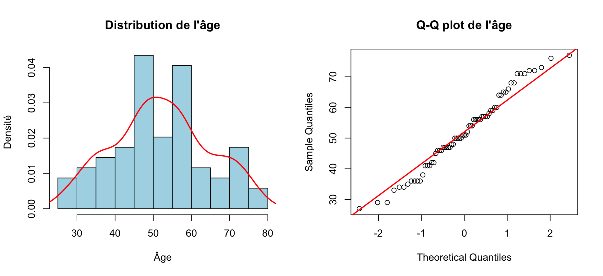{width=960}
:::
:::


-   L'âge semble suivre une distribution approximativement normale. Les tests statistiques de normalité (type Shapiro-Wilk) ont ici un intérêt limité : avec 69 patients, ils peuvent manquer de puissance pour détecter des écarts modestes, tandis que l'inspection graphique reste plus informative.

### Sexe


::: {.cell}

```{.r .cell-code}
plot_sexe_distribution()
```

::: {.cell-output-display}
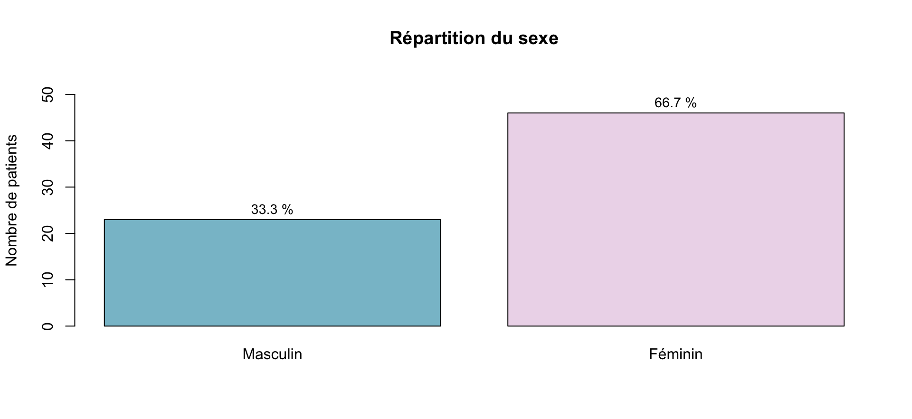{width=960}
:::
:::


-   Même si le camembert est plus visuel, le diagramme en barres est plus précis pour comparer les effectifs et les proportions (car affiche les effectifs totaux).

#### Côté


::: {.cell}

```{.r .cell-code}
plot_cote_distribution()
```

::: {.cell-output-display}
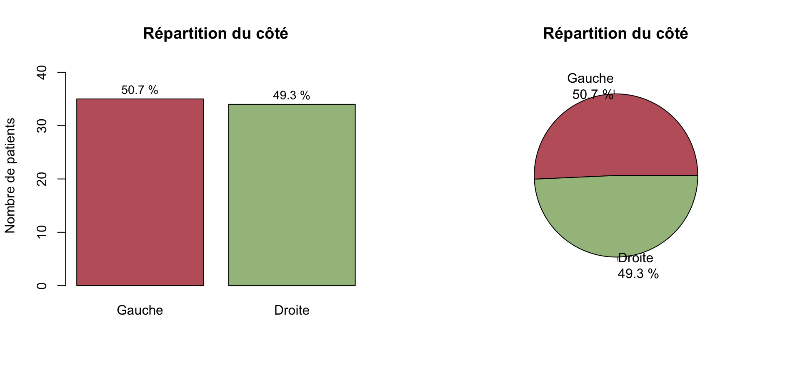{width=960}
:::
:::


#### Niveau


::: {.cell}

```{.r .cell-code}
plot_niveau_distribution()
```

::: {.cell-output-display}
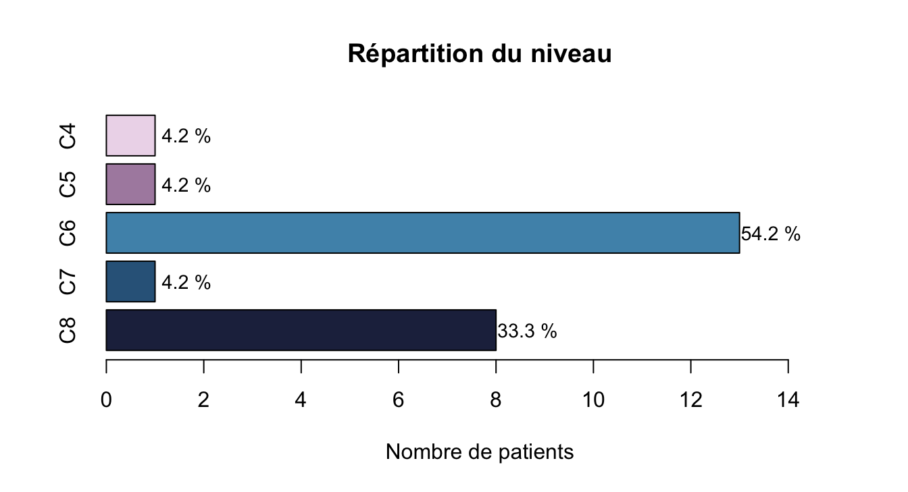{width=672}
:::
:::


#### BMI


```{.r .cell-code}
resume_bmi_table
```

`````{=html}
<table class="table" style="width: auto !important; margin-left: auto; margin-right: auto;">
<caption>Variable BMI</caption>
 <thead>
  <tr>
   <th style="text-align:right;"> Min. </th>
   <th style="text-align:right;"> 1st Qu. </th>
   <th style="text-align:right;"> Median </th>
   <th style="text-align:right;"> Mean </th>
   <th style="text-align:right;"> 3rd Qu. </th>
   <th style="text-align:right;"> Max. </th>
   <th style="text-align:right;"> NA's </th>
  </tr>
 </thead>
<tbody>
  <tr>
   <td style="text-align:right;"> 17 </td>
   <td style="text-align:right;"> 22.75 </td>
   <td style="text-align:right;"> 25 </td>
   <td style="text-align:right;"> 26.4375 </td>
   <td style="text-align:right;"> 30 </td>
   <td style="text-align:right;"> 45 </td>
   <td style="text-align:right;"> 5 </td>
  </tr>
</tbody>
</table>

`````

-   Le `BMI` est renseigné chez 64 patients sur 69.


::: {.cell}

```{.r .cell-code}
par(mfrow = c(1, 2))
hist(
    df$BMI,
    breaks = 10,
    prob = TRUE,
    main = "Distribution du BMI",
    xlab = "BMI",
    ylab = "Densité",
    col = "lightblue"
)
lines(density(df$BMI, na.rm = TRUE), col = "red", lwd = 2)
qqnorm(df$BMI, main = "Q-Q plot du BMI")
qqline(df$BMI, col = "red", lwd = 2)
```

::: {.cell-output-display}
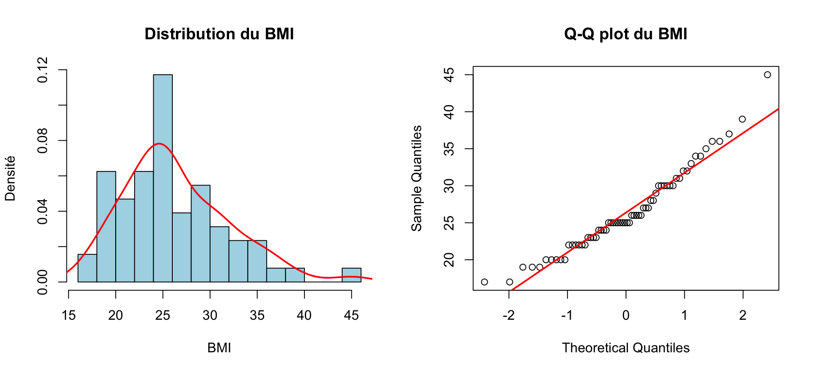{width=960}
:::
:::


#### Tabac


```{.r .cell-code}
kable(
    tabac_summary,
    caption = "Répartition du tabac",
    align = "c"
)
```


Table: Répartition du tabac

| Modalite | Effectif | Pourcentage |
|:--------:|:--------:|:-----------:|
|   Non    |    37    |    57.8     |
|   Oui    |    27    |    42.2     |

-   Le statut tabagique est renseigné chez 64 patients sur 69.


::: {.cell}

```{.r .cell-code}
par(mfrow = c(1, 2))
bar_pos <- barplot(
    c(tabac_non_n, tabac_oui_n),
    names.arg = c("Non", "Oui"),
    main = "Répartition du tabac",
    col = c(nord("frost")[2], nord("aurora")[3]),
    ylab = "Nombre de patients",
    ylim = c(0, max(c(tabac_non_n, tabac_oui_n)) * 1.18)
)
text(
    x = bar_pos,
    y = c(tabac_non_n, tabac_oui_n) + max(c(tabac_non_n, tabac_oui_n)) * 0.05,
    labels = paste0(c(tabac_non_pct, tabac_oui_pct), " %"),
    cex = 0.9
)
pie(
    c(tabac_non_n, tabac_oui_n),
    labels = paste0(c("Non", "Oui"), "\n", c(tabac_non_pct, tabac_oui_pct), " %"),
    main = "Tabac",
    col = c(nord("frost")[2], nord("aurora")[3])
)
```

::: {.cell-output-display}
{width=960}
:::
:::


#### Infiltrations


```{.r .cell-code}
kable(
    infiltration_summary,
    caption = "Répartition du statut d'infiltration",
    align = "c"
)
```


Table: Répartition du statut d'infiltration

| Modalite | Effectif | Pourcentage |
|:--------:|:--------:|:-----------:|
|   Non    |    42    |    61.8     |
|   Oui    |    26    |    38.2     |

-   Le statut d'infiltration est interprétable chez 68 patients sur 69.


::: {.cell}

```{.r .cell-code}
par(mfrow = c(1, 2))
bar_pos <- barplot(
    c(infiltration_non_n, infiltration_oui_n),
    names.arg = c("Non", "Oui"),
    main = "Statut d'infiltration",
    col = c(nord("aurora")[4], nord("frost")[1]),
    ylab = "Nombre de patients",
    ylim = c(0, max(c(infiltration_non_n, infiltration_oui_n)) * 1.18)
)
text(
    x = bar_pos,
    y = c(infiltration_non_n, infiltration_oui_n) + max(c(infiltration_non_n, infiltration_oui_n)) * 0.05,
    labels = paste0(c(infiltration_non_pct, infiltration_oui_pct), " %"),
    cex = 0.9
)
pie(
    c(infiltration_non_n, infiltration_oui_n),
    labels = paste0(c("Non", "Oui"), "\n", c(infiltration_non_pct, infiltration_oui_pct), " %"),
    main = "Infiltrations",
    col = c(nord("aurora")[4], nord("frost")[1])
)
```

::: {.cell-output-display}
{width=960}
:::
:::


#### Résultat des infiltrations


```{.r .cell-code}
kable(
    resultat_inf_summary,
    caption = "Répartition du résultat des infiltrations",
    align = "c"
)
```


Table: Répartition du résultat des infiltrations

| Modalite | Effectif | Pourcentage |
|:--------:|:--------:|:-----------:|
| Negatif  |    5     |    20.8     |
| Positif  |    19    |    79.2     |

-   Parmi les 26 patients ayant eu une infiltration, le résultat est renseigné chez 24.


::: {.cell}

```{.r .cell-code}
bar_pos <- barplot(
    c(resultat_inf_neg_n, resultat_inf_pos_n),
    names.arg = c("Negatif", "Positif"),
    main = "Résultat des infiltrations",
    col = c(nord("aurora")[1], nord("aurora")[3]),
    ylab = "Nombre de patients",
    ylim = c(0, max(c(resultat_inf_neg_n, resultat_inf_pos_n)) * 1.18)
)
text(
    x = bar_pos,
    y = c(resultat_inf_neg_n, resultat_inf_pos_n) + max(c(resultat_inf_neg_n, resultat_inf_pos_n)) * 0.05,
    labels = paste0(c(resultat_inf_neg_pct, resultat_inf_pos_pct), " %"),
    cex = 0.9
)
```

::: {.cell-output-display}
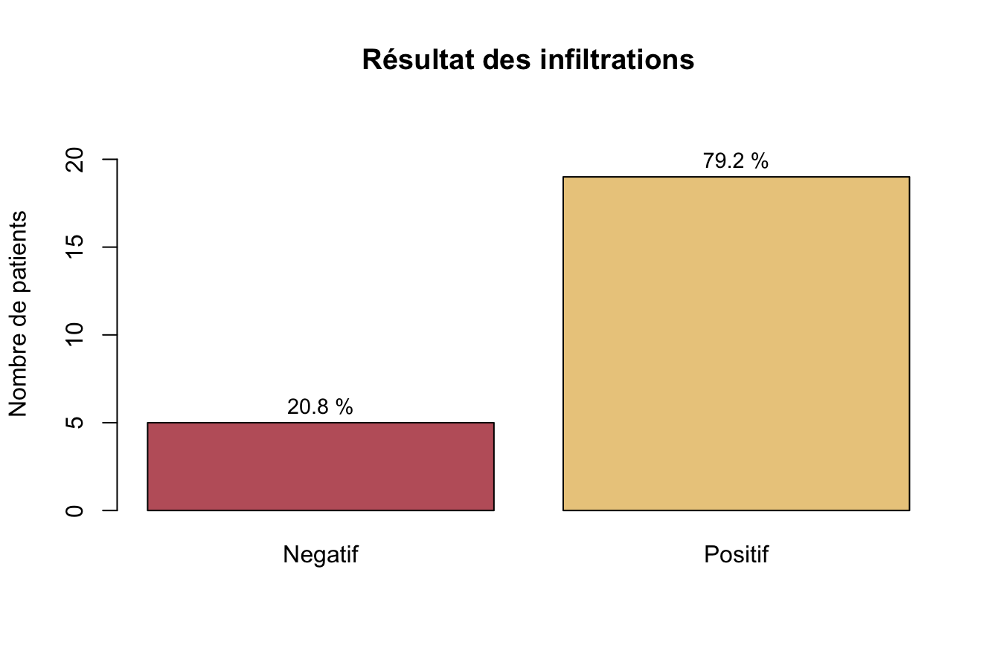{width=672}
:::
:::


\newpage
#### Tableau de caractéristiques initiales


```{.r .cell-code}
baseline_tbl
```

```{=html}
<div id="keuvwhqgtp" style="padding-left:0px;padding-right:0px;padding-top:10px;padding-bottom:10px;overflow-x:auto;overflow-y:auto;width:auto;height:auto;">
<style>#keuvwhqgtp table {
  font-family: system-ui, 'Segoe UI', Roboto, Helvetica, Arial, sans-serif, 'Apple Color Emoji', 'Segoe UI Emoji', 'Segoe UI Symbol', 'Noto Color Emoji';
  -webkit-font-smoothing: antialiased;
  -moz-osx-font-smoothing: grayscale;
}

#keuvwhqgtp thead, #keuvwhqgtp tbody, #keuvwhqgtp tfoot, #keuvwhqgtp tr, #keuvwhqgtp td, #keuvwhqgtp th {
  border-style: none;
}

#keuvwhqgtp p {
  margin: 0;
  padding: 0;
}

#keuvwhqgtp .gt_table {
  display: table;
  border-collapse: collapse;
  line-height: normal;
  margin-left: auto;
  margin-right: auto;
  color: #333333;
  font-size: 16px;
  font-weight: normal;
  font-style: normal;
  background-color: #FFFFFF;
  width: auto;
  border-top-style: solid;
  border-top-width: 2px;
  border-top-color: #A8A8A8;
  border-right-style: none;
  border-right-width: 2px;
  border-right-color: #D3D3D3;
  border-bottom-style: solid;
  border-bottom-width: 2px;
  border-bottom-color: #A8A8A8;
  border-left-style: none;
  border-left-width: 2px;
  border-left-color: #D3D3D3;
}

#keuvwhqgtp .gt_caption {
  padding-top: 4px;
  padding-bottom: 4px;
}

#keuvwhqgtp .gt_title {
  color: #333333;
  font-size: 125%;
  font-weight: initial;
  padding-top: 4px;
  padding-bottom: 4px;
  padding-left: 5px;
  padding-right: 5px;
  border-bottom-color: #FFFFFF;
  border-bottom-width: 0;
}

#keuvwhqgtp .gt_subtitle {
  color: #333333;
  font-size: 85%;
  font-weight: initial;
  padding-top: 3px;
  padding-bottom: 5px;
  padding-left: 5px;
  padding-right: 5px;
  border-top-color: #FFFFFF;
  border-top-width: 0;
}

#keuvwhqgtp .gt_heading {
  background-color: #FFFFFF;
  text-align: center;
  border-bottom-color: #FFFFFF;
  border-left-style: none;
  border-left-width: 1px;
  border-left-color: #D3D3D3;
  border-right-style: none;
  border-right-width: 1px;
  border-right-color: #D3D3D3;
}

#keuvwhqgtp .gt_bottom_border {
  border-bottom-style: solid;
  border-bottom-width: 2px;
  border-bottom-color: #D3D3D3;
}

#keuvwhqgtp .gt_col_headings {
  border-top-style: solid;
  border-top-width: 2px;
  border-top-color: #D3D3D3;
  border-bottom-style: solid;
  border-bottom-width: 2px;
  border-bottom-color: #D3D3D3;
  border-left-style: none;
  border-left-width: 1px;
  border-left-color: #D3D3D3;
  border-right-style: none;
  border-right-width: 1px;
  border-right-color: #D3D3D3;
}

#keuvwhqgtp .gt_col_heading {
  color: #333333;
  background-color: #FFFFFF;
  font-size: 100%;
  font-weight: normal;
  text-transform: inherit;
  border-left-style: none;
  border-left-width: 1px;
  border-left-color: #D3D3D3;
  border-right-style: none;
  border-right-width: 1px;
  border-right-color: #D3D3D3;
  vertical-align: bottom;
  padding-top: 5px;
  padding-bottom: 6px;
  padding-left: 5px;
  padding-right: 5px;
  overflow-x: hidden;
}

#keuvwhqgtp .gt_column_spanner_outer {
  color: #333333;
  background-color: #FFFFFF;
  font-size: 100%;
  font-weight: normal;
  text-transform: inherit;
  padding-top: 0;
  padding-bottom: 0;
  padding-left: 4px;
  padding-right: 4px;
}

#keuvwhqgtp .gt_column_spanner_outer:first-child {
  padding-left: 0;
}

#keuvwhqgtp .gt_column_spanner_outer:last-child {
  padding-right: 0;
}

#keuvwhqgtp .gt_column_spanner {
  border-bottom-style: solid;
  border-bottom-width: 2px;
  border-bottom-color: #D3D3D3;
  vertical-align: bottom;
  padding-top: 5px;
  padding-bottom: 5px;
  overflow-x: hidden;
  display: inline-block;
  width: 100%;
}

#keuvwhqgtp .gt_spanner_row {
  border-bottom-style: hidden;
}

#keuvwhqgtp .gt_group_heading {
  padding-top: 8px;
  padding-bottom: 8px;
  padding-left: 5px;
  padding-right: 5px;
  color: #333333;
  background-color: #FFFFFF;
  font-size: 100%;
  font-weight: initial;
  text-transform: inherit;
  border-top-style: solid;
  border-top-width: 2px;
  border-top-color: #D3D3D3;
  border-bottom-style: solid;
  border-bottom-width: 2px;
  border-bottom-color: #D3D3D3;
  border-left-style: none;
  border-left-width: 1px;
  border-left-color: #D3D3D3;
  border-right-style: none;
  border-right-width: 1px;
  border-right-color: #D3D3D3;
  vertical-align: middle;
  text-align: left;
}

#keuvwhqgtp .gt_empty_group_heading {
  padding: 0.5px;
  color: #333333;
  background-color: #FFFFFF;
  font-size: 100%;
  font-weight: initial;
  border-top-style: solid;
  border-top-width: 2px;
  border-top-color: #D3D3D3;
  border-bottom-style: solid;
  border-bottom-width: 2px;
  border-bottom-color: #D3D3D3;
  vertical-align: middle;
}

#keuvwhqgtp .gt_from_md > :first-child {
  margin-top: 0;
}

#keuvwhqgtp .gt_from_md > :last-child {
  margin-bottom: 0;
}

#keuvwhqgtp .gt_row {
  padding-top: 8px;
  padding-bottom: 8px;
  padding-left: 5px;
  padding-right: 5px;
  margin: 10px;
  border-top-style: solid;
  border-top-width: 1px;
  border-top-color: #D3D3D3;
  border-left-style: none;
  border-left-width: 1px;
  border-left-color: #D3D3D3;
  border-right-style: none;
  border-right-width: 1px;
  border-right-color: #D3D3D3;
  vertical-align: middle;
  overflow-x: hidden;
}

#keuvwhqgtp .gt_stub {
  color: #333333;
  background-color: #FFFFFF;
  font-size: 100%;
  font-weight: initial;
  text-transform: inherit;
  border-right-style: solid;
  border-right-width: 2px;
  border-right-color: #D3D3D3;
  padding-left: 5px;
  padding-right: 5px;
}

#keuvwhqgtp .gt_stub_row_group {
  color: #333333;
  background-color: #FFFFFF;
  font-size: 100%;
  font-weight: initial;
  text-transform: inherit;
  border-right-style: solid;
  border-right-width: 2px;
  border-right-color: #D3D3D3;
  padding-left: 5px;
  padding-right: 5px;
  vertical-align: top;
}

#keuvwhqgtp .gt_row_group_first td {
  border-top-width: 2px;
}

#keuvwhqgtp .gt_row_group_first th {
  border-top-width: 2px;
}

#keuvwhqgtp .gt_summary_row {
  color: #333333;
  background-color: #FFFFFF;
  text-transform: inherit;
  padding-top: 8px;
  padding-bottom: 8px;
  padding-left: 5px;
  padding-right: 5px;
}

#keuvwhqgtp .gt_first_summary_row {
  border-top-style: solid;
  border-top-color: #D3D3D3;
}

#keuvwhqgtp .gt_first_summary_row.thick {
  border-top-width: 2px;
}

#keuvwhqgtp .gt_last_summary_row {
  padding-top: 8px;
  padding-bottom: 8px;
  padding-left: 5px;
  padding-right: 5px;
  border-bottom-style: solid;
  border-bottom-width: 2px;
  border-bottom-color: #D3D3D3;
}

#keuvwhqgtp .gt_grand_summary_row {
  color: #333333;
  background-color: #FFFFFF;
  text-transform: inherit;
  padding-top: 8px;
  padding-bottom: 8px;
  padding-left: 5px;
  padding-right: 5px;
}

#keuvwhqgtp .gt_first_grand_summary_row {
  padding-top: 8px;
  padding-bottom: 8px;
  padding-left: 5px;
  padding-right: 5px;
  border-top-style: double;
  border-top-width: 6px;
  border-top-color: #D3D3D3;
}

#keuvwhqgtp .gt_last_grand_summary_row_top {
  padding-top: 8px;
  padding-bottom: 8px;
  padding-left: 5px;
  padding-right: 5px;
  border-bottom-style: double;
  border-bottom-width: 6px;
  border-bottom-color: #D3D3D3;
}

#keuvwhqgtp .gt_striped {
  background-color: rgba(128, 128, 128, 0.05);
}

#keuvwhqgtp .gt_table_body {
  border-top-style: solid;
  border-top-width: 2px;
  border-top-color: #D3D3D3;
  border-bottom-style: solid;
  border-bottom-width: 2px;
  border-bottom-color: #D3D3D3;
}

#keuvwhqgtp .gt_footnotes {
  color: #333333;
  background-color: #FFFFFF;
  border-bottom-style: none;
  border-bottom-width: 2px;
  border-bottom-color: #D3D3D3;
  border-left-style: none;
  border-left-width: 2px;
  border-left-color: #D3D3D3;
  border-right-style: none;
  border-right-width: 2px;
  border-right-color: #D3D3D3;
}

#keuvwhqgtp .gt_footnote {
  margin: 0px;
  font-size: 90%;
  padding-top: 4px;
  padding-bottom: 4px;
  padding-left: 5px;
  padding-right: 5px;
}

#keuvwhqgtp .gt_sourcenotes {
  color: #333333;
  background-color: #FFFFFF;
  border-bottom-style: none;
  border-bottom-width: 2px;
  border-bottom-color: #D3D3D3;
  border-left-style: none;
  border-left-width: 2px;
  border-left-color: #D3D3D3;
  border-right-style: none;
  border-right-width: 2px;
  border-right-color: #D3D3D3;
}

#keuvwhqgtp .gt_sourcenote {
  font-size: 90%;
  padding-top: 4px;
  padding-bottom: 4px;
  padding-left: 5px;
  padding-right: 5px;
}

#keuvwhqgtp .gt_left {
  text-align: left;
}

#keuvwhqgtp .gt_center {
  text-align: center;
}

#keuvwhqgtp .gt_right {
  text-align: right;
  font-variant-numeric: tabular-nums;
}

#keuvwhqgtp .gt_font_normal {
  font-weight: normal;
}

#keuvwhqgtp .gt_font_bold {
  font-weight: bold;
}

#keuvwhqgtp .gt_font_italic {
  font-style: italic;
}

#keuvwhqgtp .gt_super {
  font-size: 65%;
}

#keuvwhqgtp .gt_footnote_marks {
  font-size: 75%;
  vertical-align: 0.4em;
  position: initial;
}

#keuvwhqgtp .gt_asterisk {
  font-size: 100%;
  vertical-align: 0;
}

#keuvwhqgtp .gt_indent_1 {
  text-indent: 5px;
}

#keuvwhqgtp .gt_indent_2 {
  text-indent: 10px;
}

#keuvwhqgtp .gt_indent_3 {
  text-indent: 15px;
}

#keuvwhqgtp .gt_indent_4 {
  text-indent: 20px;
}

#keuvwhqgtp .gt_indent_5 {
  text-indent: 25px;
}

#keuvwhqgtp .katex-display {
  display: inline-flex !important;
  margin-bottom: 0.75em !important;
}

#keuvwhqgtp div.Reactable > div.rt-table > div.rt-thead > div.rt-tr.rt-tr-group-header > div.rt-th-group:after {
  height: 0px !important;
}
</style>
<table class="gt_table" data-quarto-disable-processing="false" data-quarto-bootstrap="false">
  <thead>
    <tr class="gt_col_headings">
      <th class="gt_col_heading gt_columns_bottom_border gt_left" rowspan="1" colspan="1" scope="col" id="label"><span data-qmd-base64="KipDYXJhY3TDqXJpc3RpcXVlcyoq"><span class='gt_from_md'><strong>Caractéristiques</strong></span></span></th>
      <th class="gt_col_heading gt_columns_bottom_border gt_center" rowspan="1" colspan="1" scope="col" id="stat_0"><span data-qmd-base64="KipOID0gNjkqKg=="><span class='gt_from_md'><strong>N = 69</strong></span></span><span class="gt_footnote_marks" style="white-space:nowrap;font-style:italic;font-weight:normal;line-height:0;"><sup>1</sup></span></th>
    </tr>
  </thead>
  <tbody class="gt_table_body">
    <tr><td headers="label" class="gt_row gt_left">Âge (années)</td>
<td headers="stat_0" class="gt_row gt_center">51 (45, 59)</td></tr>
    <tr><td headers="label" class="gt_row gt_left">BMI (kg/m²)</td>
<td headers="stat_0" class="gt_row gt_center">25.0 (22.5, 30.0)</td></tr>
    <tr><td headers="label" class="gt_row gt_left">Sexe</td>
<td headers="stat_0" class="gt_row gt_center"><br /></td></tr>
    <tr><td headers="label" class="gt_row gt_left">    Masculin</td>
<td headers="stat_0" class="gt_row gt_center">23 (33%)</td></tr>
    <tr><td headers="label" class="gt_row gt_left">    Féminin</td>
<td headers="stat_0" class="gt_row gt_center">46 (67%)</td></tr>
    <tr><td headers="label" class="gt_row gt_left">Côté</td>
<td headers="stat_0" class="gt_row gt_center"><br /></td></tr>
    <tr><td headers="label" class="gt_row gt_left">    Gauche</td>
<td headers="stat_0" class="gt_row gt_center">35 (51%)</td></tr>
    <tr><td headers="label" class="gt_row gt_left">    Droite</td>
<td headers="stat_0" class="gt_row gt_center">34 (49%)</td></tr>
    <tr><td headers="label" class="gt_row gt_left">Niveau</td>
<td headers="stat_0" class="gt_row gt_center"><br /></td></tr>
    <tr><td headers="label" class="gt_row gt_left">    C4</td>
<td headers="stat_0" class="gt_row gt_center">1 (1.4%)</td></tr>
    <tr><td headers="label" class="gt_row gt_left">    C5</td>
<td headers="stat_0" class="gt_row gt_center">10 (14%)</td></tr>
    <tr><td headers="label" class="gt_row gt_left">    C6</td>
<td headers="stat_0" class="gt_row gt_center">27 (39%)</td></tr>
    <tr><td headers="label" class="gt_row gt_left">    C7</td>
<td headers="stat_0" class="gt_row gt_center">21 (30%)</td></tr>
    <tr><td headers="label" class="gt_row gt_left">    C8</td>
<td headers="stat_0" class="gt_row gt_center">10 (14%)</td></tr>
    <tr><td headers="label" class="gt_row gt_left">Tabac actif</td>
<td headers="stat_0" class="gt_row gt_center">27 (42%)</td></tr>
    <tr><td headers="label" class="gt_row gt_left">Infiltrations</td>
<td headers="stat_0" class="gt_row gt_center">26 (38%)</td></tr>
    <tr><td headers="label" class="gt_row gt_left">Résultat des infiltrations</td>
<td headers="stat_0" class="gt_row gt_center">19 (79%)</td></tr>
    <tr><td headers="label" class="gt_row gt_left">Gold Standard positif</td>
<td headers="stat_0" class="gt_row gt_center">45 (65%)</td></tr>
    <tr><td headers="label" class="gt_row gt_left">ULNT1 E1 positif</td>
<td headers="stat_0" class="gt_row gt_center">48 (70%)</td></tr>
    <tr><td headers="label" class="gt_row gt_left">ULNT2a E1 positif</td>
<td headers="stat_0" class="gt_row gt_center">46 (67%)</td></tr>
    <tr><td headers="label" class="gt_row gt_left">ULNT2b E1 positif</td>
<td headers="stat_0" class="gt_row gt_center">39 (57%)</td></tr>
    <tr><td headers="label" class="gt_row gt_left">ULNT3 E1 positif</td>
<td headers="stat_0" class="gt_row gt_center">25 (36%)</td></tr>
  </tbody>
  <tfoot>
    <tr class="gt_footnotes">
      <td class="gt_footnote" colspan="2"><span class="gt_footnote_marks" style="white-space:nowrap;font-style:italic;font-weight:normal;line-height:0;"><sup>1</sup></span> <span data-qmd-base64="TWVkaWFuIChRMSwgUTMpOyBuICglKQ=="><span class='gt_from_md'>Median (Q1, Q3); n (%)</span></span></td>
    </tr>
  </tfoot>
</table>
</div>
```


\newpage

## Performances test par test

-   La première partie de l'analyse est centrée sur les tests cliniques de l'évaluateur 1

-   Elle évalue les performances "tests par tests"

-   Une seconde partie aggrège résultats et graphiques pour une comparaison globale des tests

### ULNT1

#### Résultats


```{.r .cell-code}
kable(
    u1_descriptive,
    caption = "Tableau descriptif des résultats de U1 (évaluateur 1)",
    align = "c",
    col.names = c("Test", "Positif n (%)", "Négatif n (%)")
)
```


Table: Tableau descriptif des résultats de U1 (évaluateur 1)

| Test | Positif n (%) | Négatif n (%) |
|:----:|:-------------:|:-------------:|
|  U1  |  48 (69.6%)   |  21 (30.4%)   |


```{.r .cell-code}
kable(
    u1_contingency,
    caption = "Tableau de contingence de U1 par rapport au gold standard",
    align = "c"
)
```


Table: Tableau de contingence de U1 par rapport au gold standard

|  U1   |     G+     |     G-     |   Total    |
|:-----:|:----------:|:----------:|:----------:|
|  T+   | 39 (56.5%) |  9 (13%)   | 48 (69.6%) |
|  T-   |  6 (8.7%)  | 15 (21.7%) | 21 (30.4%) |
| Total | 45 (65.2%) | 24 (34.8%) | 69 (100%)  |

-   T+/T- correspond à Test positif ou négatif, G+/G- correspond au Gold standard


```{.r .cell-code}
kable(
    u1_effectifs,
    caption = "Effectifs diagnostiques de U1 par rapport au gold standard",
    align = "c"
)
```


Table: Effectifs diagnostiques de U1 par rapport au gold standard

| Test | N  | VP | FN | FP | VN |
|:----:|:--:|:--:|:--:|:--:|:--:|
|  U1  | 69 | 39 | 6  | 9  | 15 |


```{.r .cell-code}
kable(
    u1_performance_summary,
    caption = "Performances diagnostiques de U1 par rapport au gold standard",
    align = "c",
    col.names = c("Test", "Se [IC95]", "Sp [IC95]", "VPP [IC95]", "VPN [IC95]", "LR+", "LR-", "Youden", "AUC [IC95]")
) %>%
    kable_styling(
        latex_options = c("hold_position", "scale_down"),
        full_width = FALSE,
        font_size = 7
    )
```

`````{=html}
<table class="table" style="font-size: 7px; width: auto !important; margin-left: auto; margin-right: auto;">
<caption style="font-size: initial !important;">Performances diagnostiques de U1 par rapport au gold standard</caption>
 <thead>
  <tr>
   <th style="text-align:center;"> Test </th>
   <th style="text-align:center;"> Se [IC95] </th>
   <th style="text-align:center;"> Sp [IC95] </th>
   <th style="text-align:center;"> VPP [IC95] </th>
   <th style="text-align:center;"> VPN [IC95] </th>
   <th style="text-align:center;"> LR+ </th>
   <th style="text-align:center;"> LR- </th>
   <th style="text-align:center;"> Youden </th>
   <th style="text-align:center;"> AUC [IC95] </th>
  </tr>
 </thead>
<tbody>
  <tr>
   <td style="text-align:center;"> U1 </td>
   <td style="text-align:center;"> 0.867 [0.732 ; 0.949] </td>
   <td style="text-align:center;"> 0.625 [0.406 ; 0.812] </td>
   <td style="text-align:center;"> 0.812 [0.674 ; 0.911] </td>
   <td style="text-align:center;"> 0.714 [0.478 ; 0.887] </td>
   <td style="text-align:center;"> 2.31 </td>
   <td style="text-align:center;"> 0.21 </td>
   <td style="text-align:center;"> 0.492 </td>
   <td style="text-align:center;"> 0.746 [0.635 ; 0.857] </td>
  </tr>
</tbody>
</table>

`````

#### Interprétation

-   Lecture des résultats : 
    -   Sensibilité : parmi les patients avec NCB, combien ont un test positif
    -   Spécificité : parmi les patients sans NCB, combien ont un test
    -   VPP : parmi les patients avec un test positif, combien ont une NCB
    -   VPN : parmi les patients avec un test négatif, combien n'ont pas de
    -   LR+ : combien un test positif augmente la probabilité de NCB
    -   LR- : combien un test négatif diminue la probabilité de NCB
    -   Youden : mesure globale de performance (Se + Sp - 1)
    -   AUC : mesure globale de performance (AUC de la courbe ROC). Pas vraiment un bon indicateur pour un test binaire.

-   Interprétation : 
    -   Sensibilité excellente (0.864) : repère bien les patients avec NCB
    -   LR- très bon (0.23) : un test négatif rend la NCB moins probable (utile surtout pour statistiques bayésiennes : probabilité post-test = probabilité pré-test x LR-). Donc si la probabilité pré-test est modérée, un test négatif divise la probabilité par 4 environ. 

\newpage
### ULNT2a

#### Résultats


```{.r .cell-code}
kable(
    u2a_descriptive,
    caption = "Tableau descriptif des résultats de U2a (évaluateur 1)",
    align = "c",
    col.names = c("Test", "Positifs n", "Positifs %", "Négatifs n", "Négatifs %")
)
```


Table: Tableau descriptif des résultats de U2a (évaluateur 1)

| Test | Positifs n | Positifs % | Négatifs n | Négatifs % |
|:----:|:----------:|:----------:|:----------:|:----------:|
| U2a  |     46     |    66.7    |     23     |    33.3    |


```{.r .cell-code}
kable(
    u2a_contingency,
    caption = "Tableau de contingence de U2a par rapport au gold standard",
    align = "c"
)
```


Table: Tableau de contingence de U2a par rapport au gold standard

|  U2a  |     G+     |     G-     |   Total    |
|:-----:|:----------:|:----------:|:----------:|
|  T+   | 36 (52.2%) | 10 (14.5%) | 46 (66.7%) |
|  T-   |  9 (13%)   | 14 (20.3%) | 23 (33.3%) |
| Total | 45 (65.2%) | 24 (34.8%) | 69 (100%)  |


```{.r .cell-code}
kable(
    u2a_effectifs,
    caption = "Effectifs diagnostiques de U2a par rapport au gold standard",
    align = "c"
)
```


Table: Effectifs diagnostiques de U2a par rapport au gold standard

| Test | N  | VP | FN | FP | VN |
|:----:|:--:|:--:|:--:|:--:|:--:|
| U2a  | 69 | 36 | 9  | 10 | 14 |


```{.r .cell-code}
kable(
    u2a_performance_summary,
    caption = "Performances diagnostiques de U2a par rapport au gold standard",
    align = "c",
    col.names = c("Test", "Se [IC95]", "Sp [IC95]", "VPP [IC95]", "VPN [IC95]", "LR+", "LR-", "Youden", "AUC [IC95]")
) %>%
    kable_styling(
        latex_options = c("hold_position", "scale_down"),
        full_width = FALSE,
        font_size = 7
    )
```

`````{=html}
<table class="table" style="font-size: 7px; width: auto !important; margin-left: auto; margin-right: auto;">
<caption style="font-size: initial !important;">Performances diagnostiques de U2a par rapport au gold standard</caption>
 <thead>
  <tr>
   <th style="text-align:center;"> Test </th>
   <th style="text-align:center;"> Se [IC95] </th>
   <th style="text-align:center;"> Sp [IC95] </th>
   <th style="text-align:center;"> VPP [IC95] </th>
   <th style="text-align:center;"> VPN [IC95] </th>
   <th style="text-align:center;"> LR+ </th>
   <th style="text-align:center;"> LR- </th>
   <th style="text-align:center;"> Youden </th>
   <th style="text-align:center;"> AUC [IC95] </th>
  </tr>
 </thead>
<tbody>
  <tr>
   <td style="text-align:center;"> U2a </td>
   <td style="text-align:center;"> 0.8 [0.654 ; 0.904] </td>
   <td style="text-align:center;"> 0.583 [0.366 ; 0.779] </td>
   <td style="text-align:center;"> 0.783 [0.636 ; 0.891] </td>
   <td style="text-align:center;"> 0.609 [0.385 ; 0.803] </td>
   <td style="text-align:center;"> 1.92 </td>
   <td style="text-align:center;"> 0.34 </td>
   <td style="text-align:center;"> 0.383 </td>
   <td style="text-align:center;"> 0.692 [0.575 ; 0.808] </td>
  </tr>
</tbody>
</table>

`````

#### Interprétation

-   Moins sensible que U1, mais aussi moins spécifique. 

-   En témoigne son indice de Youden plus faible que celui de U1, et son LR- moins bon que celui de U1.

\newpage
### ULNT2b

#### Résultats


```{.r .cell-code}
kable(
    u2b_descriptive,
    caption = "Tableau descriptif des résultats de U2b (évaluateur 1)",
    align = "c",
    col.names = c("Test", "Positifs n", "Positifs %", "Négatifs n", "Négatifs %")
)
```


Table: Tableau descriptif des résultats de U2b (évaluateur 1)

| Test | Positifs n | Positifs % | Négatifs n | Négatifs % |
|:----:|:----------:|:----------:|:----------:|:----------:|
| U2b  |     39     |    56.5    |     30     |    43.5    |


```{.r .cell-code}
kable(
    u2b_contingency,
    caption = "Tableau de contingence de U2b par rapport au gold standard",
    align = "c"
)
```


Table: Tableau de contingence de U2b par rapport au gold standard

|  U2b  |     G+     |     G-     |   Total    |
|:-----:|:----------:|:----------:|:----------:|
|  T+   | 31 (44.9%) | 8 (11.6%)  | 39 (56.5%) |
|  T-   | 14 (20.3%) | 16 (23.2%) | 30 (43.5%) |
| Total | 45 (65.2%) | 24 (34.8%) | 69 (100%)  |


```{.r .cell-code}
kable(
    u2b_effectifs,
    caption = "Effectifs diagnostiques de U2b par rapport au gold standard",
    align = "c"
)
```


Table: Effectifs diagnostiques de U2b par rapport au gold standard

| Test | N  | VP | FN | FP | VN |
|:----:|:--:|:--:|:--:|:--:|:--:|
| U2b  | 69 | 31 | 14 | 8  | 16 |


```{.r .cell-code}
kable(
    u2b_performance_summary,
    caption = "Performances diagnostiques de U2b par rapport au gold standard",
    align = "c",
    col.names = c("Test", "Se [IC95]", "Sp [IC95]", "VPP [IC95]", "VPN [IC95]", "LR+", "LR-", "Youden", "AUC [IC95]")
) %>%
    kable_styling(
        latex_options = c("hold_position", "scale_down"),
        full_width = FALSE,
        font_size = 7
    )
```

`````{=html}
<table class="table" style="font-size: 7px; width: auto !important; margin-left: auto; margin-right: auto;">
<caption style="font-size: initial !important;">Performances diagnostiques de U2b par rapport au gold standard</caption>
 <thead>
  <tr>
   <th style="text-align:center;"> Test </th>
   <th style="text-align:center;"> Se [IC95] </th>
   <th style="text-align:center;"> Sp [IC95] </th>
   <th style="text-align:center;"> VPP [IC95] </th>
   <th style="text-align:center;"> VPN [IC95] </th>
   <th style="text-align:center;"> LR+ </th>
   <th style="text-align:center;"> LR- </th>
   <th style="text-align:center;"> Youden </th>
   <th style="text-align:center;"> AUC [IC95] </th>
  </tr>
 </thead>
<tbody>
  <tr>
   <td style="text-align:center;"> U2b </td>
   <td style="text-align:center;"> 0.689 [0.534 ; 0.818] </td>
   <td style="text-align:center;"> 0.667 [0.447 ; 0.844] </td>
   <td style="text-align:center;"> 0.795 [0.635 ; 0.907] </td>
   <td style="text-align:center;"> 0.533 [0.343 ; 0.717] </td>
   <td style="text-align:center;"> 2.07 </td>
   <td style="text-align:center;"> 0.47 </td>
   <td style="text-align:center;"> 0.356 </td>
   <td style="text-align:center;"> 0.678 [0.56 ; 0.796] </td>
  </tr>
</tbody>
</table>

`````

#### Interprétation

-   Profil plus équilibrée entre sensibilité et spécificité que celui de `U2a`, mais il reste moins bon que `U1` pour ne pas manquer les cas. Il est à la fois aussi moins sensible que `U1` mais un peu plus spécifique que U1


\newpage
### ULNT3

#### Résultats


```{.r .cell-code}
kable(
    u3_descriptive,
    caption = "Tableau descriptif des résultats de U3 (évaluateur 1)",
    align = "c",
    col.names = c("Test", "Positifs n", "Positifs %", "Négatifs n", "Négatifs %")
)
```


Table: Tableau descriptif des résultats de U3 (évaluateur 1)

| Test | Positifs n | Positifs % | Négatifs n | Négatifs % |
|:----:|:----------:|:----------:|:----------:|:----------:|
|  U3  |     25     |    36.2    |     44     |    63.8    |


```{.r .cell-code}
kable(
    u3_contingency,
    caption = "Tableau de contingence de U3 par rapport au gold standard",
    align = "c"
)
```


Table: Tableau de contingence de U3 par rapport au gold standard

|  U3   |     G+     |     G-     |   Total    |
|:-----:|:----------:|:----------:|:----------:|
|  T+   | 18 (26.1%) | 7 (10.1%)  | 25 (36.2%) |
|  T-   | 27 (39.1%) | 17 (24.6%) | 44 (63.8%) |
| Total | 45 (65.2%) | 24 (34.8%) | 69 (100%)  |


```{.r .cell-code}
kable(
    u3_effectifs,
    caption = "Effectifs diagnostiques de U3 par rapport au gold standard",
    align = "c"
)
```


Table: Effectifs diagnostiques de U3 par rapport au gold standard

| Test | N  | VP | FN | FP | VN |
|:----:|:--:|:--:|:--:|:--:|:--:|
|  U3  | 69 | 18 | 27 | 7  | 17 |


```{.r .cell-code}
kable(
    u3_performance_summary,
    caption = "Performances diagnostiques de U3 par rapport au gold standard",
    align = "c",
    col.names = c("Test", "Se [IC95]", "Sp [IC95]", "VPP [IC95]", "VPN [IC95]", "LR+", "LR-", "Youden", "AUC [IC95]")
) %>%
    kable_styling(
        latex_options = c("hold_position", "scale_down"),
        full_width = FALSE,
        font_size = 7
    )
```

`````{=html}
<table class="table" style="font-size: 7px; width: auto !important; margin-left: auto; margin-right: auto;">
<caption style="font-size: initial !important;">Performances diagnostiques de U3 par rapport au gold standard</caption>
 <thead>
  <tr>
   <th style="text-align:center;"> Test </th>
   <th style="text-align:center;"> Se [IC95] </th>
   <th style="text-align:center;"> Sp [IC95] </th>
   <th style="text-align:center;"> VPP [IC95] </th>
   <th style="text-align:center;"> VPN [IC95] </th>
   <th style="text-align:center;"> LR+ </th>
   <th style="text-align:center;"> LR- </th>
   <th style="text-align:center;"> Youden </th>
   <th style="text-align:center;"> AUC [IC95] </th>
  </tr>
 </thead>
<tbody>
  <tr>
   <td style="text-align:center;"> U3 </td>
   <td style="text-align:center;"> 0.4 [0.257 ; 0.557] </td>
   <td style="text-align:center;"> 0.708 [0.489 ; 0.874] </td>
   <td style="text-align:center;"> 0.72 [0.506 ; 0.879] </td>
   <td style="text-align:center;"> 0.386 [0.244 ; 0.545] </td>
   <td style="text-align:center;"> 1.37 </td>
   <td style="text-align:center;"> 0.85 </td>
   <td style="text-align:center;"> 0.108 </td>
   <td style="text-align:center;"> 0.554 [0.436 ; 0.672] </td>
  </tr>
</tbody>
</table>

`````

#### Interprétation 
-   Le moins sensible de tous (`Se 0.386`) mais le plus spécifique (`Sp 0.71). 
-   Faible intérêt isolé étant donné son manque de sensibilité 


\newpage
## Synthèse globale des tests


```{.r .cell-code}
kable(
    contingency_tab,
    caption = "Tableau global de contingence des ULNT par rapport au gold standard",
    align = "c"
)
```


Table: Tableau global de contingence des ULNT par rapport au gold standard

| Test | VP | FN | FP | VN | N  |
|:----:|:--:|:--:|:--:|:--:|:--:|
|  U1  | 39 | 6  | 9  | 15 | 69 |
| U2a  | 36 | 9  | 10 | 14 | 69 |
| U2b  | 31 | 14 | 8  | 16 | 69 |
|  U3  | 18 | 27 | 7  | 17 | 69 |


```{.r .cell-code}
kable(
    diag_primary_round,
    caption = "Tableau global des performances diagnostiques des ULNT",
    align = "c",
    col.names = c("Test", "Se [IC95]", "Sp [IC95]", "VPP [IC95]", "VPN [IC95]", "LR+", "LR-", "Youden", "AUC [IC95]")
) %>%
    kable_styling(
        latex_options = c("hold_position", "scale_down"),
        full_width = FALSE,
        font_size = 7
    )
```

`````{=html}
<table class="table" style="font-size: 7px; width: auto !important; margin-left: auto; margin-right: auto;">
<caption style="font-size: initial !important;">Tableau global des performances diagnostiques des ULNT</caption>
 <thead>
  <tr>
   <th style="text-align:center;"> Test </th>
   <th style="text-align:center;"> Se [IC95] </th>
   <th style="text-align:center;"> Sp [IC95] </th>
   <th style="text-align:center;"> VPP [IC95] </th>
   <th style="text-align:center;"> VPN [IC95] </th>
   <th style="text-align:center;"> LR+ </th>
   <th style="text-align:center;"> LR- </th>
   <th style="text-align:center;"> Youden </th>
   <th style="text-align:center;"> AUC [IC95] </th>
  </tr>
 </thead>
<tbody>
  <tr>
   <td style="text-align:center;"> U1 </td>
   <td style="text-align:center;"> 0.867 [0.732 ; 0.949] </td>
   <td style="text-align:center;"> 0.625 [0.406 ; 0.812] </td>
   <td style="text-align:center;"> 0.812 [0.674 ; 0.911] </td>
   <td style="text-align:center;"> 0.714 [0.478 ; 0.887] </td>
   <td style="text-align:center;"> 2.31 </td>
   <td style="text-align:center;"> 0.21 </td>
   <td style="text-align:center;"> 0.492 </td>
   <td style="text-align:center;"> 0.746 [0.635 ; 0.857] </td>
  </tr>
  <tr>
   <td style="text-align:center;"> U2a </td>
   <td style="text-align:center;"> 0.8 [0.654 ; 0.904] </td>
   <td style="text-align:center;"> 0.583 [0.366 ; 0.779] </td>
   <td style="text-align:center;"> 0.783 [0.636 ; 0.891] </td>
   <td style="text-align:center;"> 0.609 [0.385 ; 0.803] </td>
   <td style="text-align:center;"> 1.92 </td>
   <td style="text-align:center;"> 0.34 </td>
   <td style="text-align:center;"> 0.383 </td>
   <td style="text-align:center;"> 0.692 [0.575 ; 0.808] </td>
  </tr>
  <tr>
   <td style="text-align:center;"> U2b </td>
   <td style="text-align:center;"> 0.689 [0.534 ; 0.818] </td>
   <td style="text-align:center;"> 0.667 [0.447 ; 0.844] </td>
   <td style="text-align:center;"> 0.795 [0.635 ; 0.907] </td>
   <td style="text-align:center;"> 0.533 [0.343 ; 0.717] </td>
   <td style="text-align:center;"> 2.07 </td>
   <td style="text-align:center;"> 0.47 </td>
   <td style="text-align:center;"> 0.356 </td>
   <td style="text-align:center;"> 0.678 [0.56 ; 0.796] </td>
  </tr>
  <tr>
   <td style="text-align:center;"> U3 </td>
   <td style="text-align:center;"> 0.4 [0.257 ; 0.557] </td>
   <td style="text-align:center;"> 0.708 [0.489 ; 0.874] </td>
   <td style="text-align:center;"> 0.72 [0.506 ; 0.879] </td>
   <td style="text-align:center;"> 0.386 [0.244 ; 0.545] </td>
   <td style="text-align:center;"> 1.37 </td>
   <td style="text-align:center;"> 0.85 </td>
   <td style="text-align:center;"> 0.108 </td>
   <td style="text-align:center;"> 0.554 [0.436 ; 0.672] </td>
  </tr>
</tbody>
</table>

`````


```{.r .cell-code}
contingency_plot
```

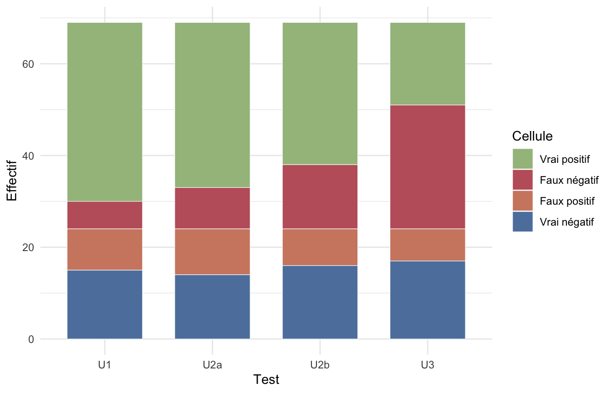{width=672}


::: {.cell}

```{.r .cell-code}
diag_key_plot
```

::: {.cell-output-display}
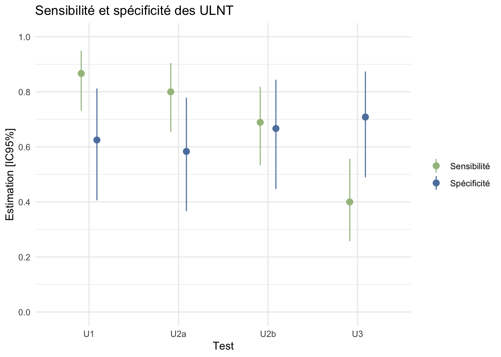{width=672}
:::
:::


Sur les deux graphiques, on voit très bien que : 

-   `ULNT1` est le plus sensible (faux négatif très faible, en rouge sur le premier graphique)

-   `ULNT3` est le plus spécifique (faux positif plus faible, en orange). Même si ça ne se joue pas à grand chose par rapport aux autres !

-   Dans tous les cas, la spécificité est faible

-   Aucun des tests pris isolément n'est à la fois sensible est spécifique

-   La section suivante compare les tests entre eux pour voir si les différences sont statistiquement significatives. Je ne suis pas sûr que ce soit indispensable (on voit bien que les tests ont des profils différents et il n'y a pas besoin d'un petit `p` pour ça), mais c'était prévu dans le protocole ! Ça permet quand même de nuancer les différences observées. 

\newpage
## Comparaisons directes entre tests

Le protocole prévoyait une comparaison des performances diagnostiques entre les différents ULNT.

L'objectif est de comparer les différences diagnostiques entre tests. 

Il s'agit d'effectuer des tests statistiques pour voir si les différences de sensibilité et de spécificité entre les tests sont statistiquement significativies. 

Comme les mêmes patients passent les différents ULNT, une comparaison appariée de type McNemar est plus adaptée qu'un simple khi2 indépendant (McNemar = khi2 pour données appariées).

-   chez les `Gold Standard positif`, on compare les **sensibilités** ;

-   chez les `Gold Standard négatif`, on compare les **spécificités**.


```{.r .cell-code}
pairwise_sensitivity_round <- pairwise_comparison_round %>%
    select(
        Comparaison,
        `N G+`,
        `Se test 1`,
        `Se test 2`,
        `Diff Se`,
        `Discordance G+ (test1 seul / test2 seul)`,
        `p McNemar Se`
    )

pairwise_specificity_round <- pairwise_comparison_round %>%
    select(
        Comparaison,
        `N G-`,
        `Sp test 1`,
        `Sp test 2`,
        `Diff Sp`,
        `Discordance G- (test1 seul / test2 seul)`,
        `p McNemar Sp`
    )

pairwise_sensitivity_table <- kable(
    pairwise_sensitivity_round,
    format = if (knitr::is_latex_output()) {
        "latex"
    } else {
        "html"
    },
    booktabs = knitr::is_latex_output(),
    longtable = knitr::is_latex_output(),
    escape = FALSE,
    caption = "Comparaisons appariees entre ULNT pour la sensibilite (chez les G+)",
    align = c("l", rep("c", 6)),
    col.names = c(
        "Comparaison",
        "N",
        "Test 1",
        "Test 2",
        "Diff.",
        linebreak("Discord.\n(t1 / t2)", align = "c"),
        linebreak("p\nMcNemar", align = "c")
    )
) %>%
    kable_styling(
        latex_options = c("hold_position", "repeat_header", "scale_down"),
        full_width = FALSE,
        font_size = 7
    )

print(pairwise_sensitivity_table)
```

<table class="table" style="font-size: 7px; width: auto !important; margin-left: auto; margin-right: auto;">
<caption style="font-size: initial !important;">Comparaisons appariees entre ULNT pour la sensibilite (chez les G+)</caption>
 <thead>
  <tr>
   <th style="text-align:left;"> Comparaison </th>
   <th style="text-align:center;"> N </th>
   <th style="text-align:center;"> Test 1 </th>
   <th style="text-align:center;"> Test 2 </th>
   <th style="text-align:center;"> Diff. </th>
   <th style="text-align:center;"> \makecell[c]{Discord.\\(t1 / t2)} </th>
   <th style="text-align:center;"> \makecell[c]{p\\McNemar} </th>
  </tr>
 </thead>
<tbody>
  <tr>
   <td style="text-align:left;"> U1 vs U2a </td>
   <td style="text-align:center;"> 45 </td>
   <td style="text-align:center;"> 0.867 </td>
   <td style="text-align:center;"> 0.800 </td>
   <td style="text-align:center;"> 0.067 </td>
   <td style="text-align:center;"> 7 / 4 </td>
   <td style="text-align:center;"> 0.546 </td>
  </tr>
  <tr>
   <td style="text-align:left;"> U1 vs U2b </td>
   <td style="text-align:center;"> 45 </td>
   <td style="text-align:center;"> 0.867 </td>
   <td style="text-align:center;"> 0.689 </td>
   <td style="text-align:center;"> 0.178 </td>
   <td style="text-align:center;"> 12 / 4 </td>
   <td style="text-align:center;"> 0.0801 </td>
  </tr>
  <tr>
   <td style="text-align:left;"> U1 vs U3 </td>
   <td style="text-align:center;"> 45 </td>
   <td style="text-align:center;"> 0.867 </td>
   <td style="text-align:center;"> 0.400 </td>
   <td style="text-align:center;"> 0.467 </td>
   <td style="text-align:center;"> 22 / 1 </td>
   <td style="text-align:center;"> 
  </td>
</tr>
  <tr>
   <td style="text-align:left;"> U2a vs U2b </td>
   <td style="text-align:center;"> 45 </td>
   <td style="text-align:center;"> 0.800 </td>
   <td style="text-align:center;"> 0.689 </td>
   <td style="text-align:center;"> 0.111 </td>
   <td style="text-align:center;"> 8 / 3 </td>
   <td style="text-align:center;"> 0.228 </td>
  </tr>
  <tr>
   <td style="text-align:left;"> U2a vs U3 </td>
   <td style="text-align:center;"> 45 </td>
   <td style="text-align:center;"> 0.800 </td>
   <td style="text-align:center;"> 0.400 </td>
   <td style="text-align:center;"> 0.400 </td>
   <td style="text-align:center;"> 18 / 0 </td>
   <td style="text-align:center;"> 
  </td>
</tr>
  <tr>
   <td style="text-align:left;"> U2b vs U3 </td>
   <td style="text-align:center;"> 45 </td>
   <td style="text-align:center;"> 0.689 </td>
   <td style="text-align:center;"> 0.400 </td>
   <td style="text-align:center;"> 0.289 </td>
   <td style="text-align:center;"> 18 / 5 </td>
   <td style="text-align:center;"> 0.0123 </td>
  </tr>
</tbody>
</table>


```{.r .cell-code}
pairwise_specificity_table <- kable(
    pairwise_specificity_round,
    format = if (knitr::is_latex_output()) {
        "latex"
    } else {
        "html"
    },
    booktabs = knitr::is_latex_output(),
    longtable = knitr::is_latex_output(),
    escape = FALSE,
    caption = "Comparaisons appariees entre ULNT pour la specificite (chez les G-)",
    align = c("l", rep("c", 6)),
    col.names = c(
        "Comparaison",
        "N",
        "Test 1",
        "Test 2",
        "Diff.",
        linebreak("Discord.\n(t1 / t2)", align = "c"),
        linebreak("p\nMcNemar", align = "c")
    )
) %>%
    kable_styling(
        latex_options = c("hold_position", "repeat_header", "scale_down"),
        full_width = FALSE,
        font_size = 7
    )

print(pairwise_specificity_table)
```

<table class="table" style="font-size: 7px; width: auto !important; margin-left: auto; margin-right: auto;">
<caption style="font-size: initial !important;">Comparaisons appariees entre ULNT pour la specificite (chez les G-)</caption>
 <thead>
  <tr>
   <th style="text-align:left;"> Comparaison </th>
   <th style="text-align:center;"> N </th>
   <th style="text-align:center;"> Test 1 </th>
   <th style="text-align:center;"> Test 2 </th>
   <th style="text-align:center;"> Diff. </th>
   <th style="text-align:center;"> \makecell[c]{Discord.\\(t1 / t2)} </th>
   <th style="text-align:center;"> \makecell[c]{p\\McNemar} </th>
  </tr>
 </thead>
<tbody>
  <tr>
   <td style="text-align:left;"> U1 vs U2a </td>
   <td style="text-align:center;"> 24 </td>
   <td style="text-align:center;"> 0.625 </td>
   <td style="text-align:center;"> 0.583 </td>
   <td style="text-align:center;"> 0.042 </td>
   <td style="text-align:center;"> 1 / 0 </td>
   <td style="text-align:center;"> 1 </td>
  </tr>
  <tr>
   <td style="text-align:left;"> U1 vs U2b </td>
   <td style="text-align:center;"> 24 </td>
   <td style="text-align:center;"> 0.625 </td>
   <td style="text-align:center;"> 0.667 </td>
   <td style="text-align:center;"> -0.042 </td>
   <td style="text-align:center;"> 2 / 3 </td>
   <td style="text-align:center;"> 1 </td>
  </tr>
  <tr>
   <td style="text-align:left;"> U1 vs U3 </td>
   <td style="text-align:center;"> 24 </td>
   <td style="text-align:center;"> 0.625 </td>
   <td style="text-align:center;"> 0.708 </td>
   <td style="text-align:center;"> -0.083 </td>
   <td style="text-align:center;"> 0 / 2 </td>
   <td style="text-align:center;"> 0.48 </td>
  </tr>
  <tr>
   <td style="text-align:left;"> U2a vs U2b </td>
   <td style="text-align:center;"> 24 </td>
   <td style="text-align:center;"> 0.583 </td>
   <td style="text-align:center;"> 0.667 </td>
   <td style="text-align:center;"> -0.083 </td>
   <td style="text-align:center;"> 2 / 4 </td>
   <td style="text-align:center;"> 0.683 </td>
  </tr>
  <tr>
   <td style="text-align:left;"> U2a vs U3 </td>
   <td style="text-align:center;"> 24 </td>
   <td style="text-align:center;"> 0.583 </td>
   <td style="text-align:center;"> 0.708 </td>
   <td style="text-align:center;"> -0.125 </td>
   <td style="text-align:center;"> 0 / 3 </td>
   <td style="text-align:center;"> 0.248 </td>
  </tr>
  <tr>
   <td style="text-align:left;"> U2b vs U3 </td>
   <td style="text-align:center;"> 24 </td>
   <td style="text-align:center;"> 0.667 </td>
   <td style="text-align:center;"> 0.708 </td>
   <td style="text-align:center;"> -0.042 </td>
   <td style="text-align:center;"> 2 / 3 </td>
   <td style="text-align:center;"> 1 </td>
  </tr>
</tbody>
</table>

Même conclusions que les graphiques précédents. 

Concernant le sensibilité : 

-   `ULNT1`, `ULNT2a` et `ULNT2b` sont significativement plus sensibles que `ULNT3`

-   Aucun test ne se démarque sur la spécificité. 

\newpage
## Reproductibilité inter-évaluateurs

Par interprétation d'un coefficient de Kappa de Cohen selon les seuils de Landis & Koch (1977) [@landisMeasurementObserverAgreement1977]

Le coefficient de Kappa de Cohen correspond à la concordance corrigée entre deux évaluateurs, c'est à dire le pourcentage d'accord entre les évaluateurs corrigé par le taux d'accord attendu par hasard (le taux attendu par hasard correspond à la probabilité que les deux évaluateurs soient d'accord simplement par hasard, en fonction de la distribution des réponses).


::: {.cell}

```{.r .cell-code}
kable(
    kappa_round,
    format = if (knitr::is_latex_output()) {
      "latex"
    } else if (knitr::is_html_output()) {
      "html"
    } else {
      "pipe"
    },
    booktabs = TRUE,
    align = "c",
    caption = "Inter-observer agreement for each ultrasound test"
)
```

::: {.cell-output-display}
`````{=html}
<table>
<caption>Inter-observer agreement for each ultrasound test</caption>
 <thead>
  <tr>
   <th style="text-align:center;"> Test </th>
   <th style="text-align:center;"> N </th>
   <th style="text-align:center;"> Accord </th>
   <th style="text-align:center;"> Kappa </th>
   <th style="text-align:center;"> IC95% bas </th>
   <th style="text-align:center;"> IC95% haut </th>
   <th style="text-align:center;"> Interpretation </th>
  </tr>
 </thead>
<tbody>
  <tr>
   <td style="text-align:center;"> U1 </td>
   <td style="text-align:center;"> 60 </td>
   <td style="text-align:center;"> 0.883 </td>
   <td style="text-align:center;"> 0.683 </td>
   <td style="text-align:center;"> 0.467 </td>
   <td style="text-align:center;"> 0.899 </td>
   <td style="text-align:center;"> substantielle </td>
  </tr>
  <tr>
   <td style="text-align:center;"> U2a </td>
   <td style="text-align:center;"> 60 </td>
   <td style="text-align:center;"> 0.833 </td>
   <td style="text-align:center;"> 0.604 </td>
   <td style="text-align:center;"> 0.383 </td>
   <td style="text-align:center;"> 0.824 </td>
   <td style="text-align:center;"> substantielle </td>
  </tr>
  <tr>
   <td style="text-align:center;"> U2b </td>
   <td style="text-align:center;"> 60 </td>
   <td style="text-align:center;"> 0.817 </td>
   <td style="text-align:center;"> 0.593 </td>
   <td style="text-align:center;"> 0.377 </td>
   <td style="text-align:center;"> 0.808 </td>
   <td style="text-align:center;"> moderee </td>
  </tr>
  <tr>
   <td style="text-align:center;"> U3 </td>
   <td style="text-align:center;"> 60 </td>
   <td style="text-align:center;"> 0.817 </td>
   <td style="text-align:center;"> 0.625 </td>
   <td style="text-align:center;"> 0.425 </td>
   <td style="text-align:center;"> 0.825 </td>
   <td style="text-align:center;"> substantielle </td>
  </tr>
</tbody>
</table>

`````
:::
:::


::: {.cell}

```{.r .cell-code}
kappa_plot
```

::: {.cell-output-display}
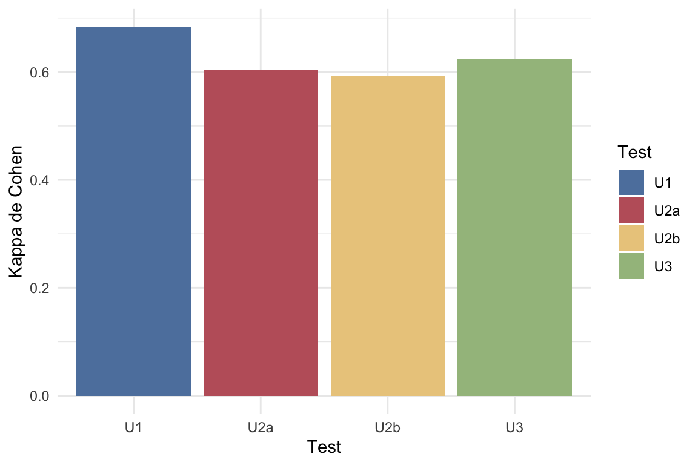{#fig-kappa-interobserver width=576}
:::
:::


Interprétation : Accord substantiel à modéré pour tous les tests. `ULNT1` est le plus reproductible.

-   < 0 : pas d'accord
-   0.00–0.20 : accord faible
-   0.21–0.40 : accord passable
-   0.41–0.60 : accord modéré
-   0.61–0.80 : accord substantiel
-   0.81–1.00 : accord presque parfait

\newpage
## Combinaisons et score de positivité ULNT

Le protocole prévoyait une exploration des associations entre tests. 

2 approches sont possibles : 

-   Des combinaisons "conjonctives" : combinaisons exactes de 2 à 4 tests, pour lesquelles le résultat est positif seulement si **tous** les tests de la combinaison sont positifs ;

-   Un "score de positivité", qui correspond simplement au **nombre total** de tests positifs, puis à des seuils du type `≥1`, `≥2`, `≥3` ou `=4`.

Exemple : `≥2 positifs` correspond à aux moins 2 tests quelqu'ils soient, alors qu'une combinaison conjonctive `U2b + U3` impose précisément quels tests doivent être positifs. 

### Combinaisons conjonctives prédéfinies

-   Combinaison la plus sensible : `ULNT1` seul (`Se 0.864`, `Sp 0.60`). 

-   Combinaison la plus spécifique : 4 combinaisons à égalité à `Sp 0.792` dont le point commun est de toutes contenir `ULNT2b` et `ULNT3`. La combinaison retenue pour la meilleure spécificité est `ULNT2b` et `ULNT3` car elle conserve la meilleure sensibilité parmi les ex aequo (`Se 0.289`), puis la meilleure parcimonie (2 tests au lieu de 3 ou 4).


```{.r .cell-code}
combination_all_round %>%
  kable(
    format = if (knitr::is_latex_output()) {
      "latex"
    } else if (knitr::is_html_output()) {
      "html"
    } else {
      "pipe"
    },
    booktabs = TRUE,
    align = "c",
    digits = 3,
    caption = "Combinaisons des ULNT avec définition positive conjonctive"
  ) %>%
  kable_styling(
    latex_options = c("hold_position", "repeat_header", "scale_down"),
    full_width = FALSE,
    font_size = 7
  )
```

`````{=html}
<table class="table" style="font-size: 7px; width: auto !important; margin-left: auto; margin-right: auto;">
<caption style="font-size: initial !important;">Combinaisons des ULNT avec définition positive conjonctive</caption>
 <thead>
  <tr>
   <th style="text-align:center;"> Combinaison </th>
   <th style="text-align:center;"> Nombre de tests </th>
   <th style="text-align:center;"> N analyse </th>
   <th style="text-align:center;"> Se [IC95%] </th>
   <th style="text-align:center;"> Sp [IC95%] </th>
   <th style="text-align:center;"> VPP [IC95%] </th>
   <th style="text-align:center;"> VPN [IC95%] </th>
   <th style="text-align:center;"> LR+ </th>
   <th style="text-align:center;"> LR- </th>
   <th style="text-align:center;"> Youden </th>
  </tr>
 </thead>
<tbody>
  <tr>
   <td style="text-align:center;"> U1 </td>
   <td style="text-align:center;"> 1 </td>
   <td style="text-align:center;"> 69 </td>
   <td style="text-align:center;"> 0.867 [0.732 ; 0.949] </td>
   <td style="text-align:center;"> 0.625 [0.406 ; 0.812] </td>
   <td style="text-align:center;"> 0.812 [0.674 ; 0.911] </td>
   <td style="text-align:center;"> 0.714 [0.478 ; 0.887] </td>
   <td style="text-align:center;"> 2.31 </td>
   <td style="text-align:center;"> 0.21 </td>
   <td style="text-align:center;"> 0.492 </td>
  </tr>
  <tr>
   <td style="text-align:center;"> U2a </td>
   <td style="text-align:center;"> 1 </td>
   <td style="text-align:center;"> 69 </td>
   <td style="text-align:center;"> 0.8 [0.654 ; 0.904] </td>
   <td style="text-align:center;"> 0.583 [0.366 ; 0.779] </td>
   <td style="text-align:center;"> 0.783 [0.636 ; 0.891] </td>
   <td style="text-align:center;"> 0.609 [0.385 ; 0.803] </td>
   <td style="text-align:center;"> 1.92 </td>
   <td style="text-align:center;"> 0.34 </td>
   <td style="text-align:center;"> 0.383 </td>
  </tr>
  <tr>
   <td style="text-align:center;"> U2a + U2b </td>
   <td style="text-align:center;"> 2 </td>
   <td style="text-align:center;"> 69 </td>
   <td style="text-align:center;"> 0.622 [0.465 ; 0.762] </td>
   <td style="text-align:center;"> 0.75 [0.533 ; 0.902] </td>
   <td style="text-align:center;"> 0.824 [0.655 ; 0.932] </td>
   <td style="text-align:center;"> 0.514 [0.34 ; 0.686] </td>
   <td style="text-align:center;"> 2.49 </td>
   <td style="text-align:center;"> 0.50 </td>
   <td style="text-align:center;"> 0.372 </td>
  </tr>
  <tr>
   <td style="text-align:center;"> U2b </td>
   <td style="text-align:center;"> 1 </td>
   <td style="text-align:center;"> 69 </td>
   <td style="text-align:center;"> 0.689 [0.534 ; 0.818] </td>
   <td style="text-align:center;"> 0.667 [0.447 ; 0.844] </td>
   <td style="text-align:center;"> 0.795 [0.635 ; 0.907] </td>
   <td style="text-align:center;"> 0.533 [0.343 ; 0.717] </td>
   <td style="text-align:center;"> 2.07 </td>
   <td style="text-align:center;"> 0.47 </td>
   <td style="text-align:center;"> 0.356 </td>
  </tr>
  <tr>
   <td style="text-align:center;"> U1 + U2b </td>
   <td style="text-align:center;"> 2 </td>
   <td style="text-align:center;"> 69 </td>
   <td style="text-align:center;"> 0.6 [0.443 ; 0.743] </td>
   <td style="text-align:center;"> 0.75 [0.533 ; 0.902] </td>
   <td style="text-align:center;"> 0.818 [0.645 ; 0.93] </td>
   <td style="text-align:center;"> 0.5 [0.329 ; 0.671] </td>
   <td style="text-align:center;"> 2.40 </td>
   <td style="text-align:center;"> 0.53 </td>
   <td style="text-align:center;"> 0.350 </td>
  </tr>
  <tr>
   <td style="text-align:center;"> U1 + U2a </td>
   <td style="text-align:center;"> 2 </td>
   <td style="text-align:center;"> 69 </td>
   <td style="text-align:center;"> 0.711 [0.557 ; 0.836] </td>
   <td style="text-align:center;"> 0.625 [0.406 ; 0.812] </td>
   <td style="text-align:center;"> 0.78 [0.624 ; 0.894] </td>
   <td style="text-align:center;"> 0.536 [0.339 ; 0.725] </td>
   <td style="text-align:center;"> 1.90 </td>
   <td style="text-align:center;"> 0.46 </td>
   <td style="text-align:center;"> 0.336 </td>
  </tr>
  <tr>
   <td style="text-align:center;"> U1 + U2a + U2b </td>
   <td style="text-align:center;"> 3 </td>
   <td style="text-align:center;"> 69 </td>
   <td style="text-align:center;"> 0.533 [0.379 ; 0.683] </td>
   <td style="text-align:center;"> 0.75 [0.533 ; 0.902] </td>
   <td style="text-align:center;"> 0.8 [0.614 ; 0.923] </td>
   <td style="text-align:center;"> 0.462 [0.301 ; 0.628] </td>
   <td style="text-align:center;"> 2.13 </td>
   <td style="text-align:center;"> 0.62 </td>
   <td style="text-align:center;"> 0.283 </td>
  </tr>
  <tr>
   <td style="text-align:center;"> U3 </td>
   <td style="text-align:center;"> 1 </td>
   <td style="text-align:center;"> 69 </td>
   <td style="text-align:center;"> 0.4 [0.257 ; 0.557] </td>
   <td style="text-align:center;"> 0.708 [0.489 ; 0.874] </td>
   <td style="text-align:center;"> 0.72 [0.506 ; 0.879] </td>
   <td style="text-align:center;"> 0.386 [0.244 ; 0.545] </td>
   <td style="text-align:center;"> 1.37 </td>
   <td style="text-align:center;"> 0.85 </td>
   <td style="text-align:center;"> 0.108 </td>
  </tr>
  <tr>
   <td style="text-align:center;"> U2a + U3 </td>
   <td style="text-align:center;"> 2 </td>
   <td style="text-align:center;"> 69 </td>
   <td style="text-align:center;"> 0.4 [0.257 ; 0.557] </td>
   <td style="text-align:center;"> 0.708 [0.489 ; 0.874] </td>
   <td style="text-align:center;"> 0.72 [0.506 ; 0.879] </td>
   <td style="text-align:center;"> 0.386 [0.244 ; 0.545] </td>
   <td style="text-align:center;"> 1.37 </td>
   <td style="text-align:center;"> 0.85 </td>
   <td style="text-align:center;"> 0.108 </td>
  </tr>
  <tr>
   <td style="text-align:center;"> U1 + U3 </td>
   <td style="text-align:center;"> 2 </td>
   <td style="text-align:center;"> 69 </td>
   <td style="text-align:center;"> 0.378 [0.238 ; 0.535] </td>
   <td style="text-align:center;"> 0.708 [0.489 ; 0.874] </td>
   <td style="text-align:center;"> 0.708 [0.489 ; 0.874] </td>
   <td style="text-align:center;"> 0.378 [0.238 ; 0.535] </td>
   <td style="text-align:center;"> 1.30 </td>
   <td style="text-align:center;"> 0.88 </td>
   <td style="text-align:center;"> 0.086 </td>
  </tr>
  <tr>
   <td style="text-align:center;"> U1 + U2a + U3 </td>
   <td style="text-align:center;"> 3 </td>
   <td style="text-align:center;"> 69 </td>
   <td style="text-align:center;"> 0.378 [0.238 ; 0.535] </td>
   <td style="text-align:center;"> 0.708 [0.489 ; 0.874] </td>
   <td style="text-align:center;"> 0.708 [0.489 ; 0.874] </td>
   <td style="text-align:center;"> 0.378 [0.238 ; 0.535] </td>
   <td style="text-align:center;"> 1.30 </td>
   <td style="text-align:center;"> 0.88 </td>
   <td style="text-align:center;"> 0.086 </td>
  </tr>
  <tr>
   <td style="text-align:center;"> U2b + U3 </td>
   <td style="text-align:center;"> 2 </td>
   <td style="text-align:center;"> 69 </td>
   <td style="text-align:center;"> 0.289 [0.164 ; 0.443] </td>
   <td style="text-align:center;"> 0.792 [0.578 ; 0.929] </td>
   <td style="text-align:center;"> 0.722 [0.465 ; 0.903] </td>
   <td style="text-align:center;"> 0.373 [0.241 ; 0.519] </td>
   <td style="text-align:center;"> 1.39 </td>
   <td style="text-align:center;"> 0.90 </td>
   <td style="text-align:center;"> 0.081 </td>
  </tr>
  <tr>
   <td style="text-align:center;"> U2a + U2b + U3 </td>
   <td style="text-align:center;"> 3 </td>
   <td style="text-align:center;"> 69 </td>
   <td style="text-align:center;"> 0.289 [0.164 ; 0.443] </td>
   <td style="text-align:center;"> 0.792 [0.578 ; 0.929] </td>
   <td style="text-align:center;"> 0.722 [0.465 ; 0.903] </td>
   <td style="text-align:center;"> 0.373 [0.241 ; 0.519] </td>
   <td style="text-align:center;"> 1.39 </td>
   <td style="text-align:center;"> 0.90 </td>
   <td style="text-align:center;"> 0.081 </td>
  </tr>
  <tr>
   <td style="text-align:center;"> U1 + U2b + U3 </td>
   <td style="text-align:center;"> 3 </td>
   <td style="text-align:center;"> 69 </td>
   <td style="text-align:center;"> 0.267 [0.146 ; 0.419] </td>
   <td style="text-align:center;"> 0.792 [0.578 ; 0.929] </td>
   <td style="text-align:center;"> 0.706 [0.44 ; 0.897] </td>
   <td style="text-align:center;"> 0.365 [0.236 ; 0.51] </td>
   <td style="text-align:center;"> 1.28 </td>
   <td style="text-align:center;"> 0.93 </td>
   <td style="text-align:center;"> 0.058 </td>
  </tr>
  <tr>
   <td style="text-align:center;"> U1 + U2a + U2b + U3 </td>
   <td style="text-align:center;"> 4 </td>
   <td style="text-align:center;"> 69 </td>
   <td style="text-align:center;"> 0.267 [0.146 ; 0.419] </td>
   <td style="text-align:center;"> 0.792 [0.578 ; 0.929] </td>
   <td style="text-align:center;"> 0.706 [0.44 ; 0.897] </td>
   <td style="text-align:center;"> 0.365 [0.236 ; 0.51] </td>
   <td style="text-align:center;"> 1.28 </td>
   <td style="text-align:center;"> 0.93 </td>
   <td style="text-align:center;"> 0.058 </td>
  </tr>
</tbody>
</table>

`````

\FloatBarrier

\newpage
### "Score de positivité" : performances selon le nombre de tests positifs

L'objectif ici est de calculer les performances diagnostiques (sensibilité, spécificité, LR+, LR-, Youden, DOR) pour différents seuils de score (`≥1`, `≥2`, `≥3`, `≥4` tests positifs). 

Cela revient à demander si un seuil du type "au moins 2 tests positifs" est plus utile qu'un test isolé. Cette logique reste différente de celle des combinaisons conjonctives : `≥3 positifs` ne précise pas quels tests sont positifs, alors que `U2b + U3` impose une paire fixe de tests positifs.

Le score correspond simplement au **nombre de tests ULNT positifs** chez un même patient ; un test peut donc être très spécifique pris isolément, mais modifie peu le score si les rares patients qu'il rend positifs le sont déjà par d'autres ULNT.


::: {.cell}

```{.r .cell-code}
score_summary_table %>%
  kable(
    format = if (knitr::is_latex_output()) {
      "latex"
    } else if (knitr::is_html_output()) {
      "html"
    } else {
      "pipe"
    },
    booktabs = TRUE,
    align = "c",
    digits = 3,
    caption = "Performances diagnostiques selon le seuil du score"
  ) %>%
  kable_styling(
    latex_options = c("hold_position", "scale_down"),
    full_width = FALSE,
    font_size = 7
  )
```

::: {.cell-output-display}
`````{=html}
<table class="table" style="font-size: 7px; width: auto !important; margin-left: auto; margin-right: auto;">
<caption style="font-size: initial !important;">Performances diagnostiques selon le seuil du score</caption>
 <thead>
  <tr>
   <th style="text-align:center;"> Seuil </th>
   <th style="text-align:center;"> Se [IC95%] </th>
   <th style="text-align:center;"> Sp [IC95%] </th>
   <th style="text-align:center;"> LR+ </th>
   <th style="text-align:center;"> LR- </th>
   <th style="text-align:center;"> Youden </th>
   <th style="text-align:center;"> DOR [IC95%] </th>
  </tr>
 </thead>
<tbody>
  <tr>
   <td style="text-align:center;"> &gt;=1 positif </td>
   <td style="text-align:center;"> 0.956 [0.849 ; 0.995] </td>
   <td style="text-align:center;"> 0.5 [0.291 ; 0.709] </td>
   <td style="text-align:center;"> 1.911 </td>
   <td style="text-align:center;"> 0.089 </td>
   <td style="text-align:center;"> 0.456 </td>
   <td style="text-align:center;"> 21.5 [4.221 ; 109.512] </td>
  </tr>
  <tr>
   <td style="text-align:center;"> &gt;=2 positifs </td>
   <td style="text-align:center;"> 0.867 [0.732 ; 0.949] </td>
   <td style="text-align:center;"> 0.625 [0.406 ; 0.812] </td>
   <td style="text-align:center;"> 2.311 </td>
   <td style="text-align:center;"> 0.213 </td>
   <td style="text-align:center;"> 0.492 </td>
   <td style="text-align:center;"> 10.833 [3.288 ; 35.693] </td>
  </tr>
  <tr>
   <td style="text-align:center;"> &gt;=3 positifs </td>
   <td style="text-align:center;"> 0.667 [0.51 ; 0.8] </td>
   <td style="text-align:center;"> 0.667 [0.447 ; 0.844] </td>
   <td style="text-align:center;"> 2.000 </td>
   <td style="text-align:center;"> 0.500 </td>
   <td style="text-align:center;"> 0.333 </td>
   <td style="text-align:center;"> 4 [1.398 ; 11.441] </td>
  </tr>
  <tr>
   <td style="text-align:center;"> &gt;=4 positifs </td>
   <td style="text-align:center;"> 0.267 [0.146 ; 0.419] </td>
   <td style="text-align:center;"> 0.792 [0.578 ; 0.929] </td>
   <td style="text-align:center;"> 1.280 </td>
   <td style="text-align:center;"> 0.926 </td>
   <td style="text-align:center;"> 0.058 </td>
   <td style="text-align:center;"> 1.382 [0.422 ; 4.525] </td>
  </tr>
</tbody>
</table>

`````
:::
:::


\FloatBarrier

NB : *Le **DOR** (diagnostic odds ratio) résume en un seul chiffre la capacité globale du score à distinguer les patients `G+` des `G-` (se calcule en faisant le rapport entre le LR+ et le LR-), mais il reste ici secondaire car moins intuitif cliniquement que la sensibilité, la spécificité et les rapports de vraisemblance. En plus, les IC du DOR sont ici très larges et se chevauchent largement, donc ils ne sont pas vraiment interprétables.*

Pour interpréter ces résultats, on peut raisonner **par addition** sans imposer d'ordre entre les tests : on calcule, pour chaque seuil, la **contribution moyenne** de chaque test quand on l'ajoute à toutes les combinaisons possibles des autres tests.

-   Dans le tableau de sensibilité, chaque case correspond à : `gain moyen de sensibilité (+ΔSe)` apporté par le test.

-   Dans le second tableau, chaque case correspond à : `diminution moyenne de la specificite (-ΔSp)` imputable au test.


::: {.cell}

```{.r .cell-code}
score_contribution_sensitivity_table %>%
  kable(
    format = if (knitr::is_latex_output()) {
      "latex"
    } else if (knitr::is_html_output()) {
      "html"
    } else {
      "pipe"
    },
    booktabs = TRUE,
    align = "c",
    caption = "Contribution moyenne de chaque test a la sensibilite du score : gain de Se (+ΔSe)"
  ) %>%
  kable_styling(
    latex_options = c("hold_position", "scale_down"),
    full_width = FALSE,
    font_size = 7
  )
```

::: {.cell-output-display}
`````{=html}
<table class="table" style="font-size: 7px; width: auto !important; margin-left: auto; margin-right: auto;">
<caption style="font-size: initial !important;">Contribution moyenne de chaque test a la sensibilite du score : gain de Se (+ΔSe)</caption>
 <thead>
  <tr>
   <th style="text-align:center;"> Seuil </th>
   <th style="text-align:center;"> ULNT1 </th>
   <th style="text-align:center;"> ULNT2a </th>
   <th style="text-align:center;"> ULNT2b </th>
   <th style="text-align:center;"> ULNT3 </th>
  </tr>
 </thead>
<tbody>
  <tr>
   <td style="text-align:center;"> &gt;=1 positif </td>
   <td style="text-align:center;"> +0.348 </td>
   <td style="text-align:center;"> +0.267 </td>
   <td style="text-align:center;"> +0.230 </td>
   <td style="text-align:center;"> +0.111 </td>
  </tr>
  <tr>
   <td style="text-align:center;"> &gt;=2 positifs </td>
   <td style="text-align:center;"> +0.259 </td>
   <td style="text-align:center;"> +0.267 </td>
   <td style="text-align:center;"> +0.230 </td>
   <td style="text-align:center;"> +0.111 </td>
  </tr>
  <tr>
   <td style="text-align:center;"> &gt;=3 positifs </td>
   <td style="text-align:center;"> +0.193 </td>
   <td style="text-align:center;"> +0.200 </td>
   <td style="text-align:center;"> +0.163 </td>
   <td style="text-align:center;"> +0.111 </td>
  </tr>
  <tr>
   <td style="text-align:center;"> &gt;=4 positifs </td>
   <td style="text-align:center;"> +0.067 </td>
   <td style="text-align:center;"> +0.067 </td>
   <td style="text-align:center;"> +0.067 </td>
   <td style="text-align:center;"> +0.067 </td>
  </tr>
</tbody>
</table>

`````
:::
:::


\FloatBarrier

-   Pour le seuil `≥1`, `ULNT1` a la contribution moyenne la plus forte au gain de sensibilité, cela signifie qu'il porte la plus grande part de la capacité de dépistage du score.


::: {.cell}

```{.r .cell-code}
score_contribution_specificity_table %>%
  kable(
    format = if (knitr::is_latex_output()) {
      "latex"
    } else if (knitr::is_html_output()) {
      "html"
    } else {
      "pipe"
    },
    booktabs = TRUE,
    align = "c",
    caption = "Contribution moyenne de chaque test a la specificite du score"
  ) %>%
  kable_styling(
    latex_options = c("hold_position", "scale_down"),
    full_width = FALSE,
    font_size = 7
  )
```

::: {.cell-output-display}
`````{=html}
<table class="table" style="font-size: 7px; width: auto !important; margin-left: auto; margin-right: auto;">
<caption style="font-size: initial !important;">Contribution moyenne de chaque test a la specificite du score</caption>
 <thead>
  <tr>
   <th style="text-align:center;"> Seuil </th>
   <th style="text-align:center;"> ULNT1 </th>
   <th style="text-align:center;"> ULNT2a </th>
   <th style="text-align:center;"> ULNT2b </th>
   <th style="text-align:center;"> ULNT3 </th>
  </tr>
 </thead>
<tbody>
  <tr>
   <td style="text-align:center;"> &gt;=1 positif </td>
   <td style="text-align:center;"> -0.115 </td>
   <td style="text-align:center;"> -0.156 </td>
   <td style="text-align:center;"> -0.149 </td>
   <td style="text-align:center;"> -0.080 </td>
  </tr>
  <tr>
   <td style="text-align:center;"> &gt;=2 positifs </td>
   <td style="text-align:center;"> -0.115 </td>
   <td style="text-align:center;"> -0.115 </td>
   <td style="text-align:center;"> -0.066 </td>
   <td style="text-align:center;"> -0.080 </td>
  </tr>
  <tr>
   <td style="text-align:center;"> &gt;=3 positifs </td>
   <td style="text-align:center;"> -0.094 </td>
   <td style="text-align:center;"> -0.094 </td>
   <td style="text-align:center;"> -0.066 </td>
   <td style="text-align:center;"> -0.080 </td>
  </tr>
  <tr>
   <td style="text-align:center;"> &gt;=4 positifs </td>
   <td style="text-align:center;"> -0.052 </td>
   <td style="text-align:center;"> -0.052 </td>
   <td style="text-align:center;"> -0.052 </td>
   <td style="text-align:center;"> -0.052 </td>
  </tr>
</tbody>
</table>

`````
:::
:::


\FloatBarrier

-   Pour la spécificité, aucun test ne ressort clairement avec cette méthode de calcul, car les contributions restent assez proches entre les tests.

-   Au seuil `≥4`, les `4` tests ont exactement la meme contribution car il n'y a qu'une seule combinaison possible : `ULNT1 + ULNT2a + ULNT2b + ULNT3` et chaque test est nécessaire pour que le score soit positif.

\newpage
## Analyses par niveau métamérique

Objectif exploratoire car 

-   les effectifs sont très faibles à certains niveaux (`1` à `27` dossiers analysés selon le niveau) ;

-   `C4` est conservé comme catégorie distincte malgré un seul dossier ;

-   aucune interprétation robuste ne doit reposer sur une seule cellule isolée.

### Résumé descriptif par niveau métamérique


```{.r .cell-code}
kable(
    diagnostic_by_level_round,
    caption = "Résumé descriptif par niveau métamérique",
    align = "c"
) %>%
    kable_styling(
        latex_options = "hold_position",
        full_width = FALSE,
        font_size = 8
    )
```

`````{=html}
<table class="table" style="font-size: 8px; width: auto !important; margin-left: auto; margin-right: auto;">
<caption style="font-size: initial !important;">Résumé descriptif par niveau métamérique</caption>
 <thead>
  <tr>
   <th style="text-align:center;"> Niveau </th>
   <th style="text-align:center;"> N analyse </th>
   <th style="text-align:center;"> NCB positif </th>
   <th style="text-align:center;"> NCB negatif </th>
   <th style="text-align:center;"> Effectif total du niveau </th>
   <th style="text-align:center;"> Mediane score ULNT [Q1 ; Q3] </th>
  </tr>
 </thead>
<tbody>
  <tr>
   <td style="text-align:center;"> C4 </td>
   <td style="text-align:center;"> 1 </td>
   <td style="text-align:center;"> 1 </td>
   <td style="text-align:center;"> 0 </td>
   <td style="text-align:center;"> 1 </td>
   <td style="text-align:center;"> 0 [0 ; 0] </td>
  </tr>
  <tr>
   <td style="text-align:center;"> C5 </td>
   <td style="text-align:center;"> 10 </td>
   <td style="text-align:center;"> 5 </td>
   <td style="text-align:center;"> 5 </td>
   <td style="text-align:center;"> 10 </td>
   <td style="text-align:center;"> 1 [0 ; 3.75] </td>
  </tr>
  <tr>
   <td style="text-align:center;"> C6 </td>
   <td style="text-align:center;"> 27 </td>
   <td style="text-align:center;"> 19 </td>
   <td style="text-align:center;"> 8 </td>
   <td style="text-align:center;"> 27 </td>
   <td style="text-align:center;"> 3 [2 ; 3] </td>
  </tr>
  <tr>
   <td style="text-align:center;"> C7 </td>
   <td style="text-align:center;"> 21 </td>
   <td style="text-align:center;"> 13 </td>
   <td style="text-align:center;"> 8 </td>
   <td style="text-align:center;"> 21 </td>
   <td style="text-align:center;"> 3 [1 ; 4] </td>
  </tr>
  <tr>
   <td style="text-align:center;"> C8 </td>
   <td style="text-align:center;"> 10 </td>
   <td style="text-align:center;"> 7 </td>
   <td style="text-align:center;"> 3 </td>
   <td style="text-align:center;"> 10 </td>
   <td style="text-align:center;"> 1.5 [0.25 ; 3] </td>
  </tr>
</tbody>
</table>

`````


::: {.cell}

```{.r .cell-code}
results_by_level_status_plot
```

::: {.cell-output-display}
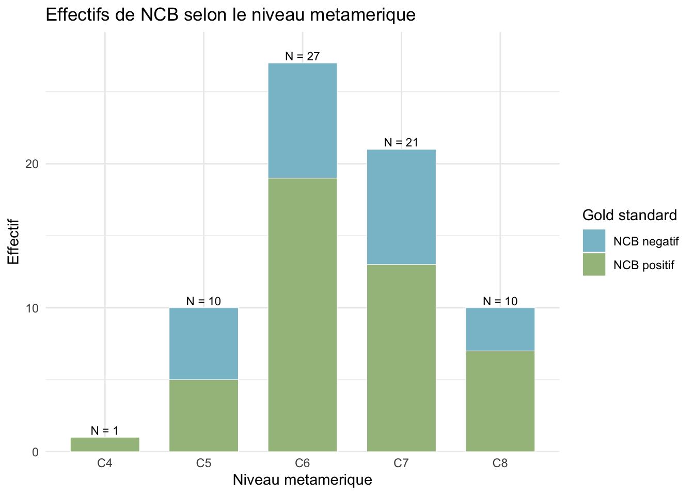{width=672}
:::
:::


\newpage


::: {.cell}

```{.r .cell-code}
results_by_level_score_plot
```

::: {.cell-output-display}
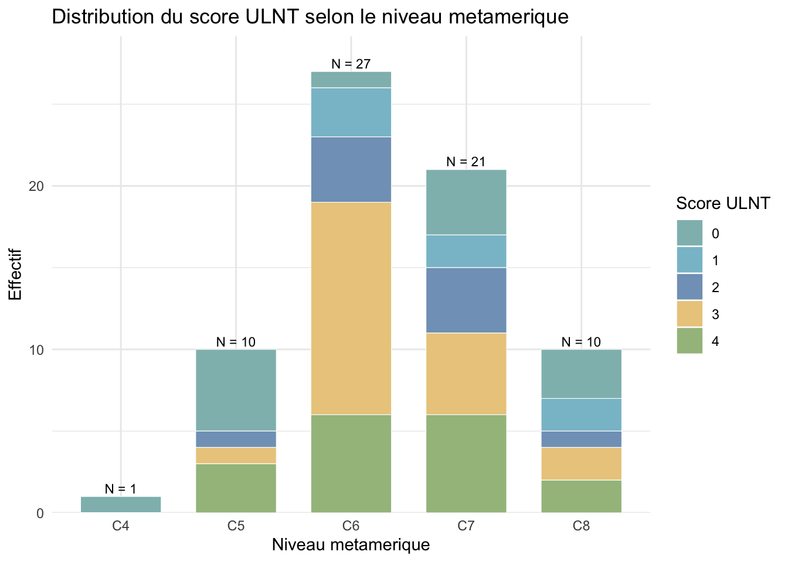{width=672}
:::
:::


-   Distribution du "score de positivité" de 0 a 4. `C4` y apparait avec un unique patient de **score 0**, ce qui explique le `0` vu auparavant sur le graphique de moyenne.

-   Graphique pas très utile et peu interprétable car effectif trop faibles... Globalement, à C6 - C7, les patients ont ≥ 3 tests positifs dans plus de la moitié des cas. 

\newpage
### Détail exploratoire test par test et niveau par niveau

```{.r .cell-code}
kable(
    diagnostic_by_level_detail_round,
    caption = "Performances diagnostiques exploratoires des ULNT selon le niveau métamérique",
    align = "c"
) %>%
    kable_styling(
        latex_options = c("hold_position", "repeat_header"),
        full_width = FALSE,
        font_size = 7
    )
```

`````{=html}
<table class="table" style="font-size: 7px; width: auto !important; margin-left: auto; margin-right: auto;">
<caption style="font-size: initial !important;">Performances diagnostiques exploratoires des ULNT selon le niveau métamérique</caption>
 <thead>
  <tr>
   <th style="text-align:center;"> Niveau </th>
   <th style="text-align:center;"> Test </th>
   <th style="text-align:center;"> N analyse </th>
   <th style="text-align:center;"> TP </th>
   <th style="text-align:center;"> FP </th>
   <th style="text-align:center;"> TN </th>
   <th style="text-align:center;"> FN </th>
   <th style="text-align:center;"> Se [IC95% exact] </th>
   <th style="text-align:center;"> Sp [IC95% exact] </th>
  </tr>
 </thead>
<tbody>
  <tr>
   <td style="text-align:center;"> C4 </td>
   <td style="text-align:center;"> U1 </td>
   <td style="text-align:center;"> 1 </td>
   <td style="text-align:center;"> 0 </td>
   <td style="text-align:center;"> 0 </td>
   <td style="text-align:center;"> 0 </td>
   <td style="text-align:center;"> 1 </td>
   <td style="text-align:center;"> 0 [0 ; 0.975] </td>
   <td style="text-align:center;"> NA </td>
  </tr>
  <tr>
   <td style="text-align:center;"> C4 </td>
   <td style="text-align:center;"> U2a </td>
   <td style="text-align:center;"> 1 </td>
   <td style="text-align:center;"> 0 </td>
   <td style="text-align:center;"> 0 </td>
   <td style="text-align:center;"> 0 </td>
   <td style="text-align:center;"> 1 </td>
   <td style="text-align:center;"> 0 [0 ; 0.975] </td>
   <td style="text-align:center;"> NA </td>
  </tr>
  <tr>
   <td style="text-align:center;"> C4 </td>
   <td style="text-align:center;"> U2b </td>
   <td style="text-align:center;"> 1 </td>
   <td style="text-align:center;"> 0 </td>
   <td style="text-align:center;"> 0 </td>
   <td style="text-align:center;"> 0 </td>
   <td style="text-align:center;"> 1 </td>
   <td style="text-align:center;"> 0 [0 ; 0.975] </td>
   <td style="text-align:center;"> NA </td>
  </tr>
  <tr>
   <td style="text-align:center;"> C4 </td>
   <td style="text-align:center;"> U3 </td>
   <td style="text-align:center;"> 1 </td>
   <td style="text-align:center;"> 0 </td>
   <td style="text-align:center;"> 0 </td>
   <td style="text-align:center;"> 0 </td>
   <td style="text-align:center;"> 1 </td>
   <td style="text-align:center;"> 0 [0 ; 0.975] </td>
   <td style="text-align:center;"> NA </td>
  </tr>
  <tr>
   <td style="text-align:center;"> C5 </td>
   <td style="text-align:center;"> U1 </td>
   <td style="text-align:center;"> 10 </td>
   <td style="text-align:center;"> 5 </td>
   <td style="text-align:center;"> 0 </td>
   <td style="text-align:center;"> 5 </td>
   <td style="text-align:center;"> 0 </td>
   <td style="text-align:center;"> 1 [0.478 ; 1] </td>
   <td style="text-align:center;"> 1 [0.478 ; 1] </td>
  </tr>
  <tr>
   <td style="text-align:center;"> C5 </td>
   <td style="text-align:center;"> U2a </td>
   <td style="text-align:center;"> 10 </td>
   <td style="text-align:center;"> 5 </td>
   <td style="text-align:center;"> 0 </td>
   <td style="text-align:center;"> 5 </td>
   <td style="text-align:center;"> 0 </td>
   <td style="text-align:center;"> 1 [0.478 ; 1] </td>
   <td style="text-align:center;"> 1 [0.478 ; 1] </td>
  </tr>
  <tr>
   <td style="text-align:center;"> C5 </td>
   <td style="text-align:center;"> U2b </td>
   <td style="text-align:center;"> 10 </td>
   <td style="text-align:center;"> 4 </td>
   <td style="text-align:center;"> 0 </td>
   <td style="text-align:center;"> 5 </td>
   <td style="text-align:center;"> 1 </td>
   <td style="text-align:center;"> 0.8 [0.284 ; 0.995] </td>
   <td style="text-align:center;"> 1 [0.478 ; 1] </td>
  </tr>
  <tr>
   <td style="text-align:center;"> C5 </td>
   <td style="text-align:center;"> U3 </td>
   <td style="text-align:center;"> 10 </td>
   <td style="text-align:center;"> 3 </td>
   <td style="text-align:center;"> 0 </td>
   <td style="text-align:center;"> 5 </td>
   <td style="text-align:center;"> 2 </td>
   <td style="text-align:center;"> 0.6 [0.147 ; 0.947] </td>
   <td style="text-align:center;"> 1 [0.478 ; 1] </td>
  </tr>
  <tr>
   <td style="text-align:center;"> C6 </td>
   <td style="text-align:center;"> U1 </td>
   <td style="text-align:center;"> 27 </td>
   <td style="text-align:center;"> 17 </td>
   <td style="text-align:center;"> 6 </td>
   <td style="text-align:center;"> 2 </td>
   <td style="text-align:center;"> 2 </td>
   <td style="text-align:center;"> 0.895 [0.669 ; 0.987] </td>
   <td style="text-align:center;"> 0.25 [0.032 ; 0.651] </td>
  </tr>
  <tr>
   <td style="text-align:center;"> C6 </td>
   <td style="text-align:center;"> U2a </td>
   <td style="text-align:center;"> 27 </td>
   <td style="text-align:center;"> 16 </td>
   <td style="text-align:center;"> 6 </td>
   <td style="text-align:center;"> 2 </td>
   <td style="text-align:center;"> 3 </td>
   <td style="text-align:center;"> 0.842 [0.604 ; 0.966] </td>
   <td style="text-align:center;"> 0.25 [0.032 ; 0.651] </td>
  </tr>
  <tr>
   <td style="text-align:center;"> C6 </td>
   <td style="text-align:center;"> U2b </td>
   <td style="text-align:center;"> 27 </td>
   <td style="text-align:center;"> 10 </td>
   <td style="text-align:center;"> 5 </td>
   <td style="text-align:center;"> 3 </td>
   <td style="text-align:center;"> 9 </td>
   <td style="text-align:center;"> 0.526 [0.289 ; 0.756] </td>
   <td style="text-align:center;"> 0.375 [0.085 ; 0.755] </td>
  </tr>
  <tr>
   <td style="text-align:center;"> C6 </td>
   <td style="text-align:center;"> U3 </td>
   <td style="text-align:center;"> 27 </td>
   <td style="text-align:center;"> 9 </td>
   <td style="text-align:center;"> 5 </td>
   <td style="text-align:center;"> 3 </td>
   <td style="text-align:center;"> 10 </td>
   <td style="text-align:center;"> 0.474 [0.244 ; 0.711] </td>
   <td style="text-align:center;"> 0.375 [0.085 ; 0.755] </td>
  </tr>
  <tr>
   <td style="text-align:center;"> C7 </td>
   <td style="text-align:center;"> U1 </td>
   <td style="text-align:center;"> 21 </td>
   <td style="text-align:center;"> 11 </td>
   <td style="text-align:center;"> 3 </td>
   <td style="text-align:center;"> 5 </td>
   <td style="text-align:center;"> 2 </td>
   <td style="text-align:center;"> 0.846 [0.546 ; 0.981] </td>
   <td style="text-align:center;"> 0.625 [0.245 ; 0.915] </td>
  </tr>
  <tr>
   <td style="text-align:center;"> C7 </td>
   <td style="text-align:center;"> U2a </td>
   <td style="text-align:center;"> 21 </td>
   <td style="text-align:center;"> 11 </td>
   <td style="text-align:center;"> 3 </td>
   <td style="text-align:center;"> 5 </td>
   <td style="text-align:center;"> 2 </td>
   <td style="text-align:center;"> 0.846 [0.546 ; 0.981] </td>
   <td style="text-align:center;"> 0.625 [0.245 ; 0.915] </td>
  </tr>
  <tr>
   <td style="text-align:center;"> C7 </td>
   <td style="text-align:center;"> U2b </td>
   <td style="text-align:center;"> 21 </td>
   <td style="text-align:center;"> 12 </td>
   <td style="text-align:center;"> 3 </td>
   <td style="text-align:center;"> 5 </td>
   <td style="text-align:center;"> 1 </td>
   <td style="text-align:center;"> 0.923 [0.64 ; 0.998] </td>
   <td style="text-align:center;"> 0.625 [0.245 ; 0.915] </td>
  </tr>
  <tr>
   <td style="text-align:center;"> C7 </td>
   <td style="text-align:center;"> U3 </td>
   <td style="text-align:center;"> 21 </td>
   <td style="text-align:center;"> 4 </td>
   <td style="text-align:center;"> 2 </td>
   <td style="text-align:center;"> 6 </td>
   <td style="text-align:center;"> 9 </td>
   <td style="text-align:center;"> 0.308 [0.091 ; 0.614] </td>
   <td style="text-align:center;"> 0.75 [0.349 ; 0.968] </td>
  </tr>
  <tr>
   <td style="text-align:center;"> C8 </td>
   <td style="text-align:center;"> U1 </td>
   <td style="text-align:center;"> 10 </td>
   <td style="text-align:center;"> 6 </td>
   <td style="text-align:center;"> 0 </td>
   <td style="text-align:center;"> 3 </td>
   <td style="text-align:center;"> 1 </td>
   <td style="text-align:center;"> 0.857 [0.421 ; 0.996] </td>
   <td style="text-align:center;"> 1 [0.292 ; 1] </td>
  </tr>
  <tr>
   <td style="text-align:center;"> C8 </td>
   <td style="text-align:center;"> U2a </td>
   <td style="text-align:center;"> 10 </td>
   <td style="text-align:center;"> 4 </td>
   <td style="text-align:center;"> 1 </td>
   <td style="text-align:center;"> 2 </td>
   <td style="text-align:center;"> 3 </td>
   <td style="text-align:center;"> 0.571 [0.184 ; 0.901] </td>
   <td style="text-align:center;"> 0.667 [0.094 ; 0.992] </td>
  </tr>
  <tr>
   <td style="text-align:center;"> C8 </td>
   <td style="text-align:center;"> U2b </td>
   <td style="text-align:center;"> 10 </td>
   <td style="text-align:center;"> 5 </td>
   <td style="text-align:center;"> 0 </td>
   <td style="text-align:center;"> 3 </td>
   <td style="text-align:center;"> 2 </td>
   <td style="text-align:center;"> 0.714 [0.29 ; 0.963] </td>
   <td style="text-align:center;"> 1 [0.292 ; 1] </td>
  </tr>
  <tr>
   <td style="text-align:center;"> C8 </td>
   <td style="text-align:center;"> U3 </td>
   <td style="text-align:center;"> 10 </td>
   <td style="text-align:center;"> 2 </td>
   <td style="text-align:center;"> 0 </td>
   <td style="text-align:center;"> 3 </td>
   <td style="text-align:center;"> 5 </td>
   <td style="text-align:center;"> 0.286 [0.037 ; 0.71] </td>
   <td style="text-align:center;"> 1 [0.292 ; 1] </td>
  </tr>
</tbody>
</table>

`````

\FloatBarrier

-   Les effectifs sont très faibles à certains niveaux, ce qui rend les résultats très instables et peu interprétables.

-   Les plus interprétables sont les niveaux `C6` et `C7` qui sont les plus peuplés.

    -   `C7` semble être le niveau où les tests sont les plus sensibles, notamment `U2b`, mais la spécificité y reste moyenne.

-   Le test de Fisher répond à la question 


\newpage
### Lecture test par test selon le niveau métamérique


::: {.cell}

```{.r .cell-code}
results_by_level_test_metric_plot
```

::: {.cell-output-display}
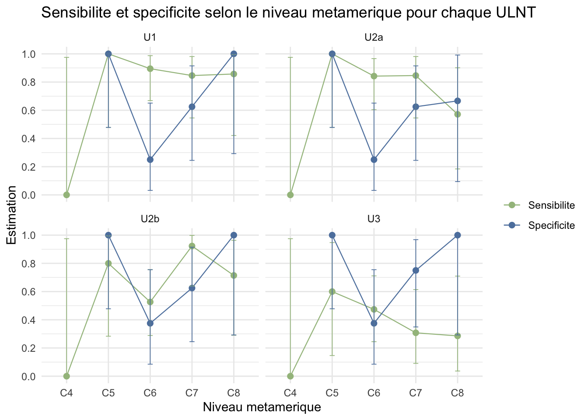{width=672}
:::
:::


Mêmes infos remises en graphique : sensibilité et spécificité, test par test et niveau par niveau. 

Ensuite mêmes infos remises en tableaux par tests. 

Attention à ne pas surinterpréter, les IC sont larges et les effectifs très faibles à certains niveaux.


```{.r .cell-code}
kable(
    u1_level_round,
    caption = "U1 selon le niveau métamérique",
    align = "c"
)
```


Table: U1 selon le niveau métamérique

| Niveau | N analyse | TP | FP | TN | FN |   Se [IC95% exact]    |   Sp [IC95% exact]    |
|:------:|:---------:|:--:|:--:|:--:|:--:|:---------------------:|:---------------------:|
|   C4   |     1     | 0  | 0  | 0  | 1  |     0 [0 ; 0.975]     |          NA           |
|   C5   |    10     | 5  | 0  | 5  | 0  |     1 [0.478 ; 1]     |     1 [0.478 ; 1]     |
|   C6   |    27     | 17 | 6  | 2  | 2  | 0.895 [0.669 ; 0.987] | 0.25 [0.032 ; 0.651]  |
|   C7   |    21     | 11 | 3  | 5  | 2  | 0.846 [0.546 ; 0.981] | 0.625 [0.245 ; 0.915] |
|   C8   |    10     | 6  | 0  | 3  | 1  | 0.857 [0.421 ; 0.996] |     1 [0.292 ; 1]     |


```{.r .cell-code}
kable(
    u2a_level_round,
    caption = "U2a selon le niveau métamérique",
    align = "c"
)
```


Table: U2a selon le niveau métamérique

| Niveau | N analyse | TP | FP | TN | FN |   Se [IC95% exact]    |   Sp [IC95% exact]    |
|:------:|:---------:|:--:|:--:|:--:|:--:|:---------------------:|:---------------------:|
|   C4   |     1     | 0  | 0  | 0  | 1  |     0 [0 ; 0.975]     |          NA           |
|   C5   |    10     | 5  | 0  | 5  | 0  |     1 [0.478 ; 1]     |     1 [0.478 ; 1]     |
|   C6   |    27     | 16 | 6  | 2  | 3  | 0.842 [0.604 ; 0.966] | 0.25 [0.032 ; 0.651]  |
|   C7   |    21     | 11 | 3  | 5  | 2  | 0.846 [0.546 ; 0.981] | 0.625 [0.245 ; 0.915] |
|   C8   |    10     | 4  | 1  | 2  | 3  | 0.571 [0.184 ; 0.901] | 0.667 [0.094 ; 0.992] |


```{.r .cell-code}
kable(
    u2b_level_round,
    caption = "U2b selon le niveau métamérique",
    align = "c"
)
```


Table: U2b selon le niveau métamérique

| Niveau | N analyse | TP | FP | TN | FN |   Se [IC95% exact]    |   Sp [IC95% exact]    |
|:------:|:---------:|:--:|:--:|:--:|:--:|:---------------------:|:---------------------:|
|   C4   |     1     | 0  | 0  | 0  | 1  |     0 [0 ; 0.975]     |          NA           |
|   C5   |    10     | 4  | 0  | 5  | 1  |  0.8 [0.284 ; 0.995]  |     1 [0.478 ; 1]     |
|   C6   |    27     | 10 | 5  | 3  | 9  | 0.526 [0.289 ; 0.756] | 0.375 [0.085 ; 0.755] |
|   C7   |    21     | 12 | 3  | 5  | 1  | 0.923 [0.64 ; 0.998]  | 0.625 [0.245 ; 0.915] |
|   C8   |    10     | 5  | 0  | 3  | 2  | 0.714 [0.29 ; 0.963]  |     1 [0.292 ; 1]     |


```{.r .cell-code}
kable(
    u3_level_round,
    caption = "U3 selon le niveau métamérique",
    align = "c"
)
```


Table: U3 selon le niveau métamérique

| Niveau | N analyse | TP | FP | TN | FN |   Se [IC95% exact]    |   Sp [IC95% exact]    |
|:------:|:---------:|:--:|:--:|:--:|:--:|:---------------------:|:---------------------:|
|   C4   |     1     | 0  | 0  | 0  | 1  |     0 [0 ; 0.975]     |          NA           |
|   C5   |    10     | 3  | 0  | 5  | 2  |  0.6 [0.147 ; 0.947]  |     1 [0.478 ; 1]     |
|   C6   |    27     | 9  | 5  | 3  | 10 | 0.474 [0.244 ; 0.711] | 0.375 [0.085 ; 0.755] |
|   C7   |    21     | 4  | 2  | 6  | 9  | 0.308 [0.091 ; 0.614] | 0.75 [0.349 ; 0.968]  |
|   C8   |    10     | 2  | 0  | 3  | 5  | 0.286 [0.037 ; 0.71]  |     1 [0.292 ; 1]     |

Globalement, uil ne paraît pas pertinent de choisir principalement le test en fonction du niveau métamérique. Le message pratique reste surtout que `U1`, `U2a` et `U2b` gardent plus d'intérêt global que `U3`.

