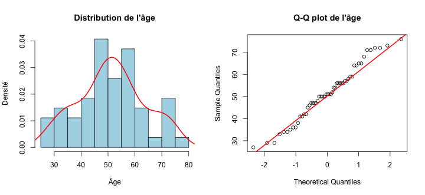
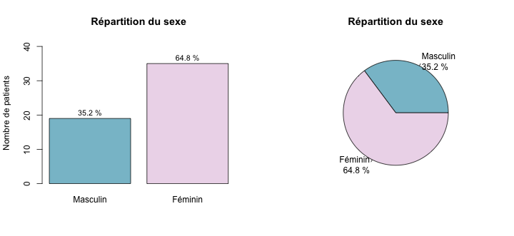
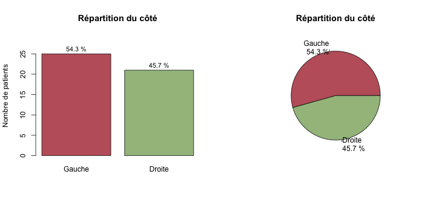
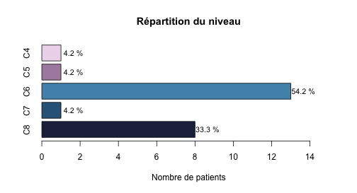

\newpage
::: {.callout-note title="Origine de ce document"}
-   Ce document est au format Quarto Markdown (.qmd) : il contient du code R et est généré directement pour obtenir un rapport en PDF ou HTML. 

-   Il est donc à la fois un document de travail pour moi, et à la fois un document de présentation des analyses. Je laisse donc volontairement les sections de code pour transparence et reproductibilité des analyses.

-   La préparation des données a été faite sur R plutôt que sur Excel pour éviter les erreurs et tracer les étapes. La première partie du document est donc consacrée à la préparation des données, avec des sections de code pour chaque variable (vous pouvez donc sauter les sections de code si vous ne souhaitez pas les détails de la préparation des données).

-   Je suis interne en chirurgie digestive à Paris et actuellement un master 2 en biostatistiques ("Méthodologie et Statistiques en Recherche biomédicale", Université Paris Saclay). Et accessoirement, ami de Brieuc !

-   Le rapport est disponible en format HTML hébergé sur Github Pages, et aussi téléchargeable en PDF, DOCX et Quarto (.qmd), contenant le code R utilisé pour les analyses.
:::

\newpage
# Import de la base et préparation des données


## Dates


## Variables numériques


``` r
# Convertir les variables numériques
df$Age <- as.numeric(df$Age)
class(df$Age)
```

## Variables catégorielles

### Sexe


``` r
# Convertir la variable "Sexe" en facteur
df$Sexe <- factor(c(M = "Masculin", F = "Féminin")[df$Sexe], levels = c("Masculin", "Féminin"))
table(df$Sexe, useNA = "ifany")
```

### Côté


``` r
# Convertir la variable "Côté" en facteur
df$Cote <- factor(
    c(G = "Gauche", D = "Droite")[df$Cote],
    levels = c("Gauche", "Droite")
)
table(df$Cote, useNA = "ifany")
```

### Niveau


``` r
# Convertir la variable "Niveau" en facteur ordonné
df$Niveau
df$Niveau <- factor(
    df$Niveau,
    levels = c("C4", "C5", "C6", "C7", "C8"),
    ordered = TRUE
)
table(df$Niveau, useNA = "ifany")
```

### Examen clinique


``` r
str(df$Examen_Clinique)
class(df$Examen_Clinique)
unique(df$Examen_Clinique)
#création d'une variable binaire "Examen_Clinique_Binaire" (1 = Positif, 0 = Negatif ou Douteux)
df$Examen_Clinique_Positif_YN <- ifelse(df$Examen_Clinique == "Positif", 1, 0)
table(df$Examen_Clinique_Positif_YN, useNA = "ifany")
#création d'une variable binaire "Examen_Clinique_Douteux_YN" (1 = Douteux, 0 = Positif ou Negatif)
df$Examen_Clinique_Douteux_YN <- ifelse(df$Examen_Clinique == "Douteux", 1, 0)
table(df$Examen_Clinique_Douteux_YN, useNA = "ifany")
```

### IRM


``` r
str(df$IRM)
class(df$IRM)
unique(df$IRM)
#création d'une variable binaire "IRM_Positif_YN" (1 = Positif, 0 = Negatif ou Douteux)
df$IRM_Positif_YN <- ifelse(df$IRM == "Positif", 1, 0)
table(df$IRM_Positif_YN, useNA = "ifany")
#création d'une variable binaire "IRM_Douteux_YN" (1 = Douteux, 0 = Positif ou Negatif)
df$IRM_Douteux_YN <- ifelse(df$IRM == "Douteux", 1, 0)
table(df$IRM_Douteux_YN, useNA = "ifany")
```

### Infiltrations


``` r
str(df$Infiltrations)
class(df$Infiltrations)
unique(df$Infiltrations)
#modification infiltrations pour mettre 1 et 0
df$Infiltrations <- ifelse(df$Infiltrations == "oui", 1, ifelse(df$Infiltrations == "non", 0, NA))
table(df$Infiltrations, useNA = "ifany")
```


### Gold Standard


``` r
#création d'une variable binaire "Gold_Standard_Positif_YN" (1 = Positif, 0 = Negatif ou Douteux ou NA)
df$Gold_Standard_Positif_YN <- ifelse(df$Gold_Standard == "Positif", 1,
    ifelse(df$Gold_Standard %in% c("Negatif", "Douteux"), 0, NA)
)
table(df$Gold_Standard_Positif_YN, useNA = "ifany")

#création d'une variable binaire "Gold_Standard_Douteux_YN" (1 = Douteux, 0 = Positif ou Negatif ou NA)
df$Gold_Standard_Douteux_YN <- ifelse(df$Gold_Standard == "Douteux", 1,
    ifelse(df$Gold_Standard %in% c("Positif", "Negatif"), 0, NA)
)
table(df$Gold_Standard_Douteux_YN, useNA = "ifany")
```

### Tests cliniques évaluateur 1

Les variables sont transformées en numériques binaires (1 = Positif / 0 = Negatif) pour faciliter les tests. 

#### U1_E1


``` r
str(df$U1_E1)
class(df$U1_E1)
table(df$U1_E1, useNA = "ifany")
#création d'une variable binaire "U1_E1_Positif_YN" (1 = Positif, 0 = Negatif ou NA) 
df$U1_E1_positif <- as.numeric(df$U1_E1 == "Positif")
table(df$U1_E1_positif, useNA = "ifany")
```

#### U2a_E1


``` r
str(df$U2a_E1)
class(df$U2a_E1)
table(df$U2a_E1, useNA = "ifany")
#création d'une variable binaire "U2a_E1_Positif_YN" (1 = Positif, 0 = Negatif ou NA) 
df$U2a_E1_positif <- as.numeric(df$U2a_E1 == "Positif")
table(df$U2a_E1_positif, useNA = "ifany")
```

#### U2b_E1


``` r
str(df$U2b_E1)
class(df$U2b_E1)
table(df$U2b_E1, useNA = "ifany")
#création d'une variable binaire "U2b_E1_Positif_YN" (1 = Positif, 0 = Negatif ou NA) 
df$U2b_E1_positif <- as.numeric(df$U2b_E1 == "Positif")
table(df$U2b_E1_positif, useNA = "ifany")
```

#### U3_E1


``` r
str(df$U3_E1)
class(df$U3_E1)
table(df$U3_E1, useNA = "ifany")
#création d'une variable binaire "U3_E1_Positif_YN" (1 = Positif, 0 = Negatif ou NA) 
df$U3_E1_positif <- as.numeric(df$U3_E1 == "Positif")
table(df$U3_E1_positif, useNA = "ifany")
```

#### Sc_E1

Il existe un "NT" dans Sc_E1, traité comme NA


``` r
str(df$Sc_E1)
class(df$Sc_E1)
table(df$Sc_E1, useNA = "ifany")
# conversion de "NT" en NA
df$Sc_E1 <- ifelse(df$Sc_E1 == "NT", NA, df$Sc_E1)
table(df$Sc_E1, useNA = "ifany")
#création d'une variable binaire "Sc_E1_Positif_YN" (1 = Positif, 0 = Negatif ou NA) 
df$Sc_E1_positif <- as.numeric(df$Sc_E1 == "Positif")
table(df$Sc_E1_positif, useNA = "ifany")
```

#### Gachette évaluateur 1

Renommage de la variable "Gachette" en "Gachette_E1" pour plus de clarté


``` r
# Renommage de la variable "Gachette" en "Gachette1"
names(df)[names(df) == "Gachette"] <- "Gachette1"
table(df$Gachette1, useNA = "ifany")
# transformation de la variable en factoriel non ordonné 
df$Gachette1 <- factor(df$Gachette1, levels = c("paraspinal", "susclavier"))
table(df$Gachette1, useNA = "ifany")
class(df$Gachette1)
```

#### Tests cliniques évaluateur 2

#### U1_E2


``` r
str(df$U1_E2)
class(df$U1_E2)
table(df$U1_E2, useNA = "ifany")
#transformation NT en NA 
df$U1_E2 <- ifelse(df$U1_E2 == "NT", NA, df$U1_E2)
table(df$U1_E2, useNA = "ifany")
#création d'une variable binaire "U1_E2_Positif_YN" (1 = Positif, 0 = Negatif ou NA) 
df$U1_E2_positif <- as.numeric(df$U1_E2 == "Positif")
table(df$U1_E2_positif, useNA = "ifany")
```

#### U2a_E2


``` r
str(df$U2a_E2)
class(df$U2a_E2)
table(df$U2a_E2, useNA = "ifany")
#transformation NT en NA 
df$U2a_E2 <- ifelse(df$U2a_E2 == "NT", NA, df$U2a_E2)
table(df$U2a_E2, useNA = "ifany")
#création d'une variable binaire "U2a_E2_Positif_YN" (1 = Positif, 0 = Negatif ou NA) 
df$U2a_E2_positif <- as.numeric(df$U2a_E2 == "Positif")
table(df$U2a_E2_positif, useNA = "ifany")
```

#### U2b_E2


``` r
str(df$U2b_E2)
class(df$U2b_E2)
table(df$U2b_E2, useNA = "ifany")
#transformation NT en NA
df$U2b_E2 <- ifelse(df$U2b_E2 == "NT", NA, df$U2b_E2)
table(df$U2b_E2, useNA = "ifany")
#création d'une variable binaire "U2b_E2_Positif_YN" (1 = Positif, 0 = Negatif ou NA) 
df$U2b_E2_positif <- as.numeric(df$U2b_E2 == "Positif")
table(df$U2b_E2_positif, useNA = "ifany")
```

#### U3_E2


``` r
str(df$U3_E2)
class(df$U3_E2)
table(df$U3_E2, useNA = "ifany")
#transformation NT en NA
df$U3_E2 <- ifelse(df$U3_E2 == "NT", NA, df$U3_E2)
table(df$U3_E2, useNA = "ifany")
#création d'une variable binaire "U3_E2_Positif_YN" (1 = Positif, 0 = Negatif ou NA) 
df$U3_E2_positif <- as.numeric(df$U3_E2 == "Positif")
table(df$U3_E2_positif, useNA = "ifany")
```

#### Sc_E2


``` r
str(df$Sc_E2)
class(df$Sc_E2)
table(df$Sc_E2, useNA = "ifany")
#transformation NT en NA
df$Sc_E2 <- ifelse(df$Sc_E2 == "NT", NA, df$Sc_E2)
table(df$Sc_E2, useNA = "ifany")
#création d'une variable binaire "Sc_E2_Positif_YN" (1 = Positif, 0 = Negatif ou NA) 
df$Sc_E2_positif <- as.numeric(df$Sc_E2 == "Positif")
table(df$Sc_E2_positif, useNA = "ifany")
```

# Introduction

-   4 tests ULNT (Upper Limb Neurodynamic Tests) : ULNT1, ULNT2a, ULNT2b, ULNT3

-   Qu'il faut comparer à deux gold standards : 

    -   Gold standard 1 : diagnostic d'une névralgie cervico-brachiale par examen clinique + IRM et consensus entre 2 orthopédistes seniors

    -   Gold standard 2 : diagnostic d'une névralgie cervico-brachiale par examen clinique + IRM par un orthopédiste senior + résultat positif à une infiltration et/ou geste chirurgical

-   Objectif : Évaluation de la performance diagnostique, par rapport au gold standard, des ULNT et du Scratch Collapse Test  pour le le diagnostic des névralgies cervicobrachiales en consultation de chir ortho.

# Résultats

## Caractéristiques initiales de la population

-   Variables disponibles : Âge (`df$Age`), Sexe (`df$Sexe`), Côté (`df$Cote`), Niveau (`df$Niveau`)

### Âge

<table class="table" style="width: auto !important; margin-left: auto; margin-right: auto;">
<caption>variable âge</caption>
 <thead>
  <tr>
   <th style="text-align:right;"> Min. </th>
   <th style="text-align:right;"> 1st Qu. </th>
   <th style="text-align:right;"> Median </th>
   <th style="text-align:right;"> Mean </th>
   <th style="text-align:right;"> 3rd Qu. </th>
   <th style="text-align:right;"> Max. </th>
  </tr>
 </thead>
<tbody>
  <tr>
   <td style="text-align:right;"> 27 </td>
   <td style="text-align:right;"> 42.75 </td>
   <td style="text-align:right;"> 51 </td>
   <td style="text-align:right;"> 52.64815 </td>
   <td style="text-align:right;"> 58.75 </td>
   <td style="text-align:right;"> 125 </td>
  </tr>
</tbody>
</table>

-   Un patient a 125 ans.

-   Pour l'instant, la médiane de la population lui est attribuée.


``` r
#| label: âge corrigé
#| echo: true
#| include: true
#| results: "hide"
# Remplacer l'âge de 125 ans par la médiane des âges
age_median <- median(df$Age, na.rm = TRUE)
df$Age <- ifelse(df$Age == 125, age_median, df$Age)
```

-   Représentation de la variable âge après correction par histogramme avec densité et QQ-plot (le QQ plot se construit en comparant les quantiles de la variable âge à ceux d'une distribution normale théorique : si les points suivent une ligne droite, la variable suit une distribution normale).



-   L'âge semble suivre une distribution approximativement normale. Les tests statistiques de normalité (type Shapiro-Wilk) n'ont pas d'intérêt dans cette situation (permet uniquement de rejeter l’hypothèse de normalité si les données s’en écartent assez pour que le test ait la puissance nécessaire, or il n'y aura pas la puissance nécessaire avec seulement 50 patients).

### Sexe

-   Représentation de la variable sexe par un diagramme en barres et par un camembert (pie chart)



-   Même si le camembert est plus visuel, le diagramme en barres est plus précis pour comparer les effectifs et les proportions (car affiche les effectifs totaux).

#### Côté

-   Représentation de la variable côté par un diagramme en barres et par un camembert (pie chart)



#### Niveau

-   Représentation de la variable niveau par un diagramme en barres et par un camembert (pie chart)



#### Tableau de caractéristiques initiales


``` r
# création tableau de caractéristiques initiales avec tbl_summary
cols_carac <- c("Age", "Sexe", "Cote", "Niveau")
tbl_carac <- df %>%
    tbl_summary(
        include = all_of(cols_carac),
        statistic = list(
            all_continuous() ~ "{median} ({sd})",
            all_categorical() ~ "{n} ({p}%)"
        ),
        digits = all_continuous() ~ 1
        ) %>%
    modify_header(label = "**Caractéristiques initiales**")

# affichage du tableau
if (knitr::is_latex_output() || knitr::is_html_output()) {
    tbl_carac
} else {
    as_kable(tbl_carac)
}
```

<!--html_preserve--><div id="vbknejtccq" style="padding-left:0px;padding-right:0px;padding-top:10px;padding-bottom:10px;overflow-x:auto;overflow-y:auto;width:auto;height:auto;">
<style>#vbknejtccq table {
  font-family: system-ui, 'Segoe UI', Roboto, Helvetica, Arial, sans-serif, 'Apple Color Emoji', 'Segoe UI Emoji', 'Segoe UI Symbol', 'Noto Color Emoji';
  -webkit-font-smoothing: antialiased;
  -moz-osx-font-smoothing: grayscale;
}

#vbknejtccq thead, #vbknejtccq tbody, #vbknejtccq tfoot, #vbknejtccq tr, #vbknejtccq td, #vbknejtccq th {
  border-style: none;
}

#vbknejtccq p {
  margin: 0;
  padding: 0;
}

#vbknejtccq .gt_table {
  display: table;
  border-collapse: collapse;
  line-height: normal;
  margin-left: auto;
  margin-right: auto;
  color: #333333;
  font-size: 16px;
  font-weight: normal;
  font-style: normal;
  background-color: #FFFFFF;
  width: auto;
  border-top-style: solid;
  border-top-width: 2px;
  border-top-color: #A8A8A8;
  border-right-style: none;
  border-right-width: 2px;
  border-right-color: #D3D3D3;
  border-bottom-style: solid;
  border-bottom-width: 2px;
  border-bottom-color: #A8A8A8;
  border-left-style: none;
  border-left-width: 2px;
  border-left-color: #D3D3D3;
}

#vbknejtccq .gt_caption {
  padding-top: 4px;
  padding-bottom: 4px;
}

#vbknejtccq .gt_title {
  color: #333333;
  font-size: 125%;
  font-weight: initial;
  padding-top: 4px;
  padding-bottom: 4px;
  padding-left: 5px;
  padding-right: 5px;
  border-bottom-color: #FFFFFF;
  border-bottom-width: 0;
}

#vbknejtccq .gt_subtitle {
  color: #333333;
  font-size: 85%;
  font-weight: initial;
  padding-top: 3px;
  padding-bottom: 5px;
  padding-left: 5px;
  padding-right: 5px;
  border-top-color: #FFFFFF;
  border-top-width: 0;
}

#vbknejtccq .gt_heading {
  background-color: #FFFFFF;
  text-align: center;
  border-bottom-color: #FFFFFF;
  border-left-style: none;
  border-left-width: 1px;
  border-left-color: #D3D3D3;
  border-right-style: none;
  border-right-width: 1px;
  border-right-color: #D3D3D3;
}

#vbknejtccq .gt_bottom_border {
  border-bottom-style: solid;
  border-bottom-width: 2px;
  border-bottom-color: #D3D3D3;
}

#vbknejtccq .gt_col_headings {
  border-top-style: solid;
  border-top-width: 2px;
  border-top-color: #D3D3D3;
  border-bottom-style: solid;
  border-bottom-width: 2px;
  border-bottom-color: #D3D3D3;
  border-left-style: none;
  border-left-width: 1px;
  border-left-color: #D3D3D3;
  border-right-style: none;
  border-right-width: 1px;
  border-right-color: #D3D3D3;
}

#vbknejtccq .gt_col_heading {
  color: #333333;
  background-color: #FFFFFF;
  font-size: 100%;
  font-weight: normal;
  text-transform: inherit;
  border-left-style: none;
  border-left-width: 1px;
  border-left-color: #D3D3D3;
  border-right-style: none;
  border-right-width: 1px;
  border-right-color: #D3D3D3;
  vertical-align: bottom;
  padding-top: 5px;
  padding-bottom: 6px;
  padding-left: 5px;
  padding-right: 5px;
  overflow-x: hidden;
}

#vbknejtccq .gt_column_spanner_outer {
  color: #333333;
  background-color: #FFFFFF;
  font-size: 100%;
  font-weight: normal;
  text-transform: inherit;
  padding-top: 0;
  padding-bottom: 0;
  padding-left: 4px;
  padding-right: 4px;
}

#vbknejtccq .gt_column_spanner_outer:first-child {
  padding-left: 0;
}

#vbknejtccq .gt_column_spanner_outer:last-child {
  padding-right: 0;
}

#vbknejtccq .gt_column_spanner {
  border-bottom-style: solid;
  border-bottom-width: 2px;
  border-bottom-color: #D3D3D3;
  vertical-align: bottom;
  padding-top: 5px;
  padding-bottom: 5px;
  overflow-x: hidden;
  display: inline-block;
  width: 100%;
}

#vbknejtccq .gt_spanner_row {
  border-bottom-style: hidden;
}

#vbknejtccq .gt_group_heading {
  padding-top: 8px;
  padding-bottom: 8px;
  padding-left: 5px;
  padding-right: 5px;
  color: #333333;
  background-color: #FFFFFF;
  font-size: 100%;
  font-weight: initial;
  text-transform: inherit;
  border-top-style: solid;
  border-top-width: 2px;
  border-top-color: #D3D3D3;
  border-bottom-style: solid;
  border-bottom-width: 2px;
  border-bottom-color: #D3D3D3;
  border-left-style: none;
  border-left-width: 1px;
  border-left-color: #D3D3D3;
  border-right-style: none;
  border-right-width: 1px;
  border-right-color: #D3D3D3;
  vertical-align: middle;
  text-align: left;
}

#vbknejtccq .gt_empty_group_heading {
  padding: 0.5px;
  color: #333333;
  background-color: #FFFFFF;
  font-size: 100%;
  font-weight: initial;
  border-top-style: solid;
  border-top-width: 2px;
  border-top-color: #D3D3D3;
  border-bottom-style: solid;
  border-bottom-width: 2px;
  border-bottom-color: #D3D3D3;
  vertical-align: middle;
}

#vbknejtccq .gt_from_md > :first-child {
  margin-top: 0;
}

#vbknejtccq .gt_from_md > :last-child {
  margin-bottom: 0;
}

#vbknejtccq .gt_row {
  padding-top: 8px;
  padding-bottom: 8px;
  padding-left: 5px;
  padding-right: 5px;
  margin: 10px;
  border-top-style: solid;
  border-top-width: 1px;
  border-top-color: #D3D3D3;
  border-left-style: none;
  border-left-width: 1px;
  border-left-color: #D3D3D3;
  border-right-style: none;
  border-right-width: 1px;
  border-right-color: #D3D3D3;
  vertical-align: middle;
  overflow-x: hidden;
}

#vbknejtccq .gt_stub {
  color: #333333;
  background-color: #FFFFFF;
  font-size: 100%;
  font-weight: initial;
  text-transform: inherit;
  border-right-style: solid;
  border-right-width: 2px;
  border-right-color: #D3D3D3;
  padding-left: 5px;
  padding-right: 5px;
}

#vbknejtccq .gt_stub_row_group {
  color: #333333;
  background-color: #FFFFFF;
  font-size: 100%;
  font-weight: initial;
  text-transform: inherit;
  border-right-style: solid;
  border-right-width: 2px;
  border-right-color: #D3D3D3;
  padding-left: 5px;
  padding-right: 5px;
  vertical-align: top;
}

#vbknejtccq .gt_row_group_first td {
  border-top-width: 2px;
}

#vbknejtccq .gt_row_group_first th {
  border-top-width: 2px;
}

#vbknejtccq .gt_summary_row {
  color: #333333;
  background-color: #FFFFFF;
  text-transform: inherit;
  padding-top: 8px;
  padding-bottom: 8px;
  padding-left: 5px;
  padding-right: 5px;
}

#vbknejtccq .gt_first_summary_row {
  border-top-style: solid;
  border-top-color: #D3D3D3;
}

#vbknejtccq .gt_first_summary_row.thick {
  border-top-width: 2px;
}

#vbknejtccq .gt_last_summary_row {
  padding-top: 8px;
  padding-bottom: 8px;
  padding-left: 5px;
  padding-right: 5px;
  border-bottom-style: solid;
  border-bottom-width: 2px;
  border-bottom-color: #D3D3D3;
}

#vbknejtccq .gt_grand_summary_row {
  color: #333333;
  background-color: #FFFFFF;
  text-transform: inherit;
  padding-top: 8px;
  padding-bottom: 8px;
  padding-left: 5px;
  padding-right: 5px;
}

#vbknejtccq .gt_first_grand_summary_row {
  padding-top: 8px;
  padding-bottom: 8px;
  padding-left: 5px;
  padding-right: 5px;
  border-top-style: double;
  border-top-width: 6px;
  border-top-color: #D3D3D3;
}

#vbknejtccq .gt_last_grand_summary_row_top {
  padding-top: 8px;
  padding-bottom: 8px;
  padding-left: 5px;
  padding-right: 5px;
  border-bottom-style: double;
  border-bottom-width: 6px;
  border-bottom-color: #D3D3D3;
}

#vbknejtccq .gt_striped {
  background-color: rgba(128, 128, 128, 0.05);
}

#vbknejtccq .gt_table_body {
  border-top-style: solid;
  border-top-width: 2px;
  border-top-color: #D3D3D3;
  border-bottom-style: solid;
  border-bottom-width: 2px;
  border-bottom-color: #D3D3D3;
}

#vbknejtccq .gt_footnotes {
  color: #333333;
  background-color: #FFFFFF;
  border-bottom-style: none;
  border-bottom-width: 2px;
  border-bottom-color: #D3D3D3;
  border-left-style: none;
  border-left-width: 2px;
  border-left-color: #D3D3D3;
  border-right-style: none;
  border-right-width: 2px;
  border-right-color: #D3D3D3;
}

#vbknejtccq .gt_footnote {
  margin: 0px;
  font-size: 90%;
  padding-top: 4px;
  padding-bottom: 4px;
  padding-left: 5px;
  padding-right: 5px;
}

#vbknejtccq .gt_sourcenotes {
  color: #333333;
  background-color: #FFFFFF;
  border-bottom-style: none;
  border-bottom-width: 2px;
  border-bottom-color: #D3D3D3;
  border-left-style: none;
  border-left-width: 2px;
  border-left-color: #D3D3D3;
  border-right-style: none;
  border-right-width: 2px;
  border-right-color: #D3D3D3;
}

#vbknejtccq .gt_sourcenote {
  font-size: 90%;
  padding-top: 4px;
  padding-bottom: 4px;
  padding-left: 5px;
  padding-right: 5px;
}

#vbknejtccq .gt_left {
  text-align: left;
}

#vbknejtccq .gt_center {
  text-align: center;
}

#vbknejtccq .gt_right {
  text-align: right;
  font-variant-numeric: tabular-nums;
}

#vbknejtccq .gt_font_normal {
  font-weight: normal;
}

#vbknejtccq .gt_font_bold {
  font-weight: bold;
}

#vbknejtccq .gt_font_italic {
  font-style: italic;
}

#vbknejtccq .gt_super {
  font-size: 65%;
}

#vbknejtccq .gt_footnote_marks {
  font-size: 75%;
  vertical-align: 0.4em;
  position: initial;
}

#vbknejtccq .gt_asterisk {
  font-size: 100%;
  vertical-align: 0;
}

#vbknejtccq .gt_indent_1 {
  text-indent: 5px;
}

#vbknejtccq .gt_indent_2 {
  text-indent: 10px;
}

#vbknejtccq .gt_indent_3 {
  text-indent: 15px;
}

#vbknejtccq .gt_indent_4 {
  text-indent: 20px;
}

#vbknejtccq .gt_indent_5 {
  text-indent: 25px;
}

#vbknejtccq .katex-display {
  display: inline-flex !important;
  margin-bottom: 0.75em !important;
}

#vbknejtccq div.Reactable > div.rt-table > div.rt-thead > div.rt-tr.rt-tr-group-header > div.rt-th-group:after {
  height: 0px !important;
}
</style>
<table class="gt_table" data-quarto-disable-processing="false" data-quarto-bootstrap="false">
  <thead>
    <tr class="gt_col_headings">
      <th class="gt_col_heading gt_columns_bottom_border gt_left" rowspan="1" colspan="1" scope="col" id="label"><span class='gt_from_md'><strong>Caractéristiques initiales</strong></span></th>
      <th class="gt_col_heading gt_columns_bottom_border gt_center" rowspan="1" colspan="1" scope="col" id="stat_0"><span class='gt_from_md'><strong>N = 54</strong></span><span class="gt_footnote_marks" style="white-space:nowrap;font-style:italic;font-weight:normal;line-height:0;"><sup>1</sup></span></th>
    </tr>
  </thead>
  <tbody class="gt_table_body">
    <tr><td headers="label" class="gt_row gt_left">Age</td>
<td headers="stat_0" class="gt_row gt_center">51.0 (12.3)</td></tr>
    <tr><td headers="label" class="gt_row gt_left">Sexe</td>
<td headers="stat_0" class="gt_row gt_center"><br /></td></tr>
    <tr><td headers="label" class="gt_row gt_left">    Masculin</td>
<td headers="stat_0" class="gt_row gt_center">19 (35%)</td></tr>
    <tr><td headers="label" class="gt_row gt_left">    Féminin</td>
<td headers="stat_0" class="gt_row gt_center">35 (65%)</td></tr>
    <tr><td headers="label" class="gt_row gt_left">Cote</td>
<td headers="stat_0" class="gt_row gt_center"><br /></td></tr>
    <tr><td headers="label" class="gt_row gt_left">    Gauche</td>
<td headers="stat_0" class="gt_row gt_center">25 (54%)</td></tr>
    <tr><td headers="label" class="gt_row gt_left">    Droite</td>
<td headers="stat_0" class="gt_row gt_center">21 (46%)</td></tr>
    <tr><td headers="label" class="gt_row gt_left">    Unknown</td>
<td headers="stat_0" class="gt_row gt_center">8</td></tr>
    <tr><td headers="label" class="gt_row gt_left">Niveau</td>
<td headers="stat_0" class="gt_row gt_center"><br /></td></tr>
    <tr><td headers="label" class="gt_row gt_left">    C4</td>
<td headers="stat_0" class="gt_row gt_center">1 (4.2%)</td></tr>
    <tr><td headers="label" class="gt_row gt_left">    C5</td>
<td headers="stat_0" class="gt_row gt_center">1 (4.2%)</td></tr>
    <tr><td headers="label" class="gt_row gt_left">    C6</td>
<td headers="stat_0" class="gt_row gt_center">13 (54%)</td></tr>
    <tr><td headers="label" class="gt_row gt_left">    C7</td>
<td headers="stat_0" class="gt_row gt_center">1 (4.2%)</td></tr>
    <tr><td headers="label" class="gt_row gt_left">    C8</td>
<td headers="stat_0" class="gt_row gt_center">8 (33%)</td></tr>
    <tr><td headers="label" class="gt_row gt_left">    Unknown</td>
<td headers="stat_0" class="gt_row gt_center">30</td></tr>
  </tbody>
  <tfoot>
    <tr class="gt_footnotes">
      <td class="gt_footnote" colspan="2"><span class="gt_footnote_marks" style="white-space:nowrap;font-style:italic;font-weight:normal;line-height:0;"><sup>1</sup></span> <span class='gt_from_md'>Median (SD); n (%)</span></td>
    </tr>
  </tfoot>
</table>
</div><!--/html_preserve-->
